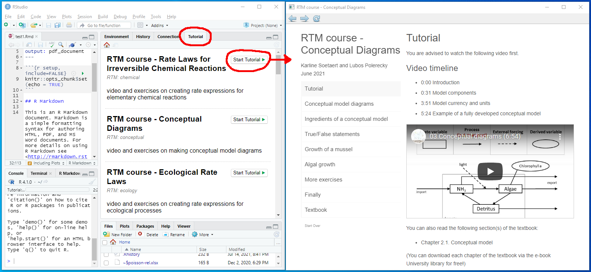

# RTM


An R-package with teaching material for Reaction-Transport Modelling in **R**. The material is used in the course

- Reactive Transport Modeling in the Hydrosphere, taught at Utrecht University
- Environmental Modeling, taught at Ghent University

The package is created with the *learnr* package.

## Installation

Before installing the *RTM* package, make sure you have installed the following R-packages and their dependencies:

* *learnr, deSolve, rootSolve, ReacTran*;
* *devtools* (this one is required to be able to install the package from the github repository). 

To install the *RTM* package, type in the R-console:

```
devtools::install_github("dynamic-R/RTM", depend=TRUE)
```
Then, type ``require(RTM)`` to load the package in R.

## What can you do with the RTM package?

### Start a Tutorial

It is assumed that you use *Rstudio* to work in R. If you have installed the *RTM* package while running *Rstudio*, **restart** *Rstudio* and the tutorial will show up in the tab "Tutorial" (top-right panel of *Rstudio*). Select a tutorial and start



To see the list of all tutorials, type in the R-console

```RTMtutorial("?")```

To run a specific tutorial (e.g., "introduction"), type in the R-console

```RTMtutorial("introduction")```

or

```RTMtutorial(1)```

Every tutorial contains a short knowledge-clip (hosted on YouTube). The corresponding slides can be downloaded from the **tutorial_slides** folder (see list of files above).

### Start an Exercise

To see the list of all exercises, type in the R-console

```RTMexercise("?")```

To view a specific exercise (e.g., "conceptual"), type in the R-console

```
RTMexercise("conceptual")             # to display it in a HTML format (default)
RTMexercise("conceptual", type="PDF") # to display it in a PDF format (nicer)
```

or

```RTMexercise(2)```

If you are new to R, it is recommended to first read the "introductionR" exercise. This is done by typing in R-console

```RTMexercise("introductionR", type="PDF")```

or

```RTMexercise(1, type="PDF")```

### View extra readers

To see the list of extra readers, type in the R-console

```RTMreader("?")```

To view a specific exercise (e.g., "fitting"), type in the R-console

```RTMreader("fitting", type="PDF")```

or

```RTMreader(4, type="PDF")```

## Uninstall

To uninstall *RTM*, locate the *RTM* package in the "Packages" tab in *Rstudio*, and click on the "x" button on the right margin.

To uninstall manually, type in the R-console (the version of the library may differ, here we assume 4.1):

* Windows users: ``remove.packages("RTM", lib="~/R/win-library/4.1")``
* Linux users: ``remove.packages("RTM", lib="~/R/x86_64-pc-linux-gnu-library/4.1")``

---
2021-07-19
