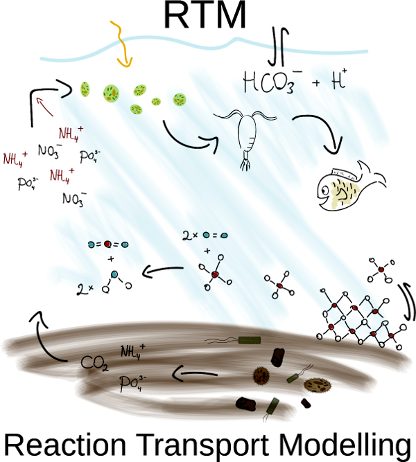
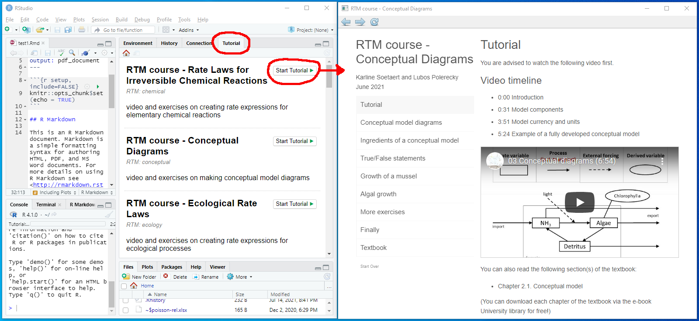

# RTM

<center></center>

**RTM** is an R-package that explains the basics of Reaction-Transport Modelling in **R**. It is used as a teaching material in the following courses:

- Reactive Transport Modeling in the Hydrosphere, taught at Utrecht University
- Environmental Modeling, taught at Ghent University

The package is created with the R-package *learnr*.

## Installation

Before installing the *RTM* package, you need to first install the following R-packages and their dependencies:

* *deSolve*, *rootSolve*, *ReacTran* (required for creating reaction-transport models in R);
* *learnr* (required for creating an interactive learning environment);
* *devtools* (required for a seamless installation of the RTM package from this github repository). 

Once the above packages have been installed, type the following command in the R-console to install the *RTM* package:

```
devtools::install_github("dynamic-R/RTM", depend=TRUE)
```
Then, type ``require(RTM)`` in the R-console to load the package in R. 

That's it! After this step, you should be able to use the package as described below.

## What can you do with the RTM package?

### Start a Tutorial

It is assumed that you use *Rstudio* to work in R. If you have installed the *RTM* package while running *Rstudio*, **restart** *Rstudio* and the tutorial will show up in the tab "Tutorial" (top-right panel of *Rstudio*). Select a tutorial and start it.

<center></center>

To see the list of all tutorials, enter the following command in the R-console:

```
RTMtutorial("?")
```

To run a specific tutorial, for example the tutorial called "introduction", enter one of the following commands in the R-console:

```
RTMtutorial("introduction")
RTMtutorial(1)
```

Every tutorial contains a short knowledge-clip (hosted on YouTube), a corresponding slide show (hosted on Google drive), and a list of questions that test your comprehension of the material covered in the knowledge-clip.


### Start an Exercise

To see the list of all exercises, enter the following command in the R-console:

```
RTMexercise("?")
```

To view a specific exercise, for example the exercise called "conceptual", enter one of the following commands in the R-console:

```
RTMexercise("conceptual")
RTMexercise(2)
```

These commands will display the exercise in an HTML format by default. If you want to display the exercise in a PDF format, which is more pleasing to the eye, modify the command as follows:

```
RTMexercise("conceptual", type="PDF")
RTMexercise(2, type="PDF")
```

Note, however, that you will need to have a working installation of LaTeX on your computer to allow this latter feature.

If you are new to R, it is recommended to first read the "introductionR" exercise. This is done by entering one of the following commands in the R-console:

```
RTMexercise("introductionR")
RTMexercise(1)
RTMexercise("introductionR", type="PDF")
RTMexercise(1, type="PDF")
```

### View extra readers

To see the list of extra readers, enter the following command in the R-console:

```
RTMreader("?")
```

To view a specific reader, for example the reader called "fitting", enter one of the following commands in the R-console:

```
RTMreader("fitting", type="PDF")
RTMreader(4, type="PDF")
```

### More help

As for any other R-package, you can get extra help by entering ``?RTM`` in the R console.

## Uninstall

To uninstall the *RTM* package, locate it in the "Packages" tab in *Rstudio*, and click on the encircled "x" button ("Remove package") on the right margin.

To uninstall the package manually, type the following command in the R-console (the version of the library may differ, here we assume 4.1):

* Windows users: 
  ```
  remove.packages("RTM", lib="~/R/win-library/4.1")
  ```
* Linux users: 
  ```
  remove.packages("RTM", lib="~/R/x86_64-pc-linux-gnu-library/4.1")
  ```

---
Last updates: 2022-01-18
