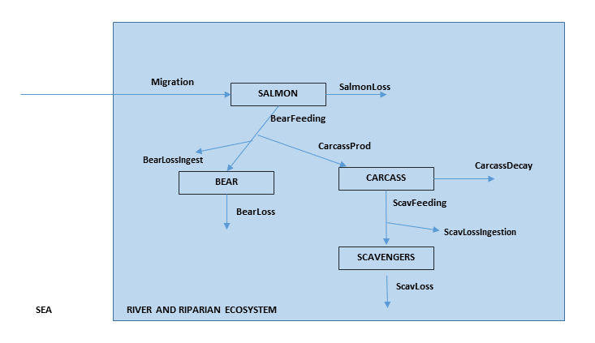

# Questions

## Problem formulation

In the previous lecture you made a food-web model of salmon, bears, scavengers and salmon carcasses. 
You first created the conceptual model (flow diagram), then wrote the mass balance equations.

Now, you will create a rate expression for every flow that entered the mass balance equations. Once you have done that, you can see how this model is implemented in R.

{width=14cm}

## Mass balance equations

Suitable mass balances for the state variable SALMON, BEAR, CARCASS and SCAVENGERS are:

$$\frac{dSALMON}{dt} = Migration - BearFeeding - SalmonLoss$$
$$\frac{dBEAR}{dt} = BearFeeding-CarcassProd-BearLossIngest-BearLoss$$
$$\frac{dCARCASS}{dt} = CarcassProd -ScavFeeding - CarcassDecay$$
$$\frac{dSCAVENGERS}{dt} = ScavFeeding -ScavLossIngest - ScavLoss$$

## Assumptions

The assumptions are the following:

1.	The units of the state variables are $kg~C~m^{-2}$; the time unit is days. 

  - Question: What are the units of the flows?
2.	The model domain (river + surrounding area) is $1000~m\times 1000~m$ large.
3.	The input of the salmon in the river is defined by a parameter called *migrate*. Per day, $10000~kg$ of salmon carbon migrate up the river. 
4.	The mortality + spawning + basal respiration of salmon, the hunting and basal respiration of the bear, and the losses of the scavengers are expressed by a first-order rate.
5.	The parameters that you should use, and their values are:

|   parameter               | units	         | description                                          |
|---------------------------|--------------- | ---------------------------------------------------- |
|   area = 1000000          | [$m^2$]	       |                                                      | 
|   migrate = 10000         | [$kg~C~d^{-1}$] | Amount of salmon entering the river system           | 
|   rSalmonLoss = 0.05      | [$d^{-1}$]	   | Salmon loss rate constant (Spawning+death+basalResp) | 
|   rBearFeeding = 0.02     | [$d^{-1}$]	   | Bear feeding rate constant                           | 
|   ksSalmon = 0.01         | [$kg~C~m^{-2}$] | Half saturation ct for ingestion bear                | 
|   rBearLoss = 0.01/365    | [$d^{-1}$]	   | Death rate constant (hunting and other) for bear    | 
|   pLossToCarcass = 0.5	  | [$-$]	         | Losses of salmon to carcass (fraction)               | 
|   pBearLossIngest = 0.4   | [$-$]	         | Ingested fraction that is lost (respiration+faeces)  | 
|   rCarcassDecay = 0.001   | [$d^{-1}$]	   | Decay rate constant of carcasses                     | 
|   rScavFeeding = 0.02     | [$d^{-1}$]	   | Feeding rate constant of scavengers                  | 
|   ksCarcass = 0.002       | [$kg~C~m^{-2}$] | Half saturation ct for ingestion scavenger           | 
|   pScavLossIngest = 0.7   | [$-$]	         | Growth efficiency of scavengers                      | 
|   rScavLoss = 1/365       | [$d^{-1}$]	   | Mortality+basal respiration rate constant scavengers | 

## Tasks

The above information is all you get. Write the mathematical equations for each flow on a piece of paper. 

Note: to make the equations (and the model code) easy to follow, we use the following formalism: 

*	State variables are written in CAPITAL LETTERS, 
*	Flows start with a capital letter, and 
*	parameters start with a lower case letter.

If you have finished with this exercise, then you can try to read, understand and then run the implementation of this model in R, using R markdown. 

It is in the file called *RiverRun_Rcode.Rmd*. 
The model is run twice, with different rate constants characterising ingestion by the bears. 

* Try to explain the output of this model. 
* Assuming the mean weight of a bear at the start of the simulation is 300 $kg$, how many bears are there in the area? What is their final weight?
