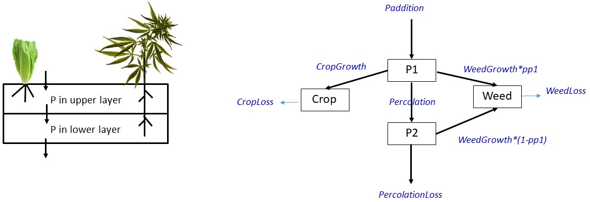

# Introduction

In the chemical, biogeochemical and ecological models that you have solved thus far, state variables were defined in terms of *concentrations* (volumetric or areal) or *biomass*, and the models were formulated through differential equations that describe the rate of change in these state variables as a function of the sinks and sources.
In economics, problems can be formulated in a similar way---as differential equations---but here one is interested in the changes in costs and profits. In this exercise, you will implement the model of crops and weeds that you have seen earlier, and expand it to additionally include an *economic* perspective. 

Note that this exercise should be considered as a demonstration of how to give models an economic "touch". It is *not* meant to be very realistic, or turn you into a millionaire.\footnote{Although if it does, we hope that you will remember how you got there! ;-)} Our choices of the parameters for the P dynamics are very roughly estimated, and the costs assumed in the model may well be totally wrong.

# Problem formulation

A farmer wants to optimise his harvest of lettuce. 
He needs to decide whether to fertilize his land with phosphate once, before planting, or at regular occasions after the lettuce seedlings have been planted, and how much of the fertilizer to add. 

The problem he has is that the field of lettuce is invaded by a weed that (i) grows slightly slower than the lettuce, and (ii) has a much deeper root system and a higher affinity for phosphorus than the lettuce. While the roots of lettuce penetrate 7 cm deep into the soil, the weed's roots penetrate down to a depth of 14 cm.

Once the fertilizer is added to the soil, it percolates, due to the rain, from the upper 7 cm to the deeper soil layer, at a rate of 0.5% per day. 

The farmer also wants to optimize the time of harvesting, so as to have a maximal profit. You will make a bio-economic model to help reach this decision.

# The biological part

In one of the previous exercises, you have already devised a conceptual model that could be used to mimic this agriculture (Figure 1). 

To account for the different root lengths of the crop and weed, the soil is subdivided into an upper layer (0--7 cm), where the roots of both plants take up nutrients, and a deeper layer (7--14 cm), where only the weed has access to nutrients. The rain induces a flow of nutrients from the upper layer to the deeper layer, and from the deeper layer to the soil below 14 cm.

Given that phosphorus is the limiting nutrient, the state variables are expressed in areal P concentrations for each layer ($mol~P~m^{-2}$).

The continuous P addition is implemented as a parameter (*Paddition*) while the fertilization at the start is imposed as the initial condition, i.e., by having a larger concentration of P in the upper soil layer. 

\newpage
## Tasks

First, create suitable rate expressions for the flows of P in the system. 

* Assume that, in addition to a competition for phosphorus, there is also a competition for space, i.e., the weed plants may limit the growth of the crop (and vice versa) because they block the sunlight. You may model this using the concept of *ecosystem carrying capacity*, assuming that the maximum *total* plant concentration (summed biomass of the weeds and crops, expressed in $mol~P~m^{-2}$) that can be sustained (ktot) is 0.3 $mol~P~m^{-2}$.

* The following table provides the parameters that you need to use. (tip: based on the units of the parameters, you should be able to deduce the corresponding rate expressions). 

| Name         | Value  | Description                    | Unit                  |
| ------------ | ------ | ------------------------------ | --------------------- |
|  Paddition   | 0.9/90 | Rate of P supply to P1         | $mol~P~m^{-2} d^{-1}$ |
|  percolation | 0.05   | Dilution by rain               | $d^{-1}$              |          
|  ksCrop      | 2e-3   | Monod ct for P uptake by crop  | $mol~P~m^{-2}$        |
|  ksWeed      | 0.5e-3 | Monod ct for P uptake by weed  | $mol~P~m^{-2}$        |
|  ktot        | 0.3    | Carrying capacity              | $mol~P~m^{-2}$        |
|  rGcrop      | 0.125  | Max. growth rate, crop         | $d^{-1}$              |          
|  rGweed      | 0.1    | Max. growth rate, weed         | $d^{-1}$              |        
|  rMcrop      | 0.0    | Loss rate (mortality)          | $d^{-1}$              |                
|  rMweed      | 0.0    | Loss rate (mortality)          | $d^{-1}$              |                
|  N           | 25     | Density of crop plants         | $ind~m^{-2}$          |                
|  P2WW        | 62000  | Convert P to wet weight        | $g~ww~(mol~P)^{-1}$   |                

Implement the model with continuous fertilization in R, using the above parameter values. You can start with the R-markdown template model file *RTM_0D.Rmd* to implement this model.\footnote{You can obtain this file from Rstudio: File $\rightarrow$ new File $\rightarrow$ Rmarkdown $\rightarrow$ from template $\rightarrow$ RTM\_0D. Save this file under a different name. Do not forget to change the heading of this file.}

* Assume the following initial concentrations of P for the crop, weed and the two soil layers (all in units of $mol~P~m^{-2}$): $WEED = 0.001$, $CROP = 0.005$, $P1 = 0.1$, and $P2 = 0.1$.

* There are 25 crop plants per $m^2$ (parameter *N*). This number does not change over time.

* Calculate, at each time point, the mean *wet weight* of the lettuce plants and export it from the model as an ordinary output variable. To do this, use the parameter $P2WW$, which is estimated based on the following assumptions: (i) the content of P in plant dry weight is 0.2% of dry weight; (ii) dry weight of lettuce plants is 25% of wet weight.

* Also output the summed biomass of crops and weeds, the total P in the system, the amount of P added to the system through fertilization, and the amount of P lost from the system due to percolation (all in $mol~P~m^{-2}$).

* Run the model for 90 days. 

An alternative culturing method is to fertilise the upper layer of the soil *before* planting the crops, so that P does not need to be administered continuously. Here, assume that the amount of P *initially added* to the top soil is the *same* as the accumulated amount of P added to the system during the *continuous fertilization* over 90 days in the previous scenario.

* Implement the model with one-time fertilization in R, using the above parameter values (except for the fertilization rate, which you should set to 0).

* Run the model for 90 days.

Compare results from both scenarios and discuss the following aspects: 

* Which strategy gives a higher crop yield?

* Is the growth of the crop limited? If so, what is the limiting factor?

* How much of the added fertilizer is utilized for growth of the crop, and how much is wasted? Where is the wasted fertilizer going to?

# The economic part

Now we take into account the cost of this culture and the profit that the farmer can make (if any).

## Assumtions

Use the following assumptions for costs:

* The cost to maintain  $1~m^2$ of the field is 1 euro per week. When the field also needs to be regularly fertilised, this increases to 1.025 euro per week per $m^2$. This only includes the cost of labor, and you can assume that this money is set aside continuously. 

* The cost of the fertiliser is 3 euro per kg of P. 

* The cost for the one-time fertilisation of the soil (before planting) is 5 euro per $m^2$.

* The cost for planting the lettuce is 0.5 euro per $m^2$.

The eventual profits are determined as follows:

* The lettuce plants can only be sold if they weigh more than 300 grams (wet weight).

* The plants are sold at a price of 1 euro per kg. 

## Tasks

* Implement the cost as an extra state variable. Think how this increases in time. Tip: you will need to put some costs in the differential equations, other costs should be added to the initial conditions.

* Estimate the income the farmer could have from selling the lettuce (this will be 0 as long as the plants weigh less than 300 g). Subtract the cost from this potential income to estimate the profit the farmer would make if he would sell the crops at that time.

Assuming that your model parameters are realistic, discuss the following aspects:

* Is it more beneficial to fertilise once or multiple times?
  
* When should the crops best be sold, and how much profit will be made?

* Regarding the waste of fertilizer, what would be the environmenal impact of the agriculture approach employed by the farmer? What would you recommend if the farmer *wanted* to make his agriculture more environmentally friendly? (Base this recommendation on the fertilizer waste.) How would this affect the profits the farmer can make? (This partially explains the title of this exercise.)

* How would you *stimulate* the farmer --- by modifying economic parameters (so cost) --- to become more environmentally friendly?
