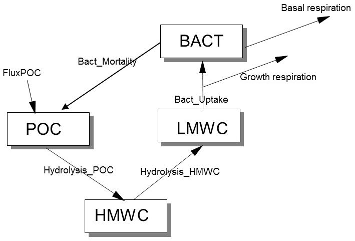

# Modelling detritus mineralization by bacteria

Detritus in the marine system is degraded by the action of heterotrophic bacteria. This is not a one-step process: bacteria cannot 'eat' detritus! A model that is closer to the reality of the process considers that particulate detritus (POC) is first hydrolysed by the action of bacterial exoenzymes to high-molecular-weight dissolved organic carbon (HMWC). This carbon pool is, in turn, attacked by bacterial enzymes to yield low-molecular-weight dissolved organic carbon (LMWC), which can then be taken up by the bacteria (BACT) to grow on it. The conceptual diagram of this model is shown in the figure below.

```{r fig1, echo=FALSE, fig.align='center', out.width="50%", fig.cap="Conceptual diagram of the detritus mineralization model."}

```

## Problem formulation

In class you have seen how to write rate expressions for ecological interactions: you need to distinguish between compartments that are actively performing the task (the "worker"), and compartments that are taken up as a result (the "resource"). This exercise is meant to make you think about these different roles that compartments may play in the model.

## Tasks

* Create the mass balance equations for this model.

* Find suitable rate expressions for the fluxes. The units of the parameters, summarized in the table below, may provide guidance as to which rate expressions you may want to implement.

* Check the units of your model equations.

Model parameters:

| parameter | value | description | units | 
|:-----------|:-------|:----------------------------------------|:-------|
| rPOC	      | 0.75    | rate constant of hydrolysis of POC             | $d^{-1}$ |
| rHMWC	      | 0.5     | rate constant of hydrolysis of HMWC            | $d^{-1}$ |
| rUptake	    | 2	      | uptake rate constant of LMWC by bacteria       | $d^{-1}$ |
| ksPOC	      | 0.10	  | Monod constant for POC hydrolysis              | $mol~C~m^{-3}$ |
| ksHMWC	    | 0.005   | Monod constant for HMWC hydrolysis             | $mol~C~m^{-3}$ |
| ksLMWC      | 0.0005  | Monod constant for LMWC uptake by bacteria     | $mol~C~m^{-3}$ |
| rBasal      | 0.1	    | basal respiration rate constant                | $d^{-1}$ |
| fLoss	      | 0.5     | fraction of LMWC uptake respired               | - |
| rMort	      | 50	    | quadratic mortality rate constant for bacteria | $(mol~C~m^{-3})^{-1}~d^{-1}$ |
| fluxPOC     | 0.0005  | constant influx of POC                         | $mol~C~m^{-3}~d^{-1}$ |

## If you have time

* Use the model template file *RTM_0D.Rmd* to implement this model in R.\footnote{You can obtain this file from Rstudio: File $\rightarrow$ new File $\rightarrow$ Rmarkdown $\rightarrow$ from template $\rightarrow$ RTM\_0D. Save this file under a different name. Do not forget to change the heading of this file.}

* The initial conditions are: $POC = 0.1$, $HMWC = 0.005$, $LMWC = 0.00015$, $BACT = 0.005$, all in $mol~C~m^{-3}$.