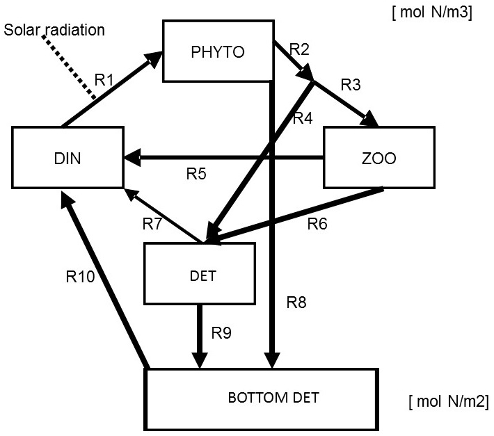

# The NPZD2 model

{width=10cm}

Figure 2 shows the conceptual diagram that includes both the free-floating and bottom detritus fractions.

It is most logical to express the pelagic (water) constituents per volume of water, i.e., in $mol~N~m^{-3}$, while the benthic (sediment) constituents are best expressed per surface of sediment, i.e., in  $mol~N~m^{-2}$. 

Consequently, most rates featuring in the mass balance of pelagic state variables are in $mol~N~m^{-3}~d^{-1}$, while the rates for the benthic state variable are in $mol~N~m^{-2}~d^{-1}$. 

An exception is the sinking of phytoplankton and detritus:
$$R8 = sinkVelocity\times PHYTO$$
$$R9 = sinkVelocity\times DET$$
With *sinkVelocity* expressed in $m~d^{-1}$, the fluxes R8 and R9 are expressed in $mol~N~m^{-2}~d^{-1}$. 

For the mass balance equations of phytoplankton and detritus, we will need to convert between volumetric ($m^{-3}$) and areal ($m^{-2}$) units.

Consequently, the mass balances for the phytoplankton and pelagic and bottom detritus are:
$$\frac{dPHYTO}{dt} = R1-R2-R8/depth$$
$$\frac{dDET}{dt} = R4+R6-R7-R9/depth$$
$$\frac{dBOT\_DET}{dt} = R8+R9-R10$$

The mineralisation rate of bottom detritus is expressed as 
$$R10 = rMineralisation\times BOT\_DET$$
and has units of $mol~N~m^{-2}~d^{-1}$. This will need to be converted to units of $mol~N~m^{-3}~d^{-1}$ to update the mass balance of pelagic DIN. 


Note that also the formula to calculate total nitrogen in the system needs to take into account the different units.

## Model implementation

```{r}
require(deSolve)  # package with solution methods

# state variables, units = molN/m3 or molN/m2 (BOT_DET)
state  <- c(DIN = 0.010, PHYTO = 0.0005, ZOO = 0.0003, DET = 0.005, BOT_DET = 0.005) 

# parameters
parms <- c(
  depth           = 10,        # [m] depth of the bay
  rUptake         = 1.0,       # [/day]
  ksPAR           = 140,       # [uEinst/m2/s]
  ksDIN           = 1.e-3,     # [molN/m3]
  rGrazing        = 1.0,       # [/day]
  ksGrazing       = 1.e-3,     # [molN/m3]
  pFaeces         = 0.3,       # [-]
  rExcretion      = 0.1,       # [/day]
  rMortality      = 400,       # [/(molN/m3)/day]
  rMineralisation = 0.05,      # [/day]
  sinkVelocity    = 1          # [m/day]
     
)

#=============================================================================
# Model formulation
#=============================================================================

NPZD2 <- function(t, state, parameters)
 {
 with(as.list(c(state, parameters)),{

    # Forcing function = Light a sine function
    # light = (540+440*sin(2*pi*t/365-1.4)), 50% of light is PAR 
    # spring starts at day 81 (22 March)
    # We calculate PAR at the middle of the water column; extinction coefficient=0.05/m
    PAR <- 0.5*(540+440*sin(2*pi*(t-81)/365))*exp(-0.05*depth/2)

   # Rate expressions - in units of [molN/m3/day] or [molN/m2/d]
    DINuptake      <- rUptake * PAR/(PAR+ksPAR) * DIN/(DIN+ksDIN)*PHYTO # molN/m3/d
    Grazing        <- rGrazing* PHYTO/(PHYTO+ksGrazing)*ZOO             # molN/m3/d
    Faeces         <- pFaeces * Grazing                                 # molN/m3/d
    ZooGrowth      <- (1-pFaeces) * Grazing                             # molN/m3/d
    Excretion      <- rExcretion * ZOO                                  # molN/m3/d
    Mortality      <- rMortality * ZOO * ZOO                            # molN/m3/d
    Mineralisation <- rMineralisation * DET                             # molN/m3/d
    SinkDet        <- sinkVelocity * DET                                # molN/m2/d !
    SinkPhy        <- sinkVelocity * PHYTO                              # molN/m2/d !
    BotMin         <- rMineralisation * BOT_DET                         # molN/m2/d !
    
   # Mass balances [molN/m3/day]
    dDIN      <- Mineralisation + Excretion - DINuptake + BotMin / depth  # molN/m3/d
    dPHYTO    <- DINuptake - Grazing  - SinkPhy / depth                   # molN/m3/d
    dZOO      <- ZooGrowth - Excretion - Mortality                        # molN/m3/d
    dDET      <- Mortality - Mineralisation + Faeces - SinkDet / depth    # molN/m3/d
    dBOT_DET  <- SinkDet + SinkPhy - BotMin                               # molN/m2/d !
    
    TotalN <- (DIN+PHYTO+ZOO+DET)*depth + BOT_DET         # molN/m2
    # the output
    return (list(c(dDIN, dPHYTO, dZOO, dDET, dBOT_DET),   # the rates of change
                   TotalN = TotalN, PAR = PAR)            # ordinary output variable
           )
    })
  }  # end of model equations
``` 

## Model run

We run the model for 2 years. 

```{r, fig.height = 6, fig.width = 10}
# output times
outtimes <- seq(from = 0, to = 2*365, length.out = 1000)  

# solve this model, using the ode function from deSolve
out <- ode(y = state, parms = parms, func = NPZD2, times = outtimes)  # solution

# visualise output
plot(out, mfrow=c(2,4))
```

Now we compare the amounts of organic matter in the pelagic vs. benthic compartment at the end of the simulation. Note that we multiply the pelagic state variables by *depth* so that the amounts are comparable (all are expressed in $mol~N~m^{-2}$).
```{r}
last <- out[nrow(out),]
c(pelagic = sum(last[3:5]*parms["depth"]), benthic = last["BOT_DET"])
```

Now, we visualize the areal concentrations of N ($mol~N~m^{-2}$) for all state variables, to illustrate how N is distributed among the different compartments throughout the year. Additionally, we plot the PHYTOplankton biomass against the ZOOplankton biomass (only for the second year) to show that although they appear to follow each other *closely* when plotted against time, they are *not* linearly proportional to each other. Instead, there is a time delay in the response of the ZOOplankton to the change in the PHYTOplankton, which results in hysteresis-like loops.

```{r, fig.height=6, fig.width=10}
out.areal <- out
out.areal[,2:5] <- out.areal[,2:5] * parms[["depth"]]
plot(out.areal, mfrow=c(2,3), which=1:5)
N <- length(outtimes)
plot(out.areal[round(N/2):N,"PHYTO"], out.areal[round(N/2):N,"ZOO"], 
     type="l", xlab="PHYTO", ylab="ZOO", main="Hysteresis-like loops")
```

We see that most of the N in the system is in the "non-living" components. During the summer, it is mostly in the "dead" organic matter, which is due to the limited rate of mineralization and the subsequent limitation of growth by DIN. In the winter, it is mostly in the inorganic form (DIN), which is due to growth limitation by low availability of light.
