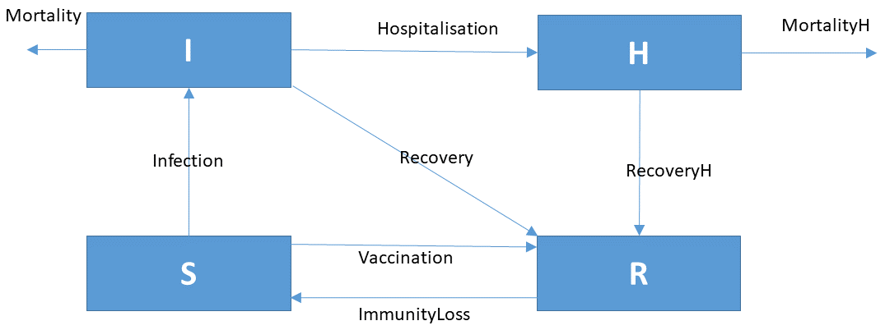

# ANSWERS

## Task 1. The simple SIR model, implemented in R

* To calculate the average duration of the infection period, $\tau$, the short answer is $\tau = 1/(g+m)$. This parameter corresponds to what is typically called the *residence time*. A rigorous mathematical derivation of the residence time is given in the Appendix, which shows that, for a first-order removal process characterized by the rate constant $k$, the residence time is $\tau=1/k$. Applying this to the situation here, the rate constant characterizing the "removal" of infected individuals is $g+m$ ($g$ due to recovery, $m$ due to mortality), yielding the value of $\tau=1/(g+m)$.

* The reproduction number (RN) can be estimated from the infection rate, which is the *total* number of infections per day. Dividing the infection rate by the number of infected individuals, we get the number of people that *one* infected individual infects on average *per day*. We need to multiply this with the average duration of the infectious period (parameter $\tau$) to arrive at $RN$. Thus, $RN = \tau*Infection/I$, which yields
$$ RN = \frac{b}{g+m}S.$$

* To keep an eye on the total number of deceased individuals, we introduce a new state variable that integrates the mortality rate over time:
$$\frac{dDeceased}{dt} = Mortality$$

Here is the implementation in R:

```{r, fig.width=10, fig.height=6, warning = FALSE, message = FALSE}
require(deSolve)    # the R-package for solving the model

# initial conditions, units of number of individuals (in the Netherlands)
state.SIR   <- c(S = 17500000, I = 1000, R = 0, Deceased = 0)

# model parameters
parms.SIR   <- c(
  b = 0.00000002,    # [1/ind/d], infection parameter 
  g = 0.07,          # [1/d],     recovery rate of infected individuals
  m = 0.007          # [1/d],     mortality rate of infected individuals
)

# model function
SIR <- function(t, state, parameters) {
  with (as.list(c(state, parameters)), {

    # rate expressions
    Infection  <- b*S*I
    Recovery   <- g*I
    Mortality  <- m*I

    # mass balance equations
    dS          <- -Infection 
    dI          <-  Infection - Recovery - Mortality
    dR          <-  Recovery
    dDeceased   <-  Mortality    # to track number of deceased people

    # average duration of infection and the Reproduction number
    tau  <- 1/(g+m)
    RN <- b*tau*S
    
    return (list(c(dS, dI, dR, dDeceased),  # the time derivatives
                 ReproductionNumber = RN,   # extra output variables
                 Population = S + I + R))
  }) 
}

# running the model
time.seq   <- seq(from = 0, to = 365, by = 1)   # time sequence, in days

# default run, business as usual scenario
out <- ode(y = state.SIR, times = time.seq, func = SIR, parms = parms.SIR)

# plot the results
plot(out, las = 1, col=1:2, lty=1)
```

## Task 2. Vaccination and immunity loss

* If we assume that the vaccination protects people against infection in a similar way as those recovered from the disease, we do not need to add a new state variable. Vaccinated people are added to the *R*ecovered population without "passing through" the *I*nfected population. The rate expression is: $$Vaccination = v \cdot S,$$ where $v$ is the fraction of the *S*usceptible population that is vaccinated *per day*.

* Immunity loss causes a transition from *R*ecovered back to *S*usceptible, and it is expressed as: $$ImmunityLoss = l \cdot R.$$ Here, $l$ is the fraction of *R*ecovered population that becomes *S*usceptible per day.

## Task 3. Hospitalisations

The easiest way to track the number of people in hospitals is

   - To distinguish between (1) infected individuals that are hospitalised ($H$) and (2) the "free-roaming" infected individuals\footnote{We borrow here a word commonly used in ecology, as even the experts could not come up with a good term.} ($I$). 
   - Thus, the hospitalisation rate is calculated by assuming that a certain fracton of *infected* individuals end up in a hospital *per day* (parameter $h$), which gives $$Hospitalisation = h \cdot I.$$ These people are removed from the "free-roaming" infected population ($I$) and added to the hospitalised population ($H$).
   - For simplicity, we assume that hospitalised patients do *not* infect other people. Thus, the infection rate remains to be given by $b\cdot S\cdot I$ (i.e., independent of $H$).
   - The recovery rate of hospitalised individuals is not necessarily the same as that of the "free-roaming" infected individuals. However, we assume it is still described by the first-order kinetics: $$RecoveryH = g_H \cdot H,$$ where $g_H$ is the corresponding rate constant.
   - Unfortunately, the severeness of their symptoms significantly increases the mortality rate of hospitalised individuals (mortality parameter $m_H$). Again, we assume the rate is first-order:  $$MortalityH = m_H \cdot H.$$

## Task 4. Updated model

The conceptual diagram describing the full COVID-19 model and the corresponding set of differential equations are therefore:

{width=80%}

$$\frac{dS}{dt} = ImmunityLoss - Infection - Vaccination$$
$$\frac{dI}{dt} = Infection - Mortality - Recovery - Hospitalisation$$
$$\frac{dR}{dt} = Recovery + RecoveryH + Vaccination - ImmunityLoss$$
$$\frac{dH}{dt} = Hospitalisation - MortalityH - RecoveryH$$

## Task 5. Better parameter values (the Belgian situation)

The quotes from the expert are used as follows:

* People that are infected and not in a hospital stay infectious for 10 days. Therefore, we have $\tau = 10~d$. Using the result in Task 1, we therefore have $1/(g+m)=10~d$. As we will see later, the mortality rate constant for the "free-roaming" infected population is much lower than the recovery rate constant ($m<<g$). Therefore, we have $g=0.1~d^{-1}$.  

* We assume the reproduction number ($RN$) at the start of the pandemic to be $RN = 2.5$. In Task 1, we have determined that $RN=b\cdot \tau\cdot S$, which implies for the infection parameter $b$ the value of $b = RN/S_{ini}/\tau = 2.5/11.5\times 10^6/10 \approx 2.2\times 10^{-8}~ ind^{-1}~d^{-1}$, where we used $S_{ini}=11.5\times 10^6$ for the Belgian population. It may be useful to realise (or note) that the reproduction number does *not* depend on the number of infected people, but rather on the *behavior* of these people, as subsumed in the parameter *b*.

* Using the same argument as in Task 1, the rate constant for the immunity loss is estimated as $l=1/(6\times 30)=0.00555~d^{-1}$.

* If 80% of infected people have symptoms, of which 20% are seriously ill and are hospitalized, we can deduce that the probability of an infected individual being hospitalized is $0.8\times 0.2=0.16$. However, this corresponds to the *entire* duration of the infectious period. Thus, the *hospitalisation* rate constant is $h=0.16/\tau = 0.016~d^{-1}$.

* The mortality rate for the hospitalised people takes into account the fact that all deaths are in the intensive care units, and this comprises 25% of the total hospitalisations. People in ICU have a probability of 30% to die. This over a period of 10 days. So, the mortality rate constant for the hospitalised people becomes $m_H= 0.3 \times 0.25/10 = 0.0075~d^{-1}$.

* Because the average stay of infected people in the hospital is 10 days, we have $10=1/(g_H+m_H)$. This is based on the same argument as used in Task 1. Using this expression and the value for $m_H$, we obtain $g_H = 1/10 - m_H = 0.0925~d^{-1}$.

* For the total mortality of "free-roaming" infected individuals of 0.1%, the parameter $m$ becomes $m=0.001/\tau =0.0001~d^{-1}$.


## Task 6. Implementation in R

```{r, fig.width=8, fig.height=8}
# the R-package for solving the model
require(deSolve)

# model parameters for Belgian case
parms      <- c(
  tau  = 10,         # [d], duration of the infectious period, free-roaming individuals
  tauH = 10,         # [d], duration of the infectious period, hospitalized individuals
  b = 2.5/11.5e6/10, # [1/ind/d], infection parameter, assuming RN=2.5, b=RN/Sini/d
  v = 0.0,           # [1/d] vaccination rate (no vaccines initially)
  g = 1/10,          # [1/d] recovery rate of free-roaming infected individuals, g=1/d
  m = 0.001/10,      # [1/d] mortality rate of free-roaming infected people, m=0.001/d
  l = 1/180,         # [1/d] immunity loss rate, l=1/(6*30)
  h = 0.2*0.8/10,    # [1/d] hospitalisation rate, h=0.8*0.2/d
  mH = 0.25*0.3/10,  # [1/d] mortality rate of hospitalised individuals, mH=0.25*0.3/dH
  gH = 1/10-0.25*0.3/10 # [1/d] recovery rate of hospitalised individuals, gH=1/dH-mH
)

# the model function
Corona <- function(t, state, parameters) {
  with (as.list(c(state, parameters)), {

    # rate expressions - units of [ind/day]
    Infection           <- b*S*I
    Vaccination         <- v*S
    Recovery            <- g*I
    Mortality           <- m*I    # Daily mortality of "free-roaming" infected 
    ImmunityLoss        <- l*R    # Daily loss of immunity of recovered individuals
    Hospitalisation     <- h*I    # Daily rate of hospitalizations of infected persons
    MortalityH          <- mH*H   # Mortality rate of hospitalised persons 
    RecoveryH           <- gH*H   # Recovery rate of hospitalised persons

    # mass balance equations
    dS        <- -Infection - Vaccination + ImmunityLoss
    dI        <-  Infection - Recovery - Mortality - Hospitalisation
    dR        <-  Recovery  + RecoveryH + Vaccination - ImmunityLoss
    dH        <-  Hospitalisation - RecoveryH - MortalityH
    dDeceased <-  Mortality + MortalityH # auxillary, track deceased individuals
    
    return (list(c(dS, dI, dR, dH, dDeceased),           # the time derivatives
                 ReproductionNumber = tau*Infection/I,   # output variables
                 MortalityRate = Mortality+MortalityH,   # daily mortality rate (ind/d)
                 MeanMortality = (Mortality+MortalityH)/(I+H) # fraction of infected 
                                                              # that die per day
                 ))
  }) 
}
```

## Task 7. Scenarios

The model is applied to the Belgian case:

```{r, fig.width=10, fig.height=10}
# the R-package for solving the model
require(deSolve)

# initial conditions, units of number of individuals (in Belgium)
state      <- c(S = 11500000, I = 1000, R = 0, H = 0, Deceased = 0)

time.seq   <- seq(from = 0, to = 365, by = 1)

# default run, business as usual
out <- ode(y = state, times = time.seq, func = Corona, parms = parms)

# run with reduced infection rate to 60% (social distancing)
parms2 <- parms
parms2["b"] <- parms2["b"]*0.6
out2 <- ode(y = state, times = time.seq, func = Corona, parms = parms2)

# add vaccination
parms3 <- parms2
parms3["v"] <- 0.005
out3 <- ode(y = state, times = time.seq, func = Corona, parms = parms3)

# vaccination but without social distancing
parms4 <- parms
parms4["v"] <- 0.005
out4 <- ode(y = state, times = time.seq, func = Corona, parms = parms4)

par(oma = c(0,2,0,0))
plot(out, out2, out3, out4, xlab = "time", lwd = 2, lty = 1, las = 1, mfrow=c(3,3),
     ylab=c("ind","ind","ind","ind","ind","--","ind/day","%/day",""))
plot.new()
legend("top", col = 1:4, lty = 1, 
       legend = c("no measures", "soc. distancing (SD)", 
                  "vaccination+SD", "vaccination-SD"))
```

# Final remarks

The simulations performed above are only realistic at the start of the pandemic. This is because they assume that the model parameters remain constant. However, in reality the parameters are frequently changed because the society *does* take measures, which themselves evolve in time. While such changes in parameter values are perfectly possible to implement in *R*, it would go far beyond the scope of this introductory course in modelling to explore them. Nevertheless, the exercise gives you a "taste" of how models can help design strategies in this type of circumstances.

But: as we have mentioned several times, models are just an abstraction of reality, and they cannot capture everything!
