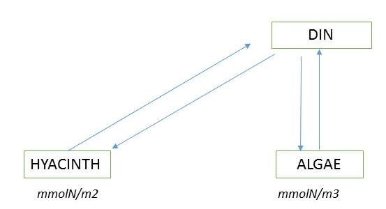

# Answers

{width=11cm}

There are only three state variables (Figure 1): HYACINTH, ALGAE and DIN. HYACINTH, which is floating on the water, is best expressed per surface of the water, while ALGAE and DIN, which are diluted in the water, are best expressed per volume of water. 

These different units need to be taken into account in the mass balance equations.

# R implementation

## Model definition

```{r, message=FALSE}
require(deSolve)  # package with solution methods

# state variables, units = molN/m3 for Algae and DIN, molN/m2 for Hyacinth
depth <- 10
state <- c(HYACINTH = 0.050, ALGAE = 0.0001, DIN = 0.020)

# parameters 
parms <- c(
  rUptakeA = 0.5,      # [/d] N-uptake rate constant of algae
  rUptakeH = 0.25,     # [/d] N-uptake rate constant of hyacinth
  rEx = 0.005,        # [/day] excretion rate constant 
  ksN = 0.1e-3,       # [mol/m3] half-saturation coeff, algae and hyacinth N-uptake
  ksIH = 30,          # [microEinst/m2/s] half-saturation light intensity  
  ksIA = 30,          # [microEinst/m2/s] half-saturation light intensity  
  irrad = 100,        # [microEinst/m2/s] light
  Hblock = 0.2,       # [mol N/m2] biomass where surface is full of Hyacinth 
  maxH = 0.3,         # [mol N/m2] carrying capacity 
  depth = depth       # [m] lake depth
)

# Model function
HyacinthAlgae <- function(t, state, params) {
  with (as.list(c(state, params)), {

   # Rate expressions 
    lightlimH <- irrad/(irrad + ksIH)   # light limitation of hyacinth
    Ialg <- irrad*exp(-0.05*depth/2)* max(0, (1 - HYACINTH/Hblock))
    lightlimA <- Ialg / (Ialg + ksIA)   # light limitation of algae
    nutlim <- DIN / (DIN+ksN)
    
   # Net uptake of nutrients by algae and hyacinths
    NupA <- rUptakeA * nutlim * lightlimA * ALGAE # [mmol/m3/d]
    NupH <- rUptakeH * nutlim * lightlimH * (1 - HYACINTH/maxH) * HYACINTH # [mmol/m2/d]

   # Excretion
    ExA <- rEx * ALGAE      # [mmol/m3/d]!
    ExH <- rEx * HYACINTH   # [mmol/m2/d]!
 
   # Mass balances [mmol/m3/d]
    dHYACINTH  <-  NupH - ExH
    dALGAE     <-  NupA - ExA
    dDIN       <- -NupA - NupH/depth + ExA + ExH/depth

    list(c(dHYACINTH, dALGAE, dDIN), 
      totalN = HYACINTH + ALGAE*depth + DIN*depth)
  })

}
``` 

## Model runs
We solve the model for various conditions. 

```{r, fig.height = 5, fig.width = 8}
# output time
outtimes <- seq(from = 0, to = 365*10, length.out = 100)  # run for 10 years

# solve this model, using the ode function from deSolve
out <- ode(y = state, parms = parms, func = HyacinthAlgae, times = outtimes)

# second run
state2 <- c(HYACINTH = 0.1e-3*depth, ALGAE = 0.050/depth, DIN = 0.020)
out2 <- ode(y = state2, parms = parms, func = HyacinthAlgae, times = outtimes)

plot(out, out2, xlab="days")
legend ("bottomleft", col = 1:2, lty =  1:2, legend = c("High", "Low"), 
        title = "Initial HYACINTH biomass", bty="n")

```

## Model Sensitivity

```{r fig.width=10, fig.height=10}


Hya <- Algae <- NULL
depth.seq <- seq(1, 100, length.out = 50) 
p2 <- parms
for (depth in depth.seq) {
  p2["depth"] <- depth
  out <- ode(y = state, parms = p2, func = HyacinthAlgae, times = outtimes)

  state2 <- c(HYACINTH = 0.1e-3*depth, ALGAE = 0.050/depth, DIN = 0.020)
  out2 <- ode(y = state2, parms = p2, func = HyacinthAlgae, times = outtimes)
  Hyacinth1 <- out[nrow(out), "HYACINTH"]
  Hyacinth2 <- out2[nrow(out2), "HYACINTH"]
  Algae1  <- out[nrow(out), "ALGAE"]
  Algae2  <- out2[nrow(out2), "ALGAE"]
  Hya <- rbind(Hya, c(Hyacinth1, Hyacinth2))
  Algae <- rbind(Algae, c(Algae1, Algae2))
}
par(mfrow = c(2, 1))
matplot(depth.seq, Hya, type = "l", lwd = 2, main="Equilibrium Hyacinth biomass", 
  xlab="lake depth, m", ylab="molN/m2", las=1)
matplot(depth.seq, Algae, type = "l", lwd = 2, main="Equilibrium Algae biomass", 
  xlab="lake depth, m", ylab="molN/m3", las=1)
legend ("topright", col = 1:2, lty =  1:2, legend = c("High", "Low"), 
        title = "Initial HYACINTH biomass")

```
