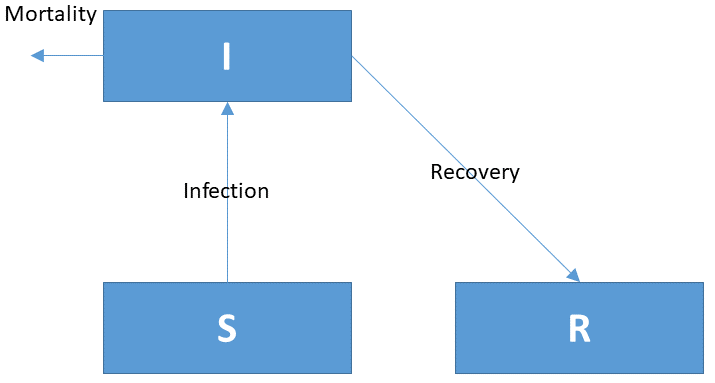

# The COVID-19 pandemic

## Problem formulation

One of the most pervasive events in 2020 (and 2021) has been the COVID-19 pandemic, the disease caused by the SARS-CoV-2 ("Corona virus"), which almost halted the social and economic activity all over the world. Despite substantial efforts to contain the pandemic, the Corona virus spread all over Europe, causing many casualties. 

The measures taken by the governments in the European countries to a large extent relied on the forecasts of mathematical models that describe the dynamics of infectious diseases (such as measles, rubella, flu, covid). In this exercise, we will first explain the ingredients of the simplest version of such models. Then, you will expand the model, adapt it to the COVID-19 pandemic, and make it as realistic as possible. You will do this based on the information we obtained from an expert from the Institute of Tropical Medicine ("Instituut voor Tropische Geneeskunde", ITG) in Antwerp, Belgium, who provided us with some insights into the characteristics of the COVID-19 pandemic. Because she is *not* a modeller, a considerable part of this exercise will involve figuring out the appropriate values for the model parameters. This will give you a "taste of a modeller's life".

## S.I.R. models 

Typically, the models used to investigate the spread of infectious diseases are called S.I.R. models. They describe the number of *S*usceptible, *I*nfected and *R*ecovered individuals in a population. Susceptible individuals are vulnerable to get the disease but are not (yet) infected. Infected individuals can recover, but some will die from the disease. Recovered individuals, at least initially, cannot become infected anymore.

{width=10cm}

As spreading the infection is *not* something that is actively pursued by the infected individuals, the *infection rate* can be modeled as if it were an *elementary chemical reaction*. That is, the infection rate depends on the probability of infected and susceptible people interacting, and the probability that an infection occurs as a result of this interaction. Thus, we describe the infection rate (in units of $ind.~d^{-1}$, where $ind$ stands for the number of individuals) with the following rate expression: 
$$Infection = b \cdot I \cdot S.$$
Here, $b$ is a rate constant that describes the infection rate (it has units of $ind^{-1}~d^{-1}$), and $I$ and $S$ are the number of infected and susceptible individuals, respectively.\footnote{In some S.I.R. models the rate parameter $b$ is replaced by $\beta/N$, where $\beta$ has units of $d^{-1}$ and N is the population density.}

Recovery from, and mortality of, infected individuals are modeled as simple first-order processes:
$$Recovery = g \cdot I,$$
$$Mortality = m \cdot I,$$
where $g$ and $m$ are the recovery and mortality rate constants, respectively.

The mass balance equations that describe the change in time of each population class are as follows:
$$\frac{dS}{dt} = -Infection,$$
$$\frac{dI}{dt} = Infection - Recovery - Mortality,$$
$$\frac{dR}{dt} = Recovery.$$
These equations imply that the rate constants $g$ and $m$ represent the *fraction* of the infected population that either recover or die *per day*, respectively (both in units of $d^{-1}$). For example, if there were no infection and no mortality ($b=m=0$), the number of infected individuals would decrease at a rate $dI/dt = -g\cdot I$, i.e., at a rate proportional to the number of infected individuals. Thus, by normalizing this rate to the number of infected individuals [$(dI/dt)/I$], we obtain the *fraction* of the infected population that recover per day, which is equal to $g$.

\newpage
# TASKS

## 1. Implement the simple S.I.R. model in R

The above model is the simplest S.I.R. model possible. It is not very realistic, and not very handy to be used as a decision-making tool. Nevertheless, you should start with implementing this model in *R* (R core team 2020) and solve it with the deSolve package (Soetaert et al., 2010).
Use the template R markdown file *RTM_0D.Rmd* to implement this model.\footnote{You can obtain this file from Rstudio: File $\rightarrow$ new File $\rightarrow$ Rmarkdown $\rightarrow$ from template $\rightarrow$ RTM\_0D. Save this file under a different name. Do not forget to change the heading of this file.}

* Run the model for 365 days, using the following parameters (not patterned to the covid pandemic!):

| Name      | Value      | Description         | Unit              |
| --------- | ---------- | ------------------- | ----------------- |
| b         | 0.00000002 | infection parameter | $ind^{-1}~d^{-1}$ |
| g         | 0.07       | recovery parameter  | $d^{-1}$          |
| m         | 0.007      | mortality parameter | $d^{-1}$          |

* Calculate the total population size in the model. This will allow you to keep track of the number of people that died from the disease. Think of an alternative way to keep track of these people. In this model we will ignore birth and mortality due to non-covid causes.

* Calculate the *average duration of the infectious period*, $\tau$, i.e., the average number of days that an infected person stays infected. Tip: you can deduce this number by considering the meaning of the parameters $g$ and $m$.\footnote{Alternatively, you can derive it by solving the differential equation for $I$ given above assuming that the infection rate is zero ($b=0$), and starting with a specific number of infected individuals initially (e.g., $I_{ini}=1000$). You will see how this is done rigorously in an appendix to the answers.}

* An often used number to designate the phase of the pandemic is the "Reproduction Number", *RN*. This is the number of people that one infected individual, on average, infects. When this number drops below 1, the number of infections will decrease (a good sign); when $RN > 1$, the number of infected individuals will increase --- exponentially --- in time (alarming).  Add the reproduction number as an ordinary output variable to the model. You will need to derive the equation to estimate this number. Tip: use the rate expression for the number of infections per day to derive *RN*. You will also need to use the value of the parameter $\tau$ derived in the previous step.

* Apply the model to the Dutch or Belgian situation. You can start the simulation assuming that all Dutch/Belgian people are susceptible to the disease, and that the spreading of the disease starts with 1000 infected individuals that return from holidays. Assume that, overall, there are 17.5 million Dutch people and 11.5 million Belgians.

## 2. Vaccination and immunity loss

Add vaccination to the S.I.R. model. For now, you may assume that people that are vaccinated become resistant to the disease in a similar way as those that have recovered from the disease. 

* Update your model with the vaccination. Assume that only susceptible individuals are vaccinated. 

* For the rate expression, assume that a *fixed fraction* of susceptible people is vaccinated per day (a crude approximation). Study the impact of vaccination by changing the vaccination rate constant from 0 to greater values. 
   
Unfortunately, recovered people can lose their immunity.

* Add the loss of immunity to the model. 
* For the rate expression, assume that a fixed fraction of recovered people loses immunity per day.  

## 3. Pressure on hospitals

One of the concerns at the start of the Covid-pandemic was that our hospitals would be swamped with Covid patients that cannot be treated anymore. A horror scenario is that patients need to wait in an ambulance (as in the UK), or be treated in corridors of the hospitals (as in Italy). 
Also, when hospitals have too many Covid patients, the treatment of non-Covid patients will be jeopardised. 

The number of hospital beds is 60,000 in Belgium and 55,000 in the Netherlands, so these numbers are to be kept in mind when taking measures to keep the pandemic manageable.

* Update your model to include the number of patients *hospitalised* due to Covid-related complications.
* Find suitable rate expressions for the rates in and out of the new compartment. 

## 4. Updated model

Based on tasks 2 and 3, you should now arrive at an updated version of your model, including the conceptual scheme, mass balance equations and rate expressions. Discuss your ideas with the lecturers before you proceed with the next step.

## 5. Finding realistic parameter values

As mentioned earlier, large part of modelling involves figuring out realistic values for the model parameters. You will do this now based on the information we received from the ITG expert. These are her quotes:

* Q1. "People that are infected by Covid-19 stay infectious on average for 10 days."

* Q2. "In Belgium and the Netherlands, the reproduction number *RN* at the start of the pandemic was between 2 and 4. A good guess is to take *RN* initially equal to 2.5." 

   - You cannot use this number directly in your model. However, based on the analysis you made earlier in this exercise (Task 1), you can use it to estimate the infection parameter *b*.

* Q3. "The immunity of the recovered people is only temporary. It is assumed that people are only immune for about 6 months after recovery from the disease". 

  - Use the same approach as in Task 1 (where you figured out how the average duration of infection, $\tau$, is related to the rate constants $g$ and $m$) to estimate a realistic value for the rate constant describing immunity loss.

* Q4. "It is estimated that 20% of infected people lack any symptoms; of the 80% that do show symptoms, 20% are seriously ill and are hospitalized."

  - Use this quote to estimate the rate constant describing the rate of hospitalisation, $h$. Hint: Consider that the 20% of the 80% amounts to the number of people that are hospitalized *at some point during the time* when they are infected. Thus, you will need the parameter $\tau$ to estimate $h$ as a value *per day*.

* Q5. "On average, patients stay 10 days in the hospital. One quarter of the hospitalised patients are in the intensive care unit (ICU) where they have a probability of 30% to die from the disease. You can assume that all patients who die in hospital die while in ICU."

  - Use this quote to estimate the average mortality and the recovery rate *per day* of the hospitalised individuals.  

* Q6. "Of all people that become infected, about 1% to 3% die." 

  - This mortality rate is the *average* mortality experienced by *all* infected individuals, i.e., the "free-roaming" and hospitalised individuals. It is not possible to use this number directly. However, 
  - you can assume that the total mortality for the free-roaming infected individuals is low, i.e., 0.1%. 
  - Create an output variable that estimates the mean mortality of the entire infected population (hospitalised and "free-roaming") to check that this mean indeed fluctuates between 1% and 3%. 

## 6. Implementation in R

Implement the updated model in *R*. Use the rate parameters derived from the expert's quotes.

## 7. Scenarios

Run several scenarios, patterned to the Belgian situation. There are 11.5 million Belgians, and the spreading of the disease starts with 1000 infected individuals that return from holidays.

* The first (worst case) scenario is where no measures at all are taken, and there is no vaccination. 
* The second scenario ("social distancing") is where the number of contacts is reduced so that the probability of infection is only 60% of its original value.
* Last scenario is similar to the previous one, but there is additionally a certain fraction of the population vaccinated per day ("social distancing with vaccination"). Assume that 0.5% of the susceptible individuals are vaccinated per day (this is a crude approximation). 

Compare all runs.

* How do these different scenarios affect the mortality rate?
* What are the implications of "social distancing" measures on the number of hospitalized and deceased people?
* What are the implications of the *combined* "social distancing with vaccination" measures, and of the "vaccination" alone (i.e., without "social distancing")? 
* Explore different levels of social distancing combined with different vaccination rates. What vaccination rates are needed to achieve "meaningful" results while keeping the society as "free" as possible (i.e., no social distancing measures)?
* Discuss among each other how the model helps you understand the reaction of the different societies around the world to the COVID-19 pandemic over the past year.

