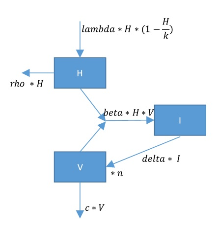

# Questions

## Problem formulation

In this exercise your task will be to interpret model equations.

The model is devised to study the impact of viruses in the aquatic environment. Viral infection is of considerable interest in aquatic sciences, because viruses play an important role in biogeochemical cycles by causing death in a variety of organisms, including algae.

Equations in this exercise are adapted from a model that describes the dynamics of the *HIV* virus, which is responsible for the acquired immune-deficiency syndrome (AIDS). The model has three components, including the number of uninfected (i.e., healthy) cells, *H*, the number of infected cells, *I*, and the number of free virions, *V* (Figure 1).

{width=8cm}

## Tasks

Based on the flow chart:

* What are suitable units of the state variables?
*	Give a name to each flow (arrow). Try to understand the mechanistic expression for each flow. That is, which expression has been chosen and why?
*	What are the units of the parameters?
*	Create mass balance equations, using the flow names you just assigned.
*	Replace each flow by its mechanistic expression as represented in the flowchart.

Implement the model in *R*. You can start with the R-markdown template file *RTM_0D.Rmd*.\footnote{You can obtain this file from Rstudio: File $\rightarrow$ new File $\rightarrow$ Rmarkdown $\rightarrow$ from template $\rightarrow$ RTM\_0D. Save this file under a different name, and do not forget to change the heading of this file.} Adapt the R-code from the template file to represent the viral infection model.

```{r setup, include=FALSE}
library(knitr)
knitr::opts_chunk$set(echo = TRUE)
```

Use the following values for initial conditions and for the model parameters:

| state variable | Value    |
|----------------| --------------|
| H	| 100   |
| I	| 150   |
| V	| 50000 |

| parameter | Value   |
|--------| -----------|
| lambda | 1          |
| delta	 | 0.55       |
| beta   | 0.00002    |
| c	     | 5.5        |
| k      | 1e5        |
| n	     | 100        |
| e	     | 1          |

Run the model for one year.
