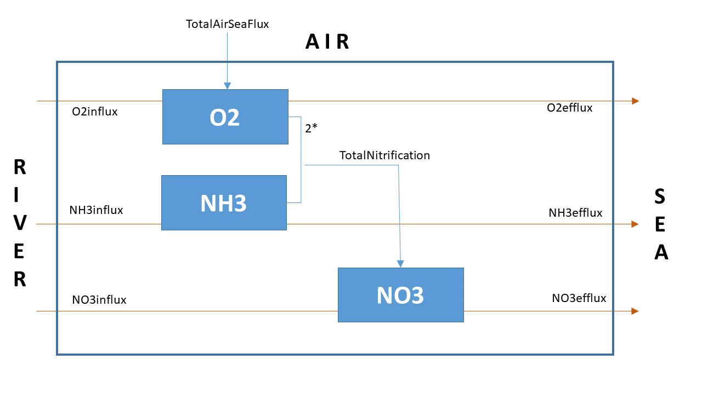

# Answers

## Mass balance equations

The mass balances for ammonia ($NH_3$), nitrate ($NO_3^-$) and oxygen ($O_2$) can be written as the following differential equations: 

$$\frac{\partial [NO_3^-]}{\partial t} = D\frac{\partial^2 [NO_3^-]}{\partial x^2 } - v\frac{\partial [NO_3^-]}{\partial x } + Nitrification$$
$$\frac{\partial [NH_3]}{\partial t} = D\frac{\partial^2 [NH_3]}{\partial x^2 } - v\frac{\partial [NH_3]}{\partial x } - Nitrification$$
$$\frac{\partial [O_2]}{\partial t} = D\frac{\partial^2 [O_2]}{\partial x^2 } - v\frac{\partial [O_2]}{\partial x } + Aeration - 2 \cdot Nitrification$$
Here, $D$ is the dispersion coefficient due to tidal mixing, and $v$ is the advective velocity (in $m~s^{-1}$), calculated from the discharge (*Q*) and cross-sectional area (*A*) as $v=Q/A$. Thus, the 1st and 2nd term in the differential equations describe the rate of change due to transport by dispersion (diffusion-like) and advection, respectively. Note that the parameters characterizing the magnitude of this change are the *same* for each component, which is because all components are *dissolved* substances affected in the same way by the water flow. Also note that we assumed that $D$ and $u$ are *not* varying along the estuary, which is why we could take them out of the spatial derivatives.

The boundary conditions at the upper boundary (river side): $[O_2]_{x=0} = 0.1$, $[NO_3^-]_{x=0} = 0.3$, $[NH_3]_{x=0} = 0.1$.
The boundary conditions at the lower boundary (sea side): $[O_2]_{x=1e5} = 0.3$, $[NO_3^-]_{x=1e5} = 0.050$, $[NH_3]_{x=1e5} = 0.010$. All values are in $mol~m^{-3}$.

It is not necessary to model the proton ($H^+$) or water ($H_2O$) concentrations in this exercise.

## R implementation

Note how the vector of state variables is defined in models with transport. From zero-dimensional models (models without transport), we are used to define state variables in a vector with *named* components, for example like this:
```{r}
# state variables in a zero-dimensional models
state <- c(O2=0.1, NO3=0.3, NH3=0.1)
```

This made it easy to refer to the state variables in the model function using the \texttt{with(as.list(...} function. 

In models with transport, each state variable is a *vector* by itself! Thus, this "trick" is *no longer* possible. Instead, we concatenate the vectors for each state variable into a *long* vector called *state*, and then "unpack" the individual vectors from this variable within the model function.

```{r, eval = TRUE, cache = FALSE, echo = TRUE, warning=FALSE, message=FALSE}
require(ReacTran)  # package with solution methods

# Note: units are: m, days, mol/m3.

# model grid
Length  <- 100000                                # m
N       <- 500                                   # - number of boxes
dx      <- Length/N                              # m grid size
x       <- seq(dx/2, by = dx, length.out = N)    # m position of cells
Area    <- 20000                                 # m2, cross-sectional area of the estuary
day2sec <- 24*3600                               # number of seconds in a day

# State variables, each is a vector of length=N - initial concentrations set to 0
Oxygen  <- rep(0, times = N)
Nitrate <- rep(0, times = N)
Ammonia <- rep(0, times = N)
state <- c(Oxygen, Nitrate, Ammonia)
SVnames <- c("Oxygen", "Nitrate", "Ammonia")

# model parameters
pars <- c(                                      
  riverO2  = 0.1,          # river oxygen conc   [mol/m3]
  seaO2    = 0.3,          # marine oxygen conc  [mol/m3]
  riverNit = 0.3,          # river nitrate conc  [mol/m3]
  seaNit   = 0.05,         # marine nitrate conc
  riverAmm = 0.1,          # river ammonium conc
  seaAmm   = 0.01,         # marine ammonium conc
  depth    = 10,           # [m]
  v        = 100/Area*day2sec, # advection velocity [m/d], discharge/cross-sect. area
  Ddisp    = 350*day2sec,  # dispersion coefficient [m2/d], tidal dispersion
  rnitri   = 0.1,          # nitrification rate constant, [/d]
  ksO2     = 1e-3,         # Monod ct for O2 limitation of nitrification [mol/m3]
  piston   = 1.0,          # piston velocity [m/day]
  O2sat    = 0.3           # saturated oxygen concentration [mol/m3], solubility
)

# Model function
Scheldt1D <- function(t, C, pars) {           # C is a LONG vector of state variables
 with (as.list(pars),{

   # here we "unpack" the vectors of individual state variables from the LONG input vector
    Oxygen  <- C[     1  :    N]
    Nitrate <- C[  (N+1) : (2*N)] # note parentheses around (N+1) and (2*N)!!
    Ammonia <- C[(2*N+1) : (3*N)]
    
    # Transport - tran.1D solves the "transport terms" (spatial derivatives).
    # It also implements the boundary conditions!
    TranOxygen <- tran.1D(C = Oxygen,
              C.up = riverO2, C.down = seaO2,  # upstream and downstream concentrations
              D = Ddisp, v = v, dx = dx)

    TranNitrate <- tran.1D(C = Nitrate,
              C.up = riverNit, C.down = seaNit,
              D = Ddisp, v = v, dx = dx)

    TranAmmonia <- tran.1D(C = Ammonia,
              C.up = riverAmm, C.down = seaAmm,
              D = Ddisp, v = v, dx = dx)

    # Nitrification rate (calculated in every location)
    Nitrification   <- rnitri * Ammonia * Oxygen/(Oxygen+ksO2)

    # air-water exchange rate (calculated in every location)
    Aeration <- -piston/depth * (Oxygen - O2sat)

    # the rates of change = transport + net reaction
    dNitrate  <- TranNitrate$dC  + Nitrification 
    dAmmonia  <- TranAmmonia$dC  - Nitrification
    dOxygen   <- TranOxygen$dC   - 2*Nitrification + Aeration
    
    list(c(dOxygen, dNitrate, dAmmonia),   # the rates of change
           TotalNitrogen = mean(Nitrate + Ammonia),  
           Nitrification  = Nitrification, 
           Aeration = Aeration,
           NH3influx = TranAmmonia$flux.up,
           NO3influx = TranNitrate$flux.up,
           O2influx  = TranOxygen$flux.up,
           NH3efflux = TranAmmonia$flux.down,
           NO3efflux = TranNitrate$flux.down,
           O2efflux  = TranOxygen$flux.down,
           # total fluxes in+out and integrated rates
           TotNinflux = TranAmmonia$flux.up + TranNitrate$flux.up,
           TotNefflux = TranAmmonia$flux.down + TranNitrate$flux.down,
           TotalNitrification = sum(Nitrification * dx),
           TotalAeration    = sum(Aeration*dx)
          )
    })
}
``` 

## Comparison of the 1970s and the current situation

We estimate the steady-state solution for the current situation and for the 1970s.

```{r, fig.height = 8, fig.width = 8}
Scheldt00 <- steady.1D(y = state, parms = pars, func = Scheldt1D, positive = TRUE,
                  nspec = length(SVnames), dimens = N, names = SVnames)

# The parameters for the 1970s
par70 <- pars
par70["riverNit"] <- 0.05    # river nitrate conc
par70["seaNit"]   <- 0.02    # marine nitrate conc
par70["riverAmm"] <- 0.60    # river ammonium conc
par70["seaAmm"]   <- 0.02    # marine ammonium conc

Scheldt70 <- steady.1D(y = state, parms = par70, func = Scheldt1D, positive = TRUE,
                  nspec = length(SVnames), dimens = N, names = SVnames)
```

```{r, fig.height = 7, fig.width = 10}
plot(Scheldt00, Scheldt70, grid=x/1000, lwd=2, lty=1, 
     mfrow=c(2,3), ylab="mol/m3", xlab="distance (km)")
plot(Scheldt00, Scheldt70, grid=x/1000, lwd=2, lty=1, mfrow=NULL, 
     which = "Nitrification", ylab="molN/m3/d", xlab="distance (km)")
legend("topright", legend = c("current", "1970s"), lty = 1, col = 1:2)
plot(Scheldt00, Scheldt70, grid=x/1000, lwd=2, lty=1, mfrow=NULL, 
     which = "Aeration", ylab="molO2/m3/d", xlab="distance (km)")
```


## Budget in Mmol/year

The current model function returns the fluxes in $mol~m^{-2}~d^{-1}$. To construct the budget for the entire estuary, we converts the values to $10^6~mol~yr^{-1}$. These budget values can be added to a diagram that represents the relevant state variables for the *entire* estuary as boxes, similar to the one shown in Figure 1.

```{r}
f1       <- Area/1e6*365        # from mol m-2 d-1 to 10^6 mol yr-1
toselect <- c("NH3influx", "NO3influx", "O2influx", 
              "NH3efflux", "NO3efflux", "O2efflux", 
              "TotalNitrification", "TotalAeration" )
BUDGET <- data.frame(Megamol_per_yr_2000  = unlist(Scheldt00[toselect]), 
                     Megamol_per_yr_1970s = unlist(Scheldt70[toselect]))*f1
knitr::kable(BUDGET, digits = 0)
```



## The impact of ammonia concentration in inflowing waters

The sensitivity analysis is run using a for-loop, where the minimal value in the steady state solution is found for each run of the loop.

```{r, fig.height=4, fig.width=5}
Sens <- function(NH3up){
 parsNH3 <- pars
 parsNH3["riverAmm"] <- NH3up   # river ammonium conc
 ScheldtNH3 <- steady.1D(y = state, parms = parsNH3, func = Scheldt1D, positive = TRUE,
                  nspec = length(SVnames), dimens = N, names = SVnames)
 return(min(ScheldtNH3$y[,"Oxygen"]))
}

NH3_vect <- seq(from = 0, to = 0.8, by = 0.04)
O2_vect  <- NULL

# use for-loop to find the minimal O2 concentration for each value in NH3_vect
for (NH3up in NH3_vect) 
   O2_vect <- c(O2_vect, Sens(NH3up))

plot(NH3_vect, O2_vect, type="b", xlab = "upstream NH3 concentration, [molN/m3]", 
  ylab = "O2, [molO2/m3]", main = "Minimal O2 concentration in the estuary")
```

