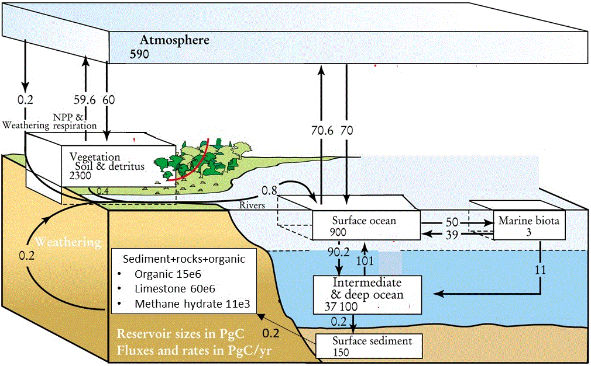

# Introduction

In a seminal work, Sarmiento and Gruber (2002) published a global carbon budget of the Earth, where C is exchanged among 7 large compartments (Figure 1): atmosphere, marine biota, terrestrial biota (vegetation, soil and detritus), surface of the ocean, intermediate and deep ocean, surface sediments in the ocean, and sediments and rocks (comprising organic carbon, limestone and methane hydrate). 

In this exercise, you will make a dynamic model of the Earth's global carbon cycle based on this budget. You will then use this model to assess the response of the Earth's carbon cycle to perturbations, tackling the following questions: How, and how fast, does the Earth's carbon cycle respond to perturbations? What is the new steady-state condition? What are the consequences of various carbon reduction scenarios?

```{r fig1, echo=FALSE, fig.align='center', out.width="70%", fig.cap="Earth's global carbon budget. Adapted from: Sinks for anthropogenic carbon. Jorge L. Sarmiento and Nicolas Gruber. Physics Today 55(8), 30 (2002); doi: 10.1063/1.1510279."}

```

## Problem formulation

The ultimate 7 compartment model is best explained based on a simple example where we only consider *two compartments*: the atmosphere, with the total mass of carbon M.ATM, and the biosphere, with the total mass of carbon M.BIO.\footnote{Note the use of dot (".") in the name of the state variable.} This model has been explored in some detail in the tutorial called *largescale* (use the command ``RTMtutorial("largescale")`` to view this tutorial).

At steady-state the mass of carbon is $590$ and $2300~Pg~C$ (Peta gram) in the atmosphere and biosphere, respectively, while the fluxes between the two compartments are $60~Pg~C~yr^{-1}$ (Figure 1).\footnote{P stands for Peta, which denotes $10^{15}$.}

In the first approximation, we assume that carbon is transferred between the atmosphere and the biosphere at a rate that is *first-order* with respect to the *source compartment*, i.e., linearly proportional to the size of the source. Thus, the mass balance equations in this simplified 2-box model have the form

$$\frac{dM.ATM}{dt}= -F_{AB}+F_{BA} = -k_{AB} \cdot M.ATM + k_{BA}  \cdot M.BIO,$$
$$\frac{dM.BIO}{dt}= +F_{AB}-F_{BA} = k_{AB} \cdot  M.ATM - k_{BA}  \cdot M.BIO,$$
where $F_{AB}$ and $F_{BA}$ are the fluxes from A to B and vice versa (units of $Pg~C~yr^{-1}$), and $k_{BA}$ and $k_{BA}$ are the corresponding first-order rate constants (units of $yr^{-1}$). Note that the formulation $F_{AB} = k_{AB}\cdot M.ATM$ means that the rate constant $k_{AB}$ represents the fraction of the source compartment transferred per year. We use this mathematical formulation to simulate what happens under transient conditions, such as when the system is perturbed from the steady state.

At steady-state, both the carbon mass ($M.ATM$, $M.BIO$) and the total fluxes ($F_{AB}$, $F_{BA}$) are known (Figure 1), so we use that information to estimate the first order removal rate constants: 

$$k_{AB} = F_{AB}/M.ATM = 60/590\,yr^{-1},$$
$$k_{BA} = F_{BA}/M.BIO = 60/2300\,yr^{-1}.$$

Obviously, if this model is run dynamically with the steady-state values as initial conditions, then the carbon masses should stay constant. Thus, the first steps in the implementation of this model in R must include the verification that this is true.

## Task 1: 2-compartment model of the Earth's global carbon cycle

Before you embark on the development of the more complex model, implement and apply the simplified 2-compartment model described above. Fluxes are expressed in $Pg~yr^{-1}$, mass in each compartment is expressed in $Pg~C$, the parameter values are

| parameter   |  value   |    unit     |
|:------------|:-------------|:------|
$k_{AB}$    | 60/590      |$yr^{-1}$|
$k_{BA}$    | 60/2300     |$yr^{-1}$|

as estimated above.  You can start with the R-markdown template file ``RTM_0D.Rmd`` to implement this model.\footnote{You can obtain this file from Rstudio: File $\rightarrow$ new File $\rightarrow$ Rmarkdown $\rightarrow$ from template $\rightarrow$ RTM\_0D. Save this file under a different name, e.g., Ccycle\_2box.Rmd. Do not forget to change the heading of this file.}

* 	Run the model for 100 years, with initial conditions that represent the steady-state (*M.ATM = 590*, *M.BIO = 2300*). The system should be at steady-state, i.e., none of the pools should change in time.

* 	Now assume that, at the start of the simulation there has been a transfer of $50~Pg~C$ from the biosphere to the atmosphere. Such a transfer might represent *deforestation* where the forest is burned to $CO_2$. Run the model for 100 years. What happens to the perturbed system? Does it return to the same steady-state as before? On which time scale do the changes occur?

*   Now implement the burning of $10~Pg~C$ of *fossil fuel* at the start. As fossil fuel is *not* explicitly modeled, this means that $10~Pg~C$ is added to the atmospheric pool at the start of the simulation. How does the system behave now? What can you say about the steady state in this perturbed system? On which time scale do the changes occur? Support your numerical results with a logical explanation. 

## Task 2: Complex representation of the Earth's carbon cycle with 7 compartments

Now you are ready to develop and implement a more realistic carbon cycle model based on the schematic diagram shown in Figure 1.

* Based on the diagram, create the mass balance equations for each carbon reservoir. Number the reservoirs and give them sensible names, e.g., M1.ATMOSPHERE, M2.SURFACEOCEAN, etc. Give sensible names to the fluxes that represent the source and sink, e.g., $F1.2$ is the flux from M1.ATMOSPHERE to M2.SURFACEOCEAN, and $F2.1$ is the reverse flux, etc.

* Assume first-order kinetics for each flux, i.e., $F1.2 = k1.2 \times M1.ATMOSPHERE$, etc. Estimate the corresponding rate constants using the steady-state situation depicted in Figure 1.

* Implement the model in R. Save it in a different file, e.g., ``Ccycle_7box.Rmd``.

* Solve the model for 1000 years, using steady-state masses as initial conditions. This model should be at steady-state, else you have made an error that you need to fix before going any further!

* Run the model to study the consequences of the following scenarios.

### Scenario 1: Instantaneous deforestation

Assess the response of the system to an instantaneous deforestation (similar as for the 2-compartment model). 

* Assume that, at the start of the simulation, there has been a transfer of $100~Pg~C$ from the biosphere to the atmosphere. 

* Run the model for 1000 years. Plot the result of this model, together with the steady-state results. 

* What happens to the perturbed system?  

* Where does the carbon end up after 1000 years? 

### Scenario 2: Burning of fossil fuel at a constant rate

* Implement in your model fossil fuel burning as an extra (constant) flux to the atmosphere. Think from which reservoir this carbon originates.

* The current fossil fuel emission is 10 $Pg~C~yr^{-1}$. Use your model to estimate the response of the different carbon reservoirs to emissions equal to 5, 10 and 20 $Pg~C~yr^{-1}$ over a time interval of 1000 years. Assume that the emissions would stay constant over this time scale.

* What fraction of the emitted carbon will be present in the atmosphere after 10, 100 and 1000 years?

* Where is most of the emitted carbon stored after 10, 100 and 1000 years?

### Scenario 3: Time-dependent burning of fossil fuel for 200 years

The burning of fossil fuel has not been constant over time. A more realistic scenario assumes that the emission rates increase linearly with time. 

Assume that the rate of fossil fuel emission to the atmosphere increased linearly over a period of 200 years, and that afterwards the mankind has managed to completely eliminate these emmissions. To implement in R a rate that first increases linearly and then abruptly drops to 0, you can write:
```
F.fuel <- a.fuel * t * (t < t_em)
```
where ``a.fuel`` describes the linear increase in the emission rate and ``t_em`` defines the time at which emissions drop to 0. Note that the term ``(t < t_em)``, which is a logical expression, will be 1 as long as the condition is true (logical TRUE), whereas it will be 0 if the condition is not fulfilled (logical FALSE). Assume ``a.fuel`` = $0.05~Pg~C~yr^{-2}$ and ``t_em`` = $200~yr$.

* Run this model for 1000 years. Where will most of the carbon end up after 1000 years?

* Run this model also for 1e6 years. Discuss the response of the system on time-scales ranging from hundreds to million years.

### Scenario 4: $CO_2$-mitigation by increased oceanic production

Several "engineering" fixes have been proposed to mitigate the consequences of anthropogenic $CO_2$ emissions. One approach is to stimulate primary production in the surface ocean (so-called ``ocean fertilization'', by adding a limiting nutrient such as iron). 

* How do you implement this strategy in the model? 

* Use the status of the system after 200 years of linearly increasing burning of fossil fuels (scenario 3) as the initial condition for this scenario. Then run the model for 1000 years with fossil fuel emissions set to zero. Experiment by changing the value of the relevant model parameter(s) to study the impact of different degrees of ocean fertilization on the removal of the atmospheric $CO_2$.

* Compare the model runs with the steady-state condition and with the scenario where no mitigation has been implemented (scenario 3).

### Scenario 5: $CO_2$-mitigation by sequestration of atmospheric $CO_2$ into deep ocean 

Another proposed mitigation approach is to sequester $CO_2$ from the atmosphere and inject it directly to the deep ocean. This can be done, for example, by stimulating primary production in the surface ocean, harvesting this extra production, and injecting it into the deep ocean. In this exercise, we can simplify this approach by by-passing this "D-tour" and assuming that atmospheric $CO_2$ is directly transferred into the deep ocean.

* How do you implement this strategy in the model?

* Use the status of the system after 200 years of linearly increasing burning of fossil fuels (scenario 3) as the initial condition for this scenario. Then run the model for 1000 years with fossil fuel emissions set to zero. Experiment by changing the value of the relevant model parameter(s) to study the impact of different rates of $CO_2$ sequestration on the removal of the atmospheric $CO_2$.

* Compare the model runs with the steady-state condition and with the scenarios 3 and 4.

<!-- Tip: you can implement this as an extra flux from the surface ocean to the deep ocean, with the magnitude of increase being a function of the ocean primary production.  
-->

<!-- ### Instantaneous deforestation: analytical analysis -->

<!-- Use an algebraic approach to understand the dynamics of the carbon flow in the instantaneous deforestation perturbation scenario. -->

<!-- * Assemble the Jacobian matrix for the differential equations that describe the system. Check that the matrix has been implemented correctly (it should, when multiplied with the states at equilibrium return 0 for the derivatives). -->
<!-- * Calculate the Jacobian's eigenvalue and eigenvectors. -->
<!-- * Use this to derive the magnitudes and characteristic time scales of the system's response to the deforestation perturbation. -->

