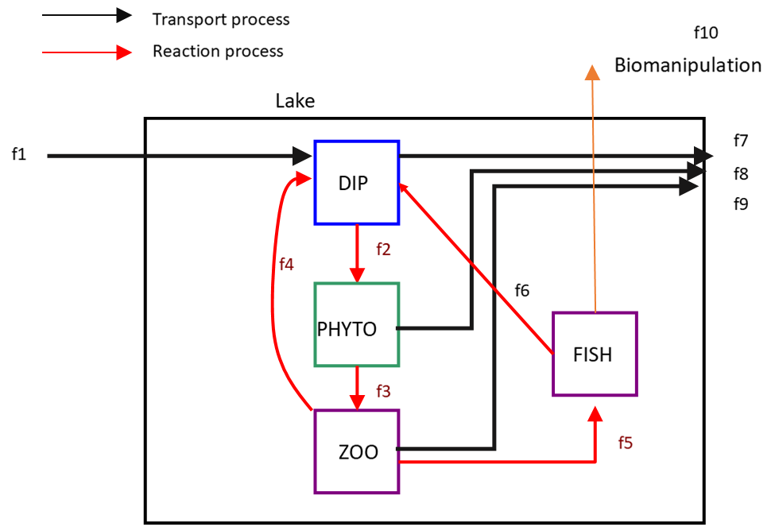

```{r setupA, include=FALSE}
knitr::opts_chunk$set(echo = TRUE)
```

\newpage
# Exercise 1 ANSWER. Lake biomanipulation

{width=10cm}

* Possible forcing function could be **f1**, the inflow of DIP
* Suitable units: mol P $m^{-3}$
* The effects of biomanipulation can be investigated by changing **f10**.

# Exercise 2 ANSWER. Decay of particulate organic matter due to bacterial activity

{width=10cm}

Note that respiration consists of two parts: *basal* respiration (a continuous process that occurs regardless whether bacteria grow or not), and *growth* respiration (linked to bacterial growth).

# Exercise 3 ANSWER. Spread of the Corona virus 

## Basic SIR model

{width=10cm}

## SIR model with vaccination

{width=10cm}

## SIR model with the "British variant"

{width=9cm}

The assumptions are:

* Immunity is gained for all variants whatever variant a person was infected with. 
* Vaccination protects against all corona variants.


# Exercise 4 ANSWER.	Crops and weed

{width=85%}

* The approach 'fertilize once before planting' can be implemented by increasing the initial concentration of P in the upper layer.
* The approach 'fertilize regularly after planting' is implemented as a flux (called *Paddition* in the scheme).
