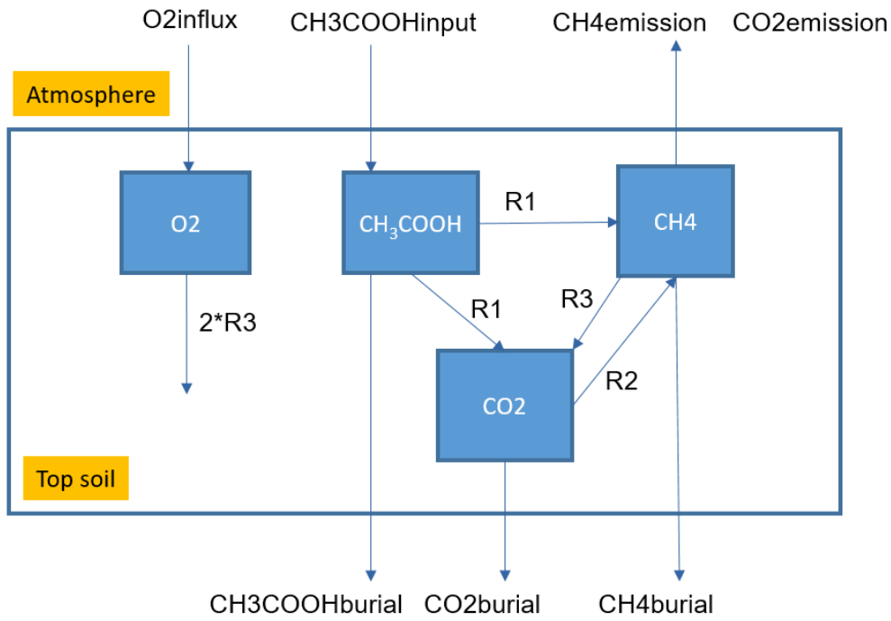
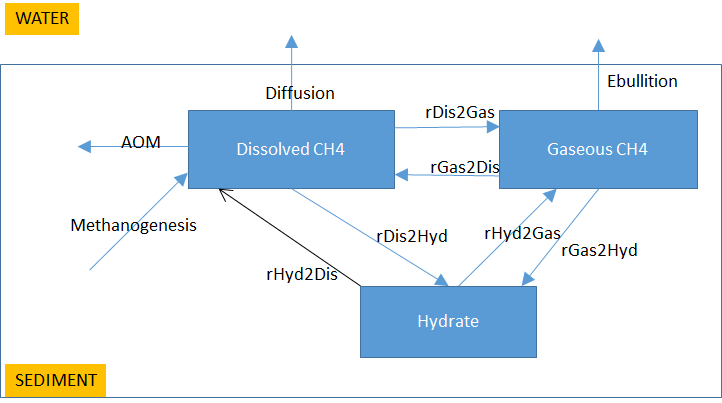
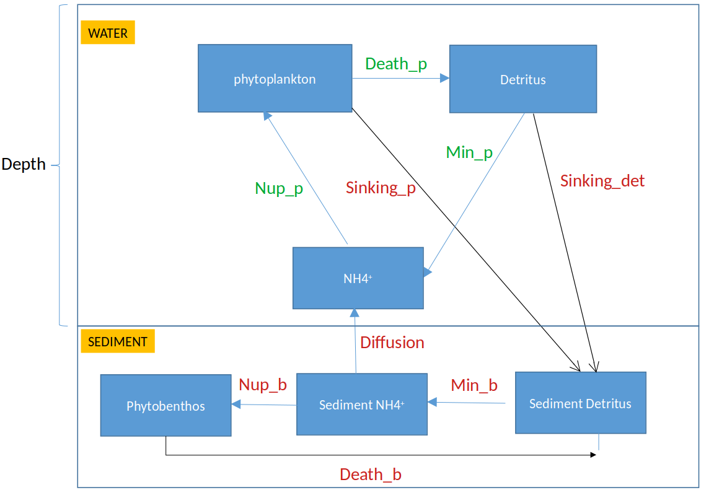

```{r setup_A, include=FALSE}
knitr::opts_chunk$set(echo = TRUE)
```

# Exercise 1 ANSWER. Decay of particulate organic matter due to bacterial activity

Based on the conceptual diagram in Figure 1, the mass balance equations are:

$$\frac{dPOC}{dt} = FluxPOC + Bact\_Mortality - Hydrolysis\_POC$$
$$\frac{dHMWC}{dt} = Hydrolysis\_POC - Hydrolysis\_HMWC$$
$$\frac{dLMWC}{dt} = Hydrolysis\_HMWC - Bact\_uptake$$
$$\frac{dBACT}{dt} = Bact\_uptake - Growth\_respiration - Basal\_respiration - Bact\_Mortality$$

# Exercise 2 ANSWER. Methane dynamics in wetlands

{width=10cm} 

Based on the following reactions
$$Reaction~1:\qquad  CH_3COOH \rightarrow CH_4 + CO_2$$
$$Reaction~2:\qquad  CO_2 + 4H_2 \rightarrow CH_4 + 2H_2O$$
$$Reaction~3:\qquad  CH_4 + 2O_2 \rightarrow CO_2 + 2H_2O$$
and the additional fluxes $CH_3COOH\_burial$, $CH_3COOH\_input$, $CH4\_emission$, $CH_4\_burial$, $CO_2\_emission$, $CO_2\_burial$, $O_2\_influx$, the mass balance equations can be written as follows:

$$\frac{dCH_3COOH}{dt} = -R_1 - CH_3COOH\_burial + CH_3COOH\_input$$
$$\frac{dCH_4}{dt} = R_1 + R_2 - R_3 - CH_4\_emission - CH_4\_burial$$
$$\frac{dCO_2}{dt} = R_1 - R_2 + R_3 - CO_2\_emission - CO_2\_burial$$
$$\frac{dO_2}{dt} = - 2R_3 + O_2\_influx$$
Units of the state variables and fluxes are:

* $CH_3COOH$, $CH_4$, $CO_2$: $mol~C~m^{-2}$
* $O_2$: $mol~O_2~m^{-2}$
* all carbon fluxes: $mol~C~m^{-2}~d^{-1}$
* $O_2$ fluxe: $mol~O_2~m^{-2}~d^{-1}$

### Model application

To estimate the fluxes, we use the linear equations:
$$41 = R_1+R_2-R_3, \qquad
31 = R_1-R_2+R_3, \qquad
20 = 2\cdot R_3.$$
Solving these equations yields $R_1=36$, $R_2=15$, and $R_3=10~mmol~m^{-2}~d^{-1}$.

# Exercise 3 ANSWER. Methane removal by anoxic processes in marine sediments

{width=12cm}

Based on the conceptual diagram shown in Figure 3, we can write the following mass balance equations:

$$\frac{dCH_{4,diss}}{dt} = Methanogenesis + rHyd2Dis - rDis2Hyd + rGas2Dis - rDis2Gas  - AOM - Diffusion$$
$$\frac{dCH_{4,gas}}{dt} = rHyd2Gas - rGas2Hyd + rDis2Gas - rGas2Dis - Ebullition$$
$$\frac{dCH_{4,hyd}}{dt} = -rHyd2Gas + rGas2Hyd + rDis2Hyd - rHyd2Dis $$
Units of the state variables and fluxes are:

* $CH_{4,diss}$, $CH_{4,gas}$, $CH_{4,hyd}$: $mol~C~m^{-2}$
* all fluxes: $mol~C~m^{-2}~d^{-1}$

# Exercise 4 ANSWER. The coupled cycles of carbon, nitrogen and oxygen in marine sediments

First, we reproduce here the reactions:

aerobic mineralization: 
$$OxicMin:\quad (CH_2O)_1(NH_3)_{NC}(H_3PO_4)_{PC} + O_2  \rightarrow  CO_2 + {NC} \cdot NH_3 + {PC} \cdot H_3PO_4 + H_2O $$ 
denitrification:
$$Denitri:\quad (CH_2O)_1(NH_3)_{NC}(H_3PO_4)_{PC} + \frac{4}{5}\cdot HNO_3 \rightarrow CO_2 + \frac{2}{5}\cdot N_2 + {NC} \cdot NH_3 + {PC} \cdot H_3PO_4 + \frac75\cdot H_2O$$
anoxic mineralization:
$$AnoxicMin:\quad (CH_2O)_1(NH_3)_{NC}(H_3PO_4)_{PC} + XO_2 \rightarrow CO_2 + X + {NC} \cdot NH_3 + {PC} \cdot H_3PO_4 + H_2O$$
nitrification:
$$Nitri:\quad NH_3 + 2\cdot O_2   \rightarrow  HNO_3 + H_2O$$
aerobic reoxidation:
$$Reox:\quad X + O_2  \rightarrow XO_2$$

By taking into account influxes and effluxes, we have the following mass balance equations:

$$\frac{dCorg}{dt} = Org\_Depo - oxicMin - Denitri - anoxicMin$$
$$\frac{dO_2}{dt} = O_2\_influx - oxicMin - 2 \cdot Nitri - Reox$$
$$\frac{dCO_2}{dt} = CO_2\_influx + oxicMin + Denitri + anoxicMin$$
$$\frac{dHNO_3}{dt} = HNO_3\_influx - 0.8 \cdot Denitri + Nitri$$
$$\frac{dNH_3}{dt} = NH_3\_influx + \frac{16}{106} \cdot (oxicMin + Denitri + anoxicMin) - Nitri$$
$$\frac{dX}{dt} = X\_influx + anoxicMin - Reox$$
$$\frac{dXO_2}{dt} = XO_2\_influx - anoxicMin + Reox$$

* Suitable units for the state variables in the sediment are:
  - $Corg$ and $CO_2$: $mol~C~m^{-2}$
  - $O_2$: $mol~O_2~m^{-2}$
  - $HNO_3$ and $NH_3$: $mol~N~m^{-2}$
  - $XO_2$ and $X$: $mol~X~m^{-2}$
  
* Units of the time derivatives and of the process rates and influxes will have an extra $d^{-1}$ after the corresponding $mol~m^{-2}$ part.

* Note that a positive value of *influx* corresponds to the net flux *from* the overlying water *into* the sediment. 

If we denote by $h$ the height of the water column, the mass balance equations for the water column components are:
$$\frac{dO_{2,wat}}{dt} = - \frac{O_2\_influx}{h}$$

$$\frac{dNH_{3,wat}}{dt} = - \frac{NH_3\_influx}{h}$$

and similarly for the other components. 

* Suitable units for the state variables in the water column are $mol~m^{-3}$, units of the time derivatives are  $mol~m^{-3}~d^{-1}$. By dividing the *influx* with $h$, where the latter is in $m$, we obtain the units of rate on the right-hand side of the water-column components in $mol~m^{-3}~d^{-1}$, as required.

# Exercise 5 ANSWER. Benthic and pelagic primary producers in shallow seas

{width=13cm}

Based on the conceptual diagram shown in Figure 4, we can write the following mass balance equations:

$$\frac{dPhytoplankton}{dt} = Nup\_p - Death\_p - \frac{Sinking\_p}{Depth}$$
$$\frac{dDetitrus}{dt} = Death\_p - Min\_p - \frac{Sinking\_det}{Depth}$$
$$\frac{dNH_4}{dt} = Min\_p - Nup\_p + \frac{Diffusion}{Depth}$$
$$\frac{dSediment\_detritus}{dt} = Sinking\_det + Sinking\_p + Death\_b - Min\_b$$
$$\frac{dSediment\_{NH4}}{dt} = Min\_b - Nup\_b - Diffusion$$
$$\frac{dPhytobenthos}{dt} = Nup\_b - Death\_b$$
Regarding units, water column constituents are in $mol~N~m^{-3}$. Rates are in $mol~N~m^{-3}~d^{-1}$, except for the rates of sinking and diffusion, which are in $mol~N~m^{-2}~d^{-1}$.