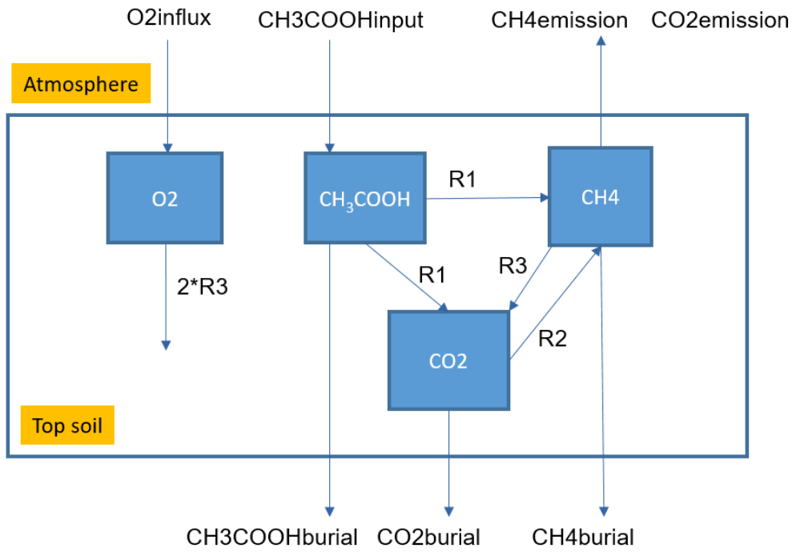
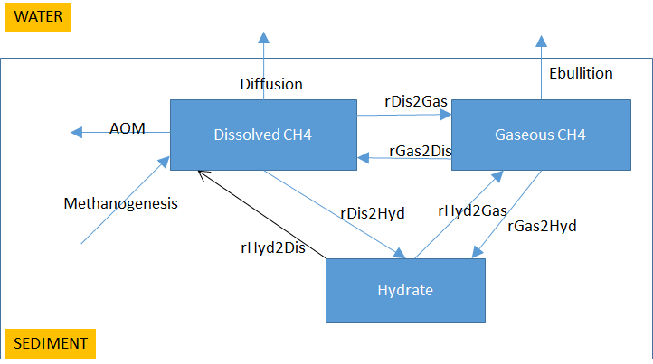
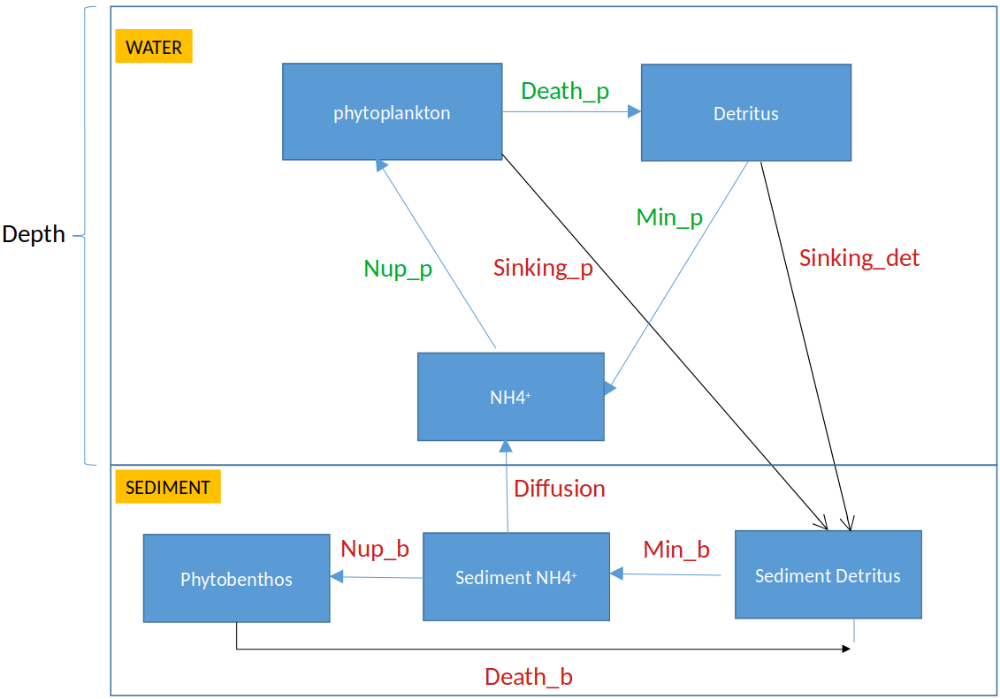

```{r setup_A, include=FALSE}
knitr::opts_chunk$set(echo = TRUE)
```

\newpage

# Answers {-}

\setcounter{section}{0}

# Decay of particulate organic matter due to bacterial activity

Based on the conceptual diagram in Figure 1, the mass balance equations are:
$$
\begin{array}{l}
\frac{dPOC}{dt} = FluxPOC + Bact\_Mortality - Hydrolysis\_POC \\[4mm]
\frac{dHMWC}{dt} = Hydrolysis\_POC - Hydrolysis\_HMWC \\[4mm]
\frac{dLMWC}{dt} = Hydrolysis\_HMWC - Bact\_uptake \\[4mm]
\frac{dBACT}{dt} = Bact\_uptake - Growth\_respiration - Basal\_respiration - Bact\_Mortality
\end{array}
$$

# Methane dynamics in wetlands

{width=10cm} 

Denoting the rates of reactions 1--3 as $R_1$, $R_2$ and $R_3$, and by additionally considering the fluxes ${CH_3COOH}\_burial$, ${CH_3COOH}\_input$, ${CH4}\_emission$, ${CH4}\_burial$, ${CO2}\_emission$, ${CO2}\_burial$, and ${O2}\_influx$, the mass balance equations can be written as follows:
$$
\begin{array}{l}
\frac{d{CH_3COOH}}{dt} = -2\cdot R_1 - {CH_3COOH}\_burial + {CH_3COOH}\_input \\[4mm]
\frac{d{CH_4}}{dt} = R_1 + R_2 - R_3 - {CH_4}\_emission - {CH_4}\_burial \\[4mm]
\frac{d{CO_2}}{dt} = R_1 - R_2 + R_3 - {CO_2}\_emission - {CO_2}\_burial \\[4mm]
\frac{d{O_2}}{dt} = - 2\cdot R_3 + {O_2}\_influx
\end{array}
$$
Units of the state variables and fluxes are:

* $CH_3COOH$, $CH_4$, $CO_2$: $mol C.m^{-2}$ 

* $O_2$: $mol O_2.m^{-2}$ 

* all carbon fluxes: ${mol C.m^{-2}.d^{-1}}$

* $O_2$ flux: ${mol O_2.m^{-2}.d^{-1}}$

To estimate the unknown fluxes $R_1$, $R_2$ and $R_3$, we use the following linear equations:
$$41 = R_1+R_2-R_3, \qquad
31 = R_1-R_2+R_3, \qquad
20 = 2\cdot R_3.$$
Solving these equations yields $R_1=36$, $R_2=15$, and $R_3=10~{mmol.m^{-2}.d^{-1}}$.


# Methane removal by anaerobic processes in marine sediments

{width=12cm}

Based on the conceptual diagram shown in Figure 3, we can write the following mass balance equations:

$$
\begin{array}{l}
\frac{d{CH_{4,diss}}}{dt} = Methanogenesis + rHyd2Dis - rDis2Hyd + \\[2mm]
\ \hspace{2cm} rGas2Dis - rDis2Gas  - AOM - Diffusion \\[4mm]
\frac{d{CH_{4,gas}}}{dt} = rHyd2Gas - rGas2Hyd + rDis2Gas - rGas2Dis - Ebullition\\[4mm]
\frac{d{CH_{4,hyd}}}{dt} = -rHyd2Gas + rGas2Hyd + rDis2Hyd - rHyd2Dis 
\end{array}
$$

Units of the state variables and fluxes are:

* $CH_{4,diss}$, $CH_{4,gas}$, $CH_{4,hyd}$: ${mol C.m^{-2}}$

* all fluxes: ${mol C.m^{-2}.d^{-1}}$


# Coupled cycles of C, N and O in marine sediments

First, we use the following abbreviations to denote the fluxes of the relevant processes:

* aerobic mineralization: $oxicMin$
* denitrification: $Denitri$
* anoxic mineralization: $AnoxicMin$
* nitrification: $Nitri$
* aerobic reoxidation: $Reox$

By considering the stoichiometric coefficients, we have the following mass balance equations:

$$
\begin{array}{l}
\frac{d{C_{org}}}{dt} = Org\_Depo - oxicMin - Denitri - anoxicMin \\[4mm]
\frac{d{O_2}}{dt} = O_2\_influx - oxicMin - 2 \cdot Nitri - Reox \\[4mm]
\frac{d{CO_2}}{dt} = CO_2\_influx + oxicMin + Denitri + anoxicMin \\[4mm]
\frac{d{HNO_3}}{dt} = HNO_3\_influx - \frac{4}{5} \cdot Denitri + Nitri \\[4mm]
\frac{d{NH_3}}{dt} = NH_3\_influx + \frac{16}{106} \cdot (oxicMin + Denitri + anoxicMin) - Nitri \\[4mm]
\frac{d{X}}{dt} = X\_influx + anoxicMin - Reox \\[4mm]
\frac{d{XO_2}}{dt} = XO_2\_influx - anoxicMin + Reox \\[4mm]
\end{array}
$$

* Suitable units for the state variables in the sediment are:

    * $C_{org}$ and $CO_2$: ${mol C.m^{-2}}$
    * $O_2$: ${mol O_2.m^{-2}}$
    * $HNO_3$ and $NH_3$: ${mol N.m^{-2}}$
    * $XO_2$ and $X$: ${mol X.m^{-2}}$
  
* Units of the time derivatives and of the process rates and influxes will have an extra ${d^{-1}}$ after the corresponding ${mol.m^{-2}}$ part.

* Note that each *influx* corresponds to the *net* flux. We use the following sign convention: a *positive* value of the influx corresponds to a net flux of a substance *from* the overlying water *into* the sediment, whereas a negative value corresponds to a net flux from the sediment into the overlying water.

If we denote by $h$ the height of the water column, the mass balance equations for the water column components are:
$$
\begin{array}{l}
\frac{d{O_{2,ow}}}{dt} = - \frac{O_2\_influx}{h}\\[4mm]
\frac{d{NH_{3,ow}}}{dt} = - \frac{NH_3\_influx}{h}\\[4mm]
\frac{d{HNO_{3,ow}}}{dt} = - \frac{HNO_3\_influx}{h}\\[4mm]
\end{array}
$$

* Suitable units for the state variables in the water column are ${mol.m^{-3}}$, units of the time derivatives are ${mol.m^{-3}.d^{-1}}$. By dividing the *influx* with $h$, where the latter is in ${m}$, we obtain the units of rates on the right-hand side of the water-column components in ${mol.m^{-3}.d^{-1}}$, as required.


# Benthic and pelagic primary producers in shallow seas

{width=13cm}

Based on the conceptual diagram shown in Figure 4, we can write the following mass balance equations:

$$
\begin{array}{l}
\frac{d{Phytoplankton}}{dt} = Nup\_p - Death\_p - \frac{Sinking\_p}{Depth} \\[4mm]
\frac{d{Detitrus}}{dt} = Death\_p - Min\_p - \frac{Sinking\_det}{Depth} \\[4mm]
\frac{d{NH_4}}{dt} = Min\_p - Nup\_p + \frac{Diffusion}{Depth} \\[4mm]
\frac{d{Sediment\_detritus}}{dt} = Sinking\_det + Sinking\_p + Death\_b - Min\_b \\[4mm]
\frac{d{Sediment\_{NH4}}}{dt} = Min\_b - Nup\_b - Diffusion \\[4mm]
\frac{d{Phytobenthos}}{dt} = Nup\_b - Death\_b \\[4mm]
\end{array}
$$

Regarding units, water column constituents are in ${mol N.m^{-3}}$, benthic constituents are in ${mol N.m^{-2}}$. Rates are in ${mol N.m^{-3}.d^{-1}}$, except for the rates of sinking and diffusion, which are in ${mol N.m^{-2}.d^{-1}}$.
