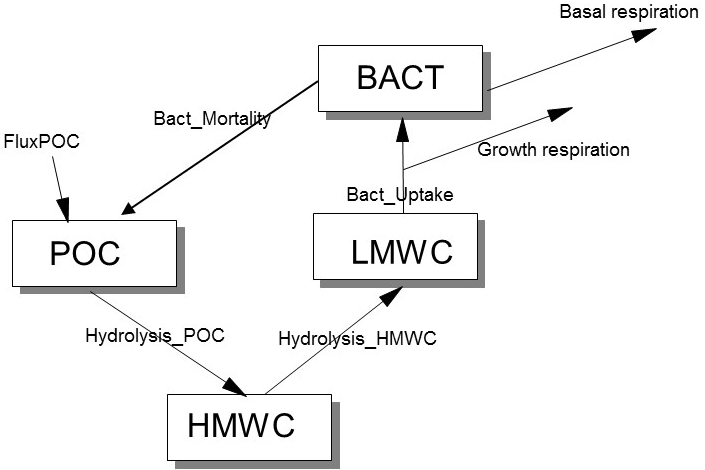

```{r setup, include=FALSE}
knitr::opts_chunk$set(echo = TRUE)
```

# Exercise 1. Decay of particulate organic matter due to bacterial activity

You are given a conceptual diagram for the carbon flow describing decay of particulate organic matter in marine sediments. 

{width=10cm}

## Task

Create the mass balance equations based on this diagram.

# Exercise 2. Methane dynamics in wetlands

Methane ($CH_4$) is an important greenhouse gas, contributing more than 20% to global warming. 
Methane emissions from wetlands are key to the global methane dynamics. 

You will devise a simple model of methane dynamics in these wetland systems that can be used to assess the future role of methane in global warming. 

The model represents the upper part of the wetland soil that is in contact with the atmosphere. The model should include methane production and oxidation (biogeochemical processes), the storage (burial) of methane in wetland soils, and methane emissions to the atmosphere (the latter two as transport processes). 

In the soil, methane is produced (from acetic acid, $CH_3COOH$) under anaerobic conditions, which proceeds in two subsequent reactions:

$$Reaction~1:\qquad  CH_3COOH \rightarrow CH_4 + CO_2$$
$$Reaction~2:\qquad  CO_2 + 4H_2 \rightarrow CH_4 + 2H_2O$$

Methane oxidation occurs under aerobic conditions via the following reaction:

$$Reaction~3:\qquad  CH_4 + 2O_2 \rightarrow CO_2 + 2H_2O$$

## Tasks

### Create the model
   1.	Draw a conceptual diagram of the model based on the processes described above. Identify state variables, process rates, import and export fluxes, and their corresponding units.
   2.	Create mass balance equations for acetic acid, methane, $CO_2$ and oxygen, based on the conceptual diagram and the chemical reactions given above. $H_2$ is very abundant in soils, due to its continuous abiogenic and biogenic production, so its concentration will hardly be affected by the methane cycle. Thus, you do not need to create a mass balance equation for $H_2$.
  3.	Add the transport terms to the mass balance equations. This includes storage (burial in the soil) of methane, $CO_2$ and acetic acid, the emission of methane and $CO_2$ to the atmosphere, the oxygen flux from the air into the sediment, and an input flux of acetic acid.
  4.	What will be the model currency and the units of each state variable?

### Model application
  5.	Use these mass balance equations together with observed data to estimate unknown fluxes.
Assume we have measured the $CH_4$ and $CO_2$ effluxes to be 40 and $30~mmol~m^{-2}~d^{-1}$, respectively, while the oxygen influx is $20~mmol~m^{-2}~d^{-1}$. 
Also, we have estimated the storage component to be $1~mmol~m^{-2}~d^{-1}$ for both $CH_4$ and $CO_2$. 

*Hints:* You can use these data to estimate the rates of processes described by reactions 1, 2 and 3 (denoted as $R_1$, $R_2$ and $R_3$). To do this, you may assume that the changes in concentrations (the time derivative on the left-hand side of your mass balance equations) are so much smaller than the individual fluxes (the terms on the right-hand side of the mass balance equations) that they can be ignored. Thus, you may set, in your mass balance equations, $dCH_4/dt = 0$, $dCO_2/dt =0$ and $dO_2/dt = 0$, and fill in the measured data. Then you use simple algebraic techniques to solve the linear equations to derive the rates $R_1$, $R_2$ and $R_3$. 

# Exercise 3. Methane removal by anoxic processes in marine sediments

Methane ($CH_4$) within marine sediments is distributed in three pools: the hydrate pool (solid), the dissolved pool and the gas phase. 

Dissolved methane is produced from organic matter in the anaerobic part of the sediment (by a process called methanogenesis). Methane is exchanged among these three pools, but it can also leave the sediment via ebullition (formation of gas bubbles and their escape due to buoyancy), or via diffusive transport of dissolved $CH_4$ to the overlying ocean water. (Note: we will ignore methane burial into deeper sediment layers in this exercise.) Especially the gas phase is important for the Earth's warming, as this readily adds to methane in the atmosphere. 

Fortunately, there is an important sink of methane in the marine sediments: microbial anaerobic oxidation of methane (AOM), which is the reaction of dissolved methane with sulphate according to the reaction:

$$CH_4 + SO_4^{2-} \rightarrow HCO_3^- + HS^- + H_2O$$

There is some doubt in the extent that the AOM can function as a methane "filter" to prevent the escape of methane to the atmosphere.

## Tasks

Make a model of the production of methane, the transformation of methane between the three phases (gas, dissolved, solid), and its removal via transport processes and the main chemical reaction. 

* For this model, it is simplest to first draw a conceptual scheme, displaying the transformations between the different phases, and the transport processes. 
* Give comprehensible names to the arrows and use those names to create the mass balance equations for each of the phases. 
* You may assume that the $CH_4$ pools are not in a thermodynamic equilibrium, so you should consider separately the forward and backward reaction. 
* Finally, decide about the model currency and the units of each state variable.

# Exercise 4. The coupled cycles of carbon, nitrogen and oxygen in marine sediments

In the natural environment, the cycles of many constituents are linked via chemical reactions that produce and consume them. We take the biogeochemical cycling of carbon ($C$), nitrogen ($N$) and oxygen ($O$) in a marine sediment as an example. 

In aquatic sediments, organic matter (OM) is the driver of a whole set of biogeochemical reactions. Here we simplify the sequence of reactions a bit, in the sense that we ignore the iron, manganese, and sulfur cycle. Additionally, we do not explicitly take into account the methane production. Rather, their impact is lumped so that their effect on oxygen and nitrogen cycle is represented.

The organic matter is assumed to have Redfield stoichiometry, so the C:N:P (molar!) ratio is 106:16:1. We represent OM as  $$(CH_2O)_1(NH_3)_{NC}(H_3PO_4)_{PC},$$ where $NC$ = 16/106 and $PC$ = 1/106.

OM is mineralized (oxidized) using a series of oxidants: oxygen ($O_2$), nitrate ($HNO_3$) and some other, unidentified oxidant ($XO_2$), which represents the lumpsum of manganese, iron oxides and sulphate. 

The reduced byproducts of this mineralization process, ammonia ($NH_3$), and an unidentified reduced substance ($X$), which is the lump-sum of reduced manganese and iron ions and sulphide ($X = [2Mn^{2+} + 4 Fe^{2+} + 0.5 H_2S]$), can be re-oxidized by a reaction with oxygen. 

All dissolved substances are exchanged with the water column. OM is added to the sediment by deposition from the water column. $N_2$, produced by the reaction of organic matter with nitrate, does not react in the sediment and does not need to be considered in the model. Also, the possibility that the unidentified reduced substance $X$ can additionally be re-oxidized by nitrate can be ignored.

The mineralization reactions can be written as (note that you need to know a little about balancing redox reactions in order to understand why the reactions, and specifically their stoichiometry, have the form as written here):

  - *aerobic mineralization*: 
$$(CH_2O)_1(NH_3)_{NC}(H_3PO_4)_{PC} + O_2  \rightarrow  CO_2 + {NC} \cdot NH_3 + {PC} \cdot H_3PO_4 + H_2O $$ 
  - *denitrification*: 
$$(CH_2O)_1(NH_3)_{NC}(H_3PO_4)_{PC} + \frac{4}{5}\cdot HNO_3 \rightarrow CO_2 + \frac{2}{5}\cdot N_2 + {NC} \cdot NH_3 + {PC} \cdot H_3PO_4 + \frac75\cdot H_2O$$
  - *anoxic mineralization*:
$$(CH_2O)_1(NH_3)_{NC}(H_3PO_4)_{PC} + XO_2 \rightarrow CO_2 + X + {NC} \cdot NH_3 + {PC} \cdot H_3PO_4 + H_2O$$

The secondary reactions to be considered are: 

  - *nitrification*:
$$NH_3 + 2\cdot O_2   \rightarrow  HNO_3 + H_2O$$
  - *aerobic reoxidation* of the unidentified reduced substances:
$$X + O_2  \rightarrow XO_2$$

## Tasks

###	4.1. Mass balance equations

* Based on the above reactions and the exchanges with the water-column, create mass balance equations for the following sediment state variables:

  -	Organic matter, $Corg$
  -	molecular oxygen, $O_2$
  -	dissolved inorganic carbon, $CO_2$
  -	nitrate, $HNO_3$
  -	ammonia, $NH_3$
  -	the unidentified reduced substances, $X$
  -	the oxidized substance, $XO_2$

* What are suitable units for the state variables? 
* What are the units of the time derivatives (left-hand side of the mass balance equations) and of the rates (terms on the right-hand side of the equations)?

### 4.2.	Interaction with the water column

Now assume that we incubate a natural sediment in a small Perspex container (inner diameter $30~cm$), with $15~cm$ of water overlying the sediment. The water is stirred so that, at all times, the overlying water is completely mixed. Also, there is no activity in the water column itself, so that all changes in the overlying water are due to the exchange with the sediment. 

We are interested in the dynamics of oxygen, nitrate, and ammonium in the overlying water. 
The concentration of the other reduced substances in the sediment are assumed to be 0 (and so the flux from the sediment is also assumed to be 0). 

* Create the mass balance equations for the following water column variables:
  - Oxygen in the overlying water, $O_{2,wat}$
  - Nitrate in the overlying water, $HNO_{3,wat}$
  - Ammonia in the overlying water, $NH_{3,wat}$
  - Unidentified reduced substances in the overlying water, $X_{wat}$

* What are suitable units for these water-column state variables? What are the units of their time-derivatives? 

# Exercise 5.	Benthic and pelagic primary producers in shallow seas

In the ocean, most of the primary production (the creation of biomass from inorganic components) is done by microscopic organisms, called algae, that use light as a source of energy. 
These algae either live in the water column (pelagic algae, also called phytoplankton), or on top of the sediment (benthic algae, also called phytobenthos). 

The living conditions of these two types of algae are fundamentally different. In well mixed waters, the free-floating algae, when close to the water surface, have ample light, but their growth may be limited by the availability of inorganic nutrients such as nitrate and ammonium. In contrast, benthic algae experience much less light as they live at the bottom of the water column (the light intensity decreases significantly as it propagates through the water column; so-called light extinction). However, the benthic algae have ample supply of nutrients that are regenerated from the bottom detritus derived from pelagic algae and pelagic detritus that settle on the sediment. 

In the environments where benthic algae can grow, they can take up significant amounts of nutrients that might otherwise benefit the pelagic algae. On the other hand, when the pelagic algae are able to grow vigorously in the waters, their large biomass may significantly reduce the light penetration in the water, thus hampering the production of benthic algae. Thus, there is a trade-off as to which of these algae will dominate in a system. 

## Tasks

You are now challenged to make a simple model that is able to investigate these dynamics. Choose the relevant state variables in the water column and in the sediment. You do not need to distinguish between ammonium or nitrate, but rather lump these two in a pool of "Dissolved Inorganic Nitrogen" (DIN). This DIN is the only nutrient that might limit algal growth (i.e., you can ignore phosphorus dynamics in your model). 

* Create the conceptual diagram and the corresponding mass balance equations.
  - Your model will have a mix of units, so take this into account when creating your mass balance equations. 
  - There is no need to make a mass balance equation for light, but you should consider the Lambert-Beer law, which says that the light intensity in the water-column decreases exponentially with water depth. 
  
* How will water depth influence the relative proportion of pelagic and benthic production?