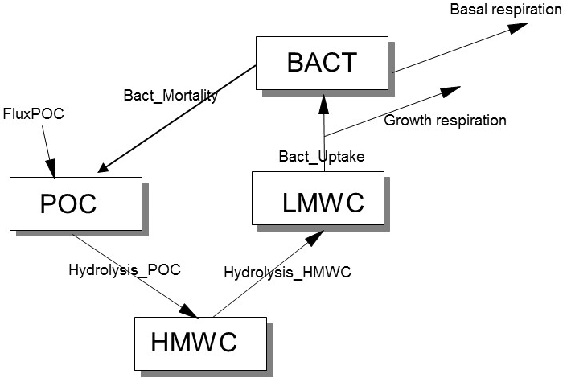

```{r setup, include=FALSE}
knitr::opts_chunk$set(echo = TRUE)
```


# Decay of particulate organic matter due to bacterial activity

You are given a conceptual diagram for the carbon flow describing decay of particulate organic matter in marine sediments. 

{width=10cm}

## Task

Based on this diagram, formulate the corresponding mass balance equations.


# Methane dynamics in wetlands

Methane ($CH_4$) is an important greenhouse gas, contributing more than 20% to global warming. Methane emissions from wetlands are key to the global methane dynamics. In this exercise, you will design a simple model of methane dynamics in wetland systems that can be used to assess the future role of methane in global warming. 

The modeled domain represents the upper part of the wetland soil that is in contact with the atmosphere. The relevant processes include methane production via organic matter decomposition, methane removal by oxidation, methane burial (storage) in deeper wetland soils, and methane emissions to the atmosphere. While the first two processes are biogeochemical, mediated by microbes, the latter two are physical, linked to transport. 

In the soil, methane is produced (from acetic acid, $CH_3COOH$) under anaerobic conditions, which proceeds in two subsequent reactions:

$$Reaction~1:\qquad  {CH_3COOH \rightarrow CH_4 + CO_2}$$
$$Reaction~2:\qquad  {CO_2 + 4H_2 \rightarrow CH_4 + 2H_2O}$$

Methane oxidation occurs under aerobic conditions via the following reaction:

$$Reaction~3:\qquad  {CH_4 + 2O_2 \rightarrow CO_2 + 2H_2O}$$

## Tasks

  1. Draw a conceptual diagram of the model based on the processes described above. Identify state variables, process rates, import and export fluxes, and their corresponding units. 
   
  2. Formulate the corresponding mass balance equations.
   
  3. Use the mass balance equations together with data provided below to estimate the unknown fluxes in your model.
  
      * $CH_4$ and $CO_2$ efflux across the soil-air interface is 40 and 30 ${mmol.m^{-2}.d^{-1}}$, respectively, while $O_2$ influx is 20 ${mmol.m^{-2}.d^{-1}}$. 
  
      * The burial (storage) component is estimated at 1 ${mmol.m^{-2}.d^{-1}}$ for both $CH_4$ and $CO_2$. 

## Hints {-}
   
   * Focus on carbon (different forms) and oxygen ($O_2$) as key elements. You can assume that $H_2$ is very abundant in soils, due to its continuous abiogenic and biogenic production, so its concentration will hardly be affected by the methane cycle. Similarly, $H_2O$ concentrations are not affected due to the high abundance of water in aquatic systems. Thus, you can simplify the model by excluding $H_2O$ and $H_2$.
   
  * Since the model describes methane exchange across the soil-air interface and a transfer of methane from upper soil to deeper soil, it is logical to normalize each state variable per *square* meter of soil.

  * As transport processes, consider storage (burial in the soil) of $CH_4$, $CO_2$ and acetic acid, the emission of $CH_4$ and $CO_2$ to the atmosphere, $O_2$ flux from air into the soil, and an input flux of acetic acid.

  * In task 3, you can use the provided data to estimate the rates of processes described by reactions 1, 2 and 3 (denoted as $R_1$, $R_2$ and $R_3$). To do this, you may assume that the changes in concentrations (the time derivative on the left-hand side of your mass balance equations) are so much smaller than the individual fluxes (the terms on the right-hand side of the mass balance equations) that they can be ignored. Thus, you may set, in your mass balance equations, $d{CH_4}/dt = 0$, $d{CO_2}/dt =0$ and $d{O_2}/dt = 0$, and fill in the provided data. Then you use simple algebraic techniques to solve the linear equations to derive the rates $R_1$, $R_2$ and $R_3$. 
  

# Methane removal by anaerobic processes in marine sediments

In marine sediments, methane ($CH_4$)  is present in three pools: the hydrate pool (solid), the dissolved pool (aq), and the gas phase (g, in the form of bubbles). 

Dissolved methane is produced from organic matter in the anaerobic part of the sediment (by a process called methanogenesis). Methane is exchanged among these three pools, but it can also leave the sediment via ebullition (escape of gas bubbles due to buoyancy), or via diffusive transport of dissolved $CH_4$ to the overlying ocean water. (Note: we will ignore methane burial into deeper sediment layers in this exercise.) The gas phase of methane is especially important for the Earth's warming, as this readily adds to methane in the atmosphere. 

Fortunately, there is an important sink of methane in marine sediments:  anaerobic oxidation of methane (AOM). This process is mediated (catalyzed) by microbes and occurs according to the following stoichiometry, using sulfate ($SO_4^{2-}$) as the oxidant:

$${CH_4(aq) + SO_4^{2-} \rightarrow HCO_3^- + HS^- + H_2O}$$

Although sulfate is highly abundant in seawater (about 28 mM ), there is some doubt about the extent by which AOM can function as a methane "filter" to prevent the escape of methane to the atmosphere.

## Tasks

Make a model of methane cycling in marine sediments. The model should include the production of methane by methanogenesis, transformation of methane between the three phases (gas, dissolved, solid), and removal of methane via transport processes and the main chemical reaction (AOM). 

* Start with a conceptual diagram, displaying the transformations between the different phases and relevant transport processes. Then, formulate the corresponding mass balance equations.

* Assume that the different $CH_4$ pools are *not* in a thermodynamic equilibrium. Hence, you need to consider the forward and backward reactions separately.

* Give comprehensive names to the arrows and use those names to create the mass balance equations for each of the phases. 

* Finally, decide about the model currency and the units of each state variable and flux.


# Coupled cycles of C, N and O in marine sediments

In the natural environment, element cycles are coupled via chemical reactions that produce or consume the elements in different forms. As an example, we take the biogeochemical cycling of carbon (C), nitrogen (N) and oxygen (O) in marine sediments. 
In sediments, organic matter (OM) drives a complex network of biogeochemical reactions. Here, we simplify this network a bit by (i) ignoring the iron, manganese, and sulfur cycles and (ii) not explicitly taking into account methane production. Instead, we "lump" their impact so that their effect on the oxygen and nitrogen cycles is represented.

We assume that OM has the so-called Redfield stoichiometry, i.e., its molar(!) C:N:P ratio is 106:16:1. Thus, we represent OM as the following molecule:
$$
{(CH_2O)_1(NH_3)_{NC}(H_3PO_4)_{PC}},
$$ 
where ${NC} = 16/106$ and ${PC} = 1/106$.

OM is mineralized (oxidized) using a series of oxidants: oxygen ($O_2$), nitrate ($HNO_3$) and some other, unidentified oxidant ($XO_2$), which represents the "lump-sum" of manganese and iron oxides and sulfate. 

The reduced by-products of this mineralization process, ammonia ($NH_3$), and an unidentified reduced substance (X), which is the lump-sum of reduced manganese and iron ions and sulfide (i.e., ${X} = {2\cdot Mn^{2+} + 4\cdot Fe^{2+} + 0.5\cdot H_2S}$), can be re-oxidized by a reaction with $O_2$. 

All dissolved substances are exchanged with the water column. OM is added to the sediment by deposition from the water column. 

$N_2$, produced by the reaction of organic matter with nitrate, does not react in the sediment and does not need to be considered in the model. 

Although the unidentified reduced substance $X$ can additionally be re-oxidized by nitrate, you can ignore this process in your model.

The relevant mineralization reactions can thus be written as shown below. (Note that you need to know a little about balancing redox reactions in order to understand why the reactions, and specifically their stoichiometry, have the form provided. Ask your peers or teachers, or search the internet, if your background knowledge on redox reaction balancing is insufficient.)

  - *aerobic mineralization*: 
$$
{(CH_2O)_1(NH_3)_{NC}(H_3PO_4)_{PC} + O_2  \rightarrow  CO_2 + {NC} \cdot NH_3 + {PC} \cdot H_3PO_4 + H_2O}
$$ 

  - *denitrification*: 
$$
{(CH_2O)_1(NH_3)_{NC}(H_3PO_4)_{PC} + \frac{4}{5}\cdot HNO_3 \rightarrow CO_2 + \frac{2}{5}\cdot N_2 + {NC} \cdot NH_3 + {PC} \cdot H_3PO_4 + \frac75\cdot H_2O}
$$

  - *anoxic mineralization*:
$${(CH_2O)_1(NH_3)_{NC}(H_3PO_4)_{PC} + XO_2 \rightarrow CO_2 + X + {NC} \cdot NH_3 + {PC} \cdot H_3PO_4 + H_2O}
$$

The secondary reactions to be considered are: 

  - *nitrification*:
$$
{NH_3 + 2\cdot O_2   \rightarrow  HNO_3 + H_2O}
$$

  - *aerobic reoxidation* of the unidentified reduced substances:
$$
{X + O_2  \rightarrow XO_2}
$$

## Tasks

### Mass balance equations {-}

* Based on the above reactions, and additionally considering the exchanges of solutes with the water-column, formulate mass balance equations for the following state variables in the sediment:

  -	organic matter, $C_{org}$
  -	molecular oxygen, $O_2$
  -	dissolved inorganic carbon, $CO_2$
  -	nitrate, $HNO_3$
  -	ammonia, $NH_3$
  -	the unidentified reduced substances, $X$, and its oxidized form, $XO_2$

* What are suitable units for the state variables? 

* What are the units of the time derivatives (left-hand side of the mass balance equations) and of the rates (terms on the right-hand side of the equations)?

### Interaction with the water column {-}

Now assume that you incubate a natural sediment in a small plastic core (inner diameter 30 cm) containing sediment overlaid with 15 cm  of seawater. The seawater is stirred so that, at all times, the overlying water is completely mixed. Also, there is no activity in the water column itself, so that all changes in the overlying water are due to the solute exchange across the sediment-water interface. 

We are interested in the dynamics of oxygen, nitrate, and ammonium in the overlying water. 
You can assume that the concentration of the other reduced substances (X) in the sediment is 0, and so you can assume that also the flux of X from the sediment is 0. 

* Formulate mass balance equations for the following water column variables:

  - Oxygen in the overlying water, $O_{2,ow}$
  - Nitrate in the overlying water, $HNO_{3,ow}$
  - Ammonia in the overlying water, $NH_{3,ow}$

* What are suitable units for these water-column state variables? What are the units of their time-derivatives? 


# Benthic and pelagic primary producers in shallow seas

In the ocean, most of the primary production (the creation of biomass from inorganic components) is done by microscopic organisms (microalgae or cyanobacteria), that use light as a source of energy. These organisms live either in the water column (pelagic, also called phytoplankton), or on top of the sediment (benthic, also called microphytobenthos, MPB).

The living conditions of these two types of organisms are fundamentally different. In well mixed waters, the free-floating phytoplankton cells, when close to the water surface, have ample light, but their growth may be limited by the availability of inorganic nutrients such as nitrate and ammonium. In contrast, MPB experience much less light as they live at the bottom of the water column (the light intensity decreases significantly as it propagates through the water column; so-called light extinction). However, MPB cells have ample supply of nutrients that are regenerated from the bottom detritus derived from pelagic phytoplankton and other detritus that settles on the sediment. 

In environments where MPB can grow, they can take up significant amounts of nutrients that would otherwise benefit the phytoplankton cells. On the other hand, when phytoplankton cells are able to grow vigorously in the waters, their large biomass may significantly reduce the light penetration in the water, thus hampering the production of MPB. Thus, there is a trade-off as to which of these microbes will dominate in a system. 

## Tasks

You are now challenged to make a simple model that is able to investigate the dynamics of phytoplankton and MPB biomass. Choose the relevant state variables in the water column and in the sediment. You do not need to distinguish between ammonium or nitrate, but rather lump these two species in a pool of "Dissolved Inorganic Nitrogen" (DIN). Assume that this DIN is the only nutrient that might limit the growth of the photosynthetic microbes (i.e., you can ignore phosphorus dynamics in your model). 

* Create the conceptual diagram of this model and the corresponding mass balance equations.

  - Your model will have a mix of units, so take this into account when creating your mass balance equations. 
  - There is no need to make a mass balance equation for light, but you should consider the Lambert-Beer law, which says that the light intensity in the water-column decreases exponentially with water depth. 
  
* How will water depth influence the relative proportion of pelagic and benthic production?
