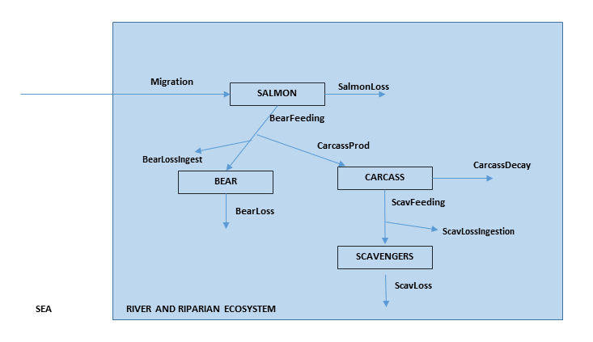
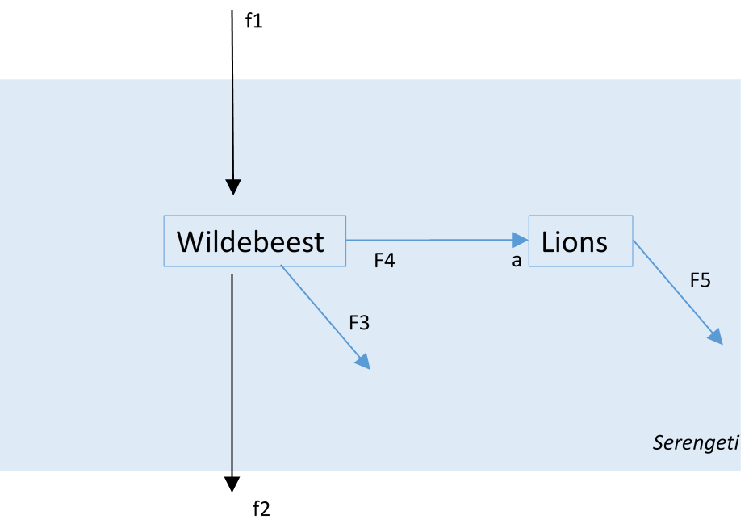
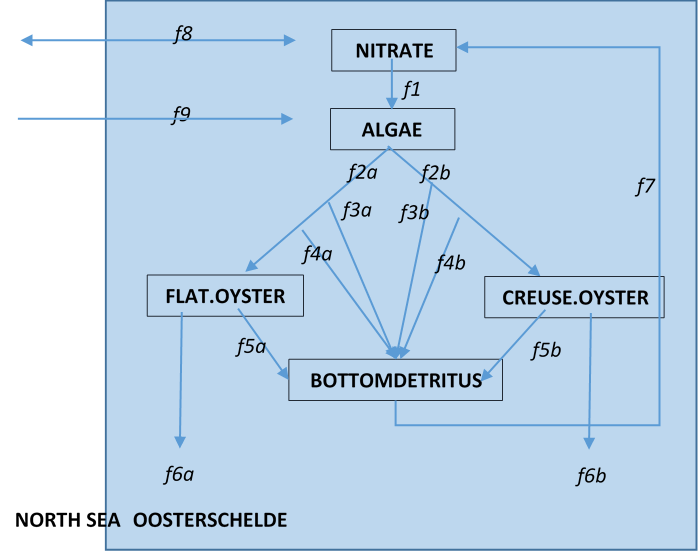

```{r setupA, include=FALSE}
knitr::opts_chunk$set(echo = TRUE)
```

# ANSWERS

## Exercise 1 ANSWER. Carbon cycling in a Canadian National Park

{width=13cm}

* Model domain: entire river and riparian ecosystem 
* Boundary: sea
* Time-scale: months, the length of the migration
* State variables: BEAR, SALMON, CARCASS, SCAVENGERS

Suitable units are: $mol~carbon$ (for the entire area) or $mol~C~m^{-2}$.

The mass balance equations based on the conceptual scheme in Figure 1 are:

$$\frac{dSALMON}{dt} = Migration - BearFeeding - SalmonLoss$$
$$\frac{dBEAR}{dt} = BearFeeding-CarcassProd-BearLossIngest-BearLoss$$
$$\frac{dCARCASS}{dt} = CarcassProd -ScavFeeding - CarcassDecay$$
$$\frac{dSCAVENGERS}{dt} = ScavFeeding -ScavLossIngest - ScavLoss$$


## Exercise 2 ANSWER. Lake biomanipulation

{width=12cm}

* Possible forcing function could be f1, the inflow of DIP.
* Suitable units: $mol~P~m^{-3}$
* The effects of biomanipulation can be investigated by changing f10.

* Mass balance equations are:

$$\frac{dDIP}{dt} = f1+f4+f6-f2-f7$$
$$\frac{dPHYTO}{dt} = f2-f3-f8$$
$$\frac{dZOO}{dt} = f3-f4-f5-f9$$
$$\frac{dFISH}{dt} = f5-f6-f10$$

# Exercise 3 ANSWER.	Population dynamics in the Serengeti National Park

{width=9cm}

* Scale of the model: 	entire park 
* Time scale: 		season
* Units: 			$kg~km^{-2}$
* State variables: 	WILDEBEEST, LIONS
* Reaction processes: 	death (f3, f5), predation (f4)
* Transport: 		immigration (f1) and emigration (f2)

The mass balance equations are:

$$\frac{dWILDEBEEST}{dt} = f1-f2-f4-f3$$
$$\frac{dLIONS}{dt} = a \times f4-f5$$

# Exercise 4 ANSWER. Oysters in the Oosterschelde

* Scale of the model: 	Oosterschelde, mean depth = D. 
* Time scale: 		year
* State variables: NITRATE, ALGAE, CREUSEOYS, FLATOYS, BOTTOMDETRITUS
* Units:
   - $mol~N~m^{-3}$ (NITRATE, ALGAE)
   - $mol~N~m^{-2}$ (OYSTERS, BOTTOM DETRITUS)
* Reaction processes:
   - algal growth (f1)
   - oyster filtration (f2a, f2b)
   - pseudofaeces production (f3a, f3b)
   - faeces production (f4a, f4b)
   - oyster mortality (f5a, f5b) 
   - harvesting (f6a, f6b)
   - detritus mineralisation (f7)
* Transport: 		import of NITRATE (f8) and ALGAE (f9)

{width=10cm}

The mass balance equations are :

$$\frac{dNITRATE}{dt} = f8-f1+f7/D$$
$$\frac{dALGAE}{dt} = f9+f1-f2a/D-f2b/D$$
$$\frac{dFLAT.OYSTER}{dt} = f2a-f3a-f4a-f5a-f6a$$
$$\frac{dCREUSE.OYSTER}{dt} = f2b-f3b-f4b-f5b-f6b$$
$$\frac{dBOTTOMDETRITS}{dt} = f3a+f3b+f4a+f4b+f5a+f5b-f7$$
Units of f1, f8 and f9 are $mol~N~m^{-3}d^{-1}$, while the units of the other processes are $mol~N~m^{-2}d^{-1}$.

We need to take into account the system’s depth (D) when implementing the effect of the bottom detritus mineralisation (in  $mol~N~m^{-2}~d^{-1}$) on the rate of change of nitrate (in $mol~N~m^{-3}~d^{-1}$). This assumes that the flux of nitrate from the bottom to the water column is immediately homogenised over the entire water depth (i.e., the water column is well-mixed).

The same applies for the ingestion by the oysters (f2a, f2b), when taking into account their effects on algae.
