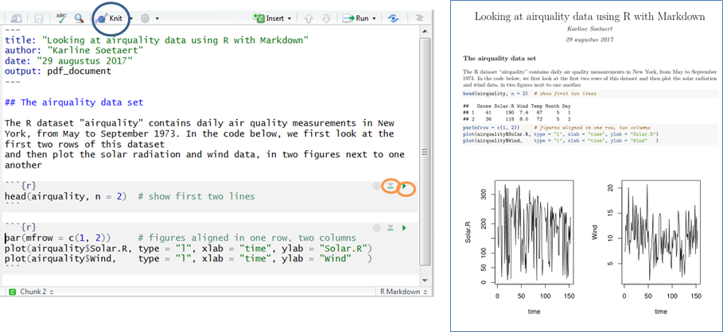

```{r , include=FALSE}
knitr::opts_chunk$set(echo = TRUE)
```

```{r, include = FALSE, silent = TRUE}
library(ReacTran)
library(marelac)
```

# If you are a total beginner

You will need to install couple of programs on your computer to be able to do all the learning, modelling and reporting work in the course. The software we will use is free of charge and used by thousands --- if not millions -- of people all around the world. In this section we will explain step by step how to get started with the installation to make sure that everything works on your computer as it should.

We assume here that you use Microsoft Windows. The sequence of steps for Linux or Mac-OS users is the same, although the actual execution of the steps may be different. 

## Core R software

R is the programming language that we will use in the course. It can be downloaded from \url{http://www.r-project.org/}. Click on the *download R* link, choose a mirror, and download the precompiled binary distribution for your system. On this website, you will also find useful documentation.

First, install the *base* R (e.g., installation file ``R-4.1.0-win.exe``). Subsequently, install *Rtools* (e.g., installation file ``rtools40v2-x86_64.exe``). This will allow you to compile R-packages on your computer, which will be quite important later on. Ensure that you complete the instructions described in the section *Putting Rtools on the PATH* after you have installed *Rtools*.
  
## Rstudio

To execute R code in a nice and comprehensive environment, we will use *Rstudio*.  Go to \url{http://rstudio.org}, choose *Download*, choose *Rstudio Desktop Free*, download the installation package for your system (e.g., ``RStudio-1.4.1717.exe``), and install it.

Open *Rstudio* and test whether you can compile an R-package from source, as described in the instructions for installing *Rtools*.

## R packages

Many of the useful functions are not part of the *R* base program, but are available as *R packages*. They are not necessarily made by the *R* core-development team, but are developed and shared with the R community by experts in other fields, e.g., in the field of modelling.

To install an R-package in Rstudio, click on the *Packages* tab (lower-right window), click on *install*, type the package name, make sure you have checked *install dependencies*, and click *install*. When asked about compilation for packages that need to be installed from sources, click *yes*. Be patient, the package compilation step may take a while.
  
In this course, we will use number of packages. We recommend that you install them in this order:

* ``learnr`` --- This package will allow you to view *tutorials*, which are an essential part of the course. Read more about tutorials below.

* ``deSolve`` (Soetaert et al., 2010) --- This package allows you to perform numerical numerical integration. Thus, it allows you to solve 0-dimensional differential equations, which will be dealt with in the first part of the course.

* ``ReacTran`` (Soetaert and Meysman, 2012) --- This package allows you to solve differential equations describing reaction-transport models in 1D and 2D. This is the core R-package that we will use in the second part of the course. 
  
  - When installing ``ReacTran``, the package ``rootSolve`` (Soetaert, 2009) will also be installed. It is a package that allows you to find the root of functions.
  
* ``marelac`` (Soetaert and Petzoldt, 2018) --- This package contains functions and constants from the aquatic sciences.

* ``devtools`` --- This package allows you to develop R packages. We will use it to install the R package ``RTM`` from the github repository. This package contains much of the teaching material for the course (see below). 

## LaTeX distribution

We will use the typesetting program \LaTeX\ to produce beautifully typeset documents. This program is extremely powerful and versatile, and it is widely used especially by people who want to write equations in their documents. In this course we will use it to convert documents written in R Markdown into aesthetically pleasing PDF documents.
To install \LaTeX, go to \url{https://miktex.org/}, choose *Download*, download the installation file (e.g., ``basic-miktex-21.6-x64.exe``), and install it. During the installation process, select *yes* when asked *Install missing packages on-the-fly*. It is handy to check for updates just after the installation has finished, to be sure that all \LaTeX\ packages are up-to-date.

Restart *Rstudio* if it was running before \LaTeX\ installation.

## Check whether everything is working 

To check whether everything is working at this point, open *Rstudio*, and create a new R Markdown file. This is done from the menu by selecting File $\rightarrow$ New file $\rightarrow$ R Markdown $\rightarrow$ Document. Type the title, your name in the author box, check the ``PDF`` checkbox, and click *Ok*. If everything goes as expected, your *Rstudio* session should look similar as shown in Figure 1.


First, save the file under a different name (e.g., ``test1.Rmd``), and click on the *Knit* button in the top part of the editor pane (useful short-cut: press ``Ctrl+Shift+K``). This will start a compilation process, which should ultimately create the file ``test1.pdf``. 

Note that when you do this for the very first time, the compilation may take a while. This is because *MikTeX* is installing extra \LaTeX\ packages, which are likely missing on your computer as they have not been installed by default during the installation process.\footnote{This assumes that you have selected \emph{yes} when asked \emph{Install missing packages on-the-fly} during \emph{MikTeX} installation. If you forgot to do that, you need to stop the \emph{knitting} process by clicking the red stop button, and go to the folder of your \texttt{test1.Rmd} file. There should be a file called \texttt{test1.tex}. Open it in the native \TeX\ editor that comes with the MikTeX distribution (most likely \texttt{TeXworks}), and compile it with pdf\LaTeX\ from there. In this process, you should be prompted to install missing \LaTeX\ packages.} Be patient and wait until the compilation process is finished.\footnote{At the time of writing this reader, it took about two minutes until the first-time \emph{knitting} and \LaTeX\ compilation were complete. The subsequent compilations, however, take only a few seconds.}

If everything goes well, you should find a file ``test1.pdf`` in the same folder as the ``test1.Rmd``. You can open it in any PDF reader. Note, however, that *Acrobat reader*, which is a commonly used PDF reader, may not be the best choice. This is because the PDF file is *locked* for writing when open by *Acrobat reader*. This means that if you want to re-knit your Rmd file to a PDF file, you may end up with a writing error rather than an updated PDF file. To avoid this, you will need to close the PDF file in *Acrobat reader* before clicking the *knit* button in *Rstudio*. We recommend a better solution: use a PDF viewer that does *not* lock the viewed PDF file. One such program is called ``SumatraPDF``, which can be downloaded from \url{http://www.sumatrapdfreader.org}.

## RTM package

Much of the teaching material that you will study during the course is present in the R-package called ``RTM`` (short for Reaction-Transport Modelling). This package is currently available from a Github repository ``dynamic-R/RTM`` (\url{https://github.com/dynamic-R/RTM}). You can install it by typing the following command in the R-console:

```devtools::install_github("dynamic-R/RTM", depend=TRUE)```

### RTM tutorials

First of all, the package contains *tutorials*. You will study these to gain basic knowledge about modelling in general as well as about modelling in R. We recommend that you watch the video first. Then solve the tasks and exercises, which will prepare you for the exam.

Select the *tutorial* tab in Rstudio, and then click on the *Start Tutorial* button to view any of the RTM tutorials (Figure 2).


Alternatively, type in the R-console
```
require(RTM)
RTMtutorial("?")
```
to see a list of available tutorials, as shown here:
```
                     x                                      description
1         introduction                      About the course at Utrecht
2                  why                          Why modelling is useful
3           conceptual                         Making conceptual models
4          massbalance                  Creating mass balance equations
5              Rmodels              Dynamic modelling in the R language
6           largescale        Large-scale models (e.g. earth's C-cycle)
7             chemical                    Elementary chemical reactions
8          equilibrium      Equilibrium (reversible) chemical reactions
9            enzymatic                              Enzymatic reactions
10        partitioning   Chemical reactions partitioning between phases
11             ecology                             Ecological reactions
12  transportProcesses                   The general transport equation
13     transportFluxes               Advection and diffusion/dispersion
14     transportPorous               Reaction transport in porous media
15 transportBoundaries          Boundary conditions in transport models
16          transportR Modelling Reaction tranport in porous media in R
```
Select the one you want to view (e.g., ``conceptual``) and then start it by typing in the R-console
```
RTMtutorial("conceptual")
```
or
```
RTMtutorial(3)
```

### RTM exercises

### RTM readers


# Scientific programming practice---Rmarkdown

Scientific research often involves computation, e.g., to convert numbers to different units, to calculate derived quantities, to perform statistical analyses on the data, or to create and solve environmental models. More and more these computations are done by writing computer codes, or scripts. These scripts consist of a sequence of commands that tell the computer what it should do. 

It is good programming practice to write computer codes that are easy to understand. This not only facilitates exchange of these codes with other people (e.g., colleagues, your supervisor or lecturer during class), but it will also give you a headstart if you want to use these codes in the future. 

In addition, well-documented code is an essential step to reproducible and reusable science.

## A first coding attempt

Consider the following piece of an R-code:

```{r, eval = FALSE}
head(airquality,n=2)
par(mfrow=c(1,2))
plot(airquality$Solar.R,type="l",xlab="time",ylab="Solar.R")
plot(airquality$Wind,type="l",xlab="time",ylab="Wind")
```

While we can more or less guess what this code does, it is not clear where the data come from and what the purpose of this code is. Also, the statements themselves are not legible. 

## Adding structure and comments in codes

Readability of code can easily be increased by adding *structure* to the code: alignment of comparable sections, use of spaces and more. 

One way to document the above code is to add comments to it. In *R*, comments are preceded by a hash-sign ("#"). 

The following code is self explanatory:

```{r, eval = TRUE, fig.width = 8, fig.height = 4, fig.cap="Plotting example."}
# The R dataset "airquality" contains daily air quality measurements in New York,
# from May to September 1973. 
# In the code below, we first look at the first two rows of this dataset
# and then plot the solar radiation and wind data, in two figures next to one another
# source code written by Karline Soetaert

head(airquality, n = 2)  # show first two lines

par(mfrow = c(1, 2))     # figures aligned in one row, two columns
plot(airquality$Solar.R, type = "l", xlab = "time", ylab = "Solar.R")
plot(airquality$Wind,    type = "l", xlab = "time", ylab = "Wind"   )
```

If we execute this code, then the first two lines of the dataset will be printed to the console, and the graphs will be created and included in a figure within the document. However, the output will be separate from the code that generated it.

# R plus markdown---creating fully integrated documents

Even better is to have the text, the code and the output in one document. This is what *R plus markdown* does. When the final document is "created", the R-code is executed and the results are merged in the document. 



Figure 2 shows how this works. The *Rmarkdown* document (screencapture from Rstudio) is on the left, while the result --- after executing this document via *knit* --- is on the right.

There are several parts in the *Rmarkdown* document:

* The title section (called *yaml header*) is between the two '- - -' sections at the start of the document. Here you can give a title, specify the author, include a date, abstract, etc.
* Headings are defined with #, or ##, or ### for first, second and third level headings, respectively.
* Text sections can include many features, for instance, lists are created by using an asterisk ('*') for bullets and numbers such as '1', '2', etc., for numbered lists. Figures, tables, equations can be added as well, and so on.
* The *R*-code is embedded between the $`\,`\,`\{r\}$ and $`\,`\,`$ symbols. On the top-right position of such a section you will find three symbols (of which two are marked with orange circles in figure 2). Pressing the middle symbol will run all code chunks above, while the right symbol will run the current *R*-chunk. If you move with the cursor to a specific line within the *R*-chunk and press Ctrl+Enter, the current line in the chunk will be executed. If there is any output, it will be displayed in the console.

Finally, the "Knit" button (encircled in blue in the figure) will execute the *Rmarkdown* document and generate the document on the right. You can choose between HTML, PDF, WORD or other types of documents.\footnote{Note that before you can generate a PDF document you will need to have \LaTeX\ installed. \LaTeX\ is a typesetting program widely used in the scientific community. Search the internet to learn how to install it on your computer. Additionally, especially when working under Windows, you may need to install the \textit{R}-package \textit{tinytex} to make the compilation of your \textit{Rmarkdown} documents into PDF work under \textit{Rstudio}. Read carefully the comments and warnings during the installation of \textit{tinytex}.} This final document contains both the *R*-code and the results. It fully documents the analysis.

## Getting started with Rmarkdown

The easiest way to get started is to create a first *R* markdown document using Rstudio:
Go to the menu and press "File/new File/R markdown". This will open an *R* markdown file that already contains some *R* code and text. Do this, and look at the contents of this document. 

Two useful information sources are accessible from the Rstudio menu: *help/cheatsheets/R markdown Cheat Sheet* and *help/cheatsheets/R markdown Reference Guide*. 

Short help on the text format that can be used in markdown documents can be found in *help/Markdown quick reference*.

## Tasks

Open the Rmarkdown file called "Rmarkdown_small.Rmd" in Rstudio. The file is available via Blackboard and was used to generate Figure 1.

  * Try the different buttons featuring on the top right of the R-code.
  * Change the title of the document and make yourself the author. 
  * Generate a WORD document and a HTML document.\footnote{HTML is a language used to display webpages.} 
  * If you know a bit of *R*, create a second plot that depicts the temperature and the ozone concentration using the same dataset.

\newpage

# A quick overview of R and Rstudio

  An *R*-code is legible once you realise that:

* <- is the assignment operator (e.g., A <- 1 assigns the value of 1 to variable A).\footnote{Note that within an R-code edited in Rstudio, you can quickly type this operator by pressing a shortcut Alt+minus. This will also include spaces around the operator for increased legibility of the command. This works well for Windows and Linux users. Mac-OS users may need to search the internet for a suitable shortcut.}
* everything starting with a hash-sign (#) is considered a comment.
* *R* is case-sensitive: *a* and *A* are two different objects.

Figure 3 shows a screen capture of a typical *Rstudio* session, with the editor (upper left), the R-console (lower left), a help page (upper right) and a plot (lower right). Note the context-sensitive syntax used by the editor (green=comments, blue=reserved words).

\begin{figure}[!hb]
\centering
\includegraphics[width=0.8\textwidth]{Rstudio.png}
\caption{Screen capture of an Rstudio session.}
\end{figure}

## Console versus scripts versus Rmarkdown

There are three ways in which to work with R.

### Console

We can type commands into the *R* console window at the command prompt (>) and use *R* as a powerful scientific calculator. For instance, enter in the console window:

```{r, eval = FALSE}
 pi*0.795^2 ; 25*6/sqrt(67) ; log(25) ; log10(25)
```

Here *sqrt*, *log* and *log10* are built-in functions in R, *pi*  is a built-in constant, and the semi-colon (;) is used to separate R-commands entered on one line.

In the console window, the "UP" and "DOWN" arrow keys can be used to navigate through previously typed commands (command history). Note that typing commands in the console is not the most efficient way of using *R*, especially if you want to debug and save your work for later use (see next).

### Scripts

A better way of using *R* is by creating R-scripts in Rstudio's editor and save them in a file (e.g., "MyModel1.R") for later re-use.

R-scripts are sequences of R-commands and expressions. These scripts
should be submitted to *R* before they are executed.
This can be done in several ways:

  * by typing in the R-console window:
     
```{R, eval = FALSE }
 source ("MyModel1.R") 
```

  *	by opening the file in a text editor, copying the *R*-script to the clipboard (ctrl-C) and pasting it (ctrl-V) into the *R*-console window;
  - If you use *Rstudio*, which we recommend, you can either execute the current line (Ctrl+Enter), a section or the entire file (Ctrl+S).

  Throughout these notes, the following convention is used:

```{R, eval = FALSE }
> 3/2
```

  denotes an *R*-code (> is the prompt), and 

```{R, eval = FALSE }
[1] 1
```

is an *R* output, as written in the console window.

### Rmarkdown

The most integrated way to work with *R* is by using *Rmarkdown*. This is what we will do in the modelling course. This means that you will make, for each modelling project or exercise, a document that contains both the R-code AND the text that provides information on the 'how' and 'why'. 

Typically you will use the Rmarkdown document to include everything that you want to show to us, or to keep for later use. You will still use the console to do some quick calculations, or to produce a quick graph, to see whether you are on the right track. 

## Getting help, examples, demonstrations

*R* has an extensive help facility. Apart from the Help window launched
  from the Help menu, it is also available from   the command line prompt.

For instance, typing

```{R, eval = FALSE }
 ?log
 ?sin
 ?sqrt
 ?round
 ?Special
```
  
will explain about logarithms and exponential functions, trigonometric
functions, and other functions.

```{R, eval = FALSE }
 ?Arithmetic
```

lists the arithmetic operations in R.
  
```{R, eval = FALSE }
 help.search("steady")
```

will list occurrences of the word "steady" in R-commands.

Sometimes the best help is provided by the very active mailing list.
If you have a specific problem, just type *R: your problem*
on your search engine. Chances are that someone encountered the problem
and it was already solved.

Most of the help files also include examples. You can run all of them by
using R-statement *example*.

For instance, typing into the console window:

```{R, eval = FALSE }
 example(pairs)
```

will run all the examples from the pairs help file.
(Try this, *pairs* is a very powerful way of visualizing
pair-wise relationships.)

Alternatively, you may select one example from the help file, copy it to the clipboard
(ctrl-C for  windows users) and then paste it (ctrl-V) in the console window.
In addition, the *R* main software and many R-packages come with
demonstration material. Typing
  
```{R, eval = FALSE }
 demo()
```

will give a list of available demonstrations in the main software.
  
```{R, eval = FALSE }
 demo(transport1D)
```
  
will demonstrate some modelling output generated with package 
  *ReacTran*.
  
## Small things to remember

* Pathnames in *R* are written with forward slashes ("/"). Note that this contrasts to the convention used in Windows, which uses a backslash ($\backslash$) to separate folders in the paths.

To set a working directory in R, use this command:
      
```{R, eval = FALSE }
setwd("C:/R code/") 
```
Within *Rstudio*, you can do this via menu *Session*/*Set Working Directory*.

*  If a sentence on one line is syntaxically correct, *R* will execute it, even if the intention was that the sentence proceeds on the next line. 

For instance, if we write
      
```{R, eval = FALSE }
A <- 3 + cos(pi)
    - sqrt(5)
```

then A will be assigned the value of $3+cos(\pi)$ and *R* will display the value of $-\sqrt 5$ ($-2.236068$) in the console.

In contrast, in the following lines,
      
```{R, eval = FALSE }
A <- 3 + cos(pi) -
     sqrt(5)
A
```

*R* will assign to *A* the value of $3+cos(\pi)-\sqrt 5$, as the sentence on the first line was not syntaxically finished. In this case, *R* has (correctly) assumed that the sentence continued on the next line.

Be careful if you want to split a complex statement over several lines!
These errors are very difficult to trace, so it is best to avoid this practice.

## Exercises---Using R as a calculator

It is very convenient to use *R* as a powerful calculator. This can best
be done from within the *R*-console.

Use the console to calculate the value of:
   
* $(4/6*8-1)^{2/3}$ 
* ln(20)
* $log_2(4096)$
* $2*\pi*3$
* $\sqrt {2.3^2  + 5.4^2  - 2*2.3*5.4*\cos (\pi /8)}$

Hint: you may need to look up some help for some of these functions. Typing 
```{R, eval = FALSE }
?"+"
?log
```
will display help for the common arithmetic operators and about the built-in *R*-function *log*.


\clearpage

# R-variables

*R* calculates as easily with *vectors*, *matrices* and *arrays* as with *single numbers*.

*R* also includes more complex structures such as *data frames* and *lists*,
which allow to combine several types of data.

Learning how to create these variables, how to address them and modify
them is essential if you want the make good use of the *R* software.
  
## Numbers, vectors, matrices and arrays

### Value assignment

When variables are used, they need to be initialised with numbers. Here is an example.
  
```{r}
A <- 1
B <- 2
A + B
```

R can take as arguments for its functions single numbers, vectors,
  matrices, or arrays.


```{r}
V <- exp(-0.1)
```

calculates the exponential of $-0.1$ ($e^{-1}$). The operator <- assigns the result of this calculation to variable V.

V can then be used in subsequent calculations:

```{r}
log(V)
```

Note that the assignment of a value to V does not display it.

To display V we simply write:

```{r}
 V
```

Alternatively, we may assign the result of calculations to a variable AND
view the results, by embracing the statement between parentheses:

```{r}
 ( X <- sin(3/2*pi) )
```

Apart from integers, real and complex numbers, *R* also recognizes infinity
(*Inf*) and Not a Number (*NaN*). Try:

```{R, eval = FALSE }
 1/0
 0/0
 2.3e-8 * 1000
```

Note that *e-8* denotes $10^{-8}$.

### Vectors

Vectors can be created in many ways; most often we will use:

*	The function *c()* combines numbers into a vector\footnote{This is perhaps THE most important function in R.}
*	The operator ":" creates a sequence of values, each by 1 larger (or smaller) than the previous one 
* A more general sequence can be generated by R-function *seq*

For instance, the commands

```{R, eval = FALSE }
c(0, pi/2, pi, 3*pi/2, 2*pi)
seq(from = 0, to = 2*pi, by = pi/2)
seq(0, 2*pi, pi/2)
seq(to = 2*pi, from = 0, by = pi/2)
```

will all create a vector, consisting of: 0, $\pi/2, \pi, \ldots, 2\pi$.

Note that R-function *seq* takes as input (amongst others) parameters *from*, *to* and *by* (second line). If the order of these arguments is kept, they do *not* need to be specified by name (third line). But we recommend that you *always* use the names of the input argument if you want to specify their value. In this case, you can change the order of the input arguments as you like (fourth line).

The next command calculates the sine of this vector and outputs the result:

```{r}
sin( seq(0, 2*pi, pi/2) )
```

The next statements

```{r}
 V <- 1:10
 sqrt(V)
```

create a sequence of integers between 1 and 10 and take the square root
  of all of them, displaying the result to the screen.
  The operator <- assigns the sequence to V.


 A peculiar feature of *R* is that the elements of a vector can also
  be given *names*:

```{r}
( Ocean <- c(total.mass = 1.35e25, volume = 1.34e18, mean.depth = 3690) )
names(Ocean)
```

### Matrices

  Matrices can also be created in several ways; most often we will use the 
  R-function *matrix*:

The statement:

```{r}
A <- matrix(nrow = 3, data = c(1, 2, 3, 4, 6, 8, 10, 12, 14))
```
  
  creates a *matrix* A, with three rows, and, as there are nine elements, three columns.
  Note that the *data* are input as a vector (using the c() function), and these values are sorted into the matrix column after column (by default).

```{r}
A
sqrt(A)
```

  The above statements display the matrix followed by the square root
  of its elements.

## Selecting and extracting elements

  To select subsets of vectors or matrices, we can either

*	specify the numbers of the elements that we want
*	specify the names of the elements that we want 
*	specify a vector of logical values (TRUE/FALSE) to indicate which elements to include (TRUE) and which not to include (FALSE). This uses logical expressions


### Simple indexing

The elements of vectors, matrices and arrays are indexed using the
  *[]* operator:

To show only the volume of our vector *Ocean*:
```{r}
Ocean["volume"]
```

The following statement takes the elements on the $1^{st}$ and $3^{rd}$ row and on the first two columns of matrix *A*.

```{r}
A[c(1, 3), 1:2]
```

If an index is omitted, then all the rows ($1^{st}$ index omitted) or  columns ($2^{nd}$ index omitted) are selected. In the following:

```{r}
A[1:3, ] <- A[1:3, ] * 2
A
```

the elements on the first three rows of A are multiplied with $2$.
  
Similar selection methods apply to vectors:

```{r}
V[1 : 10]
V[seq(from = 1, to = 5, by = 2)]
```


### Logical expressions

Logical expressions are often used to select elements from vectors and
matrices that obey certain criteria.

*R* distinguishes logical variables *TRUE* and *FALSE*, represented by the
integers $1$ and $0$.\footnote{Note that variables \textit{T} and \textit{F} are reserved in \textit{R} to represent the logical \textit{TRUE} and \textit{FALSE}, respectively. Therefore, if you want to avoid unexpected consequences, you should \textit{not} use \textit{T} and \textit{F} as variables to which you assign values. For example, it might be tempting to use \textit{T} to denote temperature, or \textit{F} to denote flux. It is recommended that you do \textit{not} do this, but use instead more intuitive names such as \textit{Temp} and \textit{Flux}.}

The following will return *TRUE* for values of sequence V that are greater than 1:

```{r}
(V <- seq(from = -2, to = 2, by = 0.5))
 V > 1
```

while

```{r}
V [V > 1]
```

will select the values from V that are greater than 1, and 

```{r}
V [V > 1] <- 0
```

will set to zero all elements in V that are greater than 1.

## Removing elements

When the index is preceded by a "-", the element is removed. For example,

```{r}
 A[ ,-1]
```

will show the contents of matrix *A*, except the first column, while the command

```{r}
V[- V < 0]
```

will only show the positive elements of *V*.
  
## More complex data structures

Frequently used data structures that are more complex than vectors or 
  matrices are *data.frames* and *lists*.

### Data-frames

A *data.frame* superficially looks like a *matrix*, but its columns 
may contain different types of elements (e.g. one column may contain strings,
another integers etc...). 

For instance, the data set *iris* is of class *data.frame*.

```{r}
head(iris)
```

The data set contains strings and numbers. Each column has a name, and can be 
accessed by its name using the dollar-sign ('$'):

```{r}
mean(iris$Petal.Width)
```

### Lists

A list is a combination of several objects; each object can be of
  different length. For instance:

```{r}
 LL <- list(Vector = V, Matrix = A)
```

  will combine the previously defined vector V and matrix A in a list called 
  *LL*.

```{r}
names(LL)
LL
```

### Selecting elements from data frames and lists

Lists and data frames can be accessed by their names, or by the square bracket ('[ ]') and double square bracket ('[[ ]]') operators.

Note: The object resulting from a selection using single brackets '[ ]',
  will be a *data.frame* respectively a *list* itself;
  with double brackets '[[ ]]', one obtains a *vector* (data.frames)
  or a variable data-type (lists).

For instance:

```{r}
LL$Vector * 2
```

will multiply all values of element *Vector* with 2.

```{r}
mean(LL[[1]])
```

will calculate the mean of element *Vector*.

## Exercises---vectors and sequences

### Mean of a vector
*	Use *R*-function *mean* to estimate the mean of two numbers, 9 and 17. (You may notice that this is not as simple as you might think! Tip: use the *c()* operator.)

### Sediment depth profiles 
*	For a sediment model, we divide 10 cm of sediment into thin layers, 
        each 1mm thick. These are thin slices, because it is assumed that 
        porosities, concentrations,... remain constant within 
        each layer. We need to know the depth in the centre of each sediment layer. 
        To do so, we need to create a sequence of depth values, 
        extending from 0.05 cm to 9.95 cm, at 1 mm intervals.
    - Create this sequence, put it in a vector called *depth*. Use R-function  *seq*. 
    - Display this vector.
* Porosity, the volumetric water content of the sediment is 
        often described as an exponentially decreasing function; for instance, 
        following formula generates a typical porosity profile for a deep-sea sediment:
        
$$porosity = 0.7+(1-0.7)*\exp(-1*depth)$$
         
   - Calculate the porosity for every value in *depth*. Save the results in 
        a vector called "porosity". 
   - What is the porosity near the surface (0.05 cm); what is the porosity at 9.95 cm.
        Put these two values in a vector, called *V*.
   - What is the mean porosity in the entire 10 cm? 
   - What is the mean porosity in the upper cm? 
   - Now plot porosity versus depth as follows:

```{r, eval = FALSE}
       plot(depth, porosity)
```

### Estuarine morphology

*	The Westerschelde estuary has a trumpet-shaped morphology, i.e.
        its cross-sectional area increases in a sigmoidal fashion from 
        Rupelmonde near the river towards Vlissingen near the sea. 
        
* The estuary is 100 km long, and the cross-sectional surface, $A$, as a function of distance ($x$), in  $m^2$, can be approximated with the following equation:
        
$$A(x) = A_r + dA * \frac{x^p}{x^p + {k_s}^p}$$
        
where $dA = A_s - A_r$, p = $5$, ks = $50000$ m,
$A_r = 4000 m^2$, $A_s = 76000 m^2$. Here $A_r$ and  $A_s$ are the 
cross-sectional surfaces at the boundary with the *r*iver and the 
*s*ea respectively. 
        
* The estuary is divided in 200 boxes. Create a sequence of $x$-values 
    that contain the position in the middle of each box, from the river 
    to the sea.
    -	For each box calculate the cross-sectional surface area; put it in a 
        vector called *Area*.
    -	For modelling purposes, we need the *volume* of each box, 
    rather than the cross-sectional area. Create a vector, 
    called *Volume* that contains the volumes of each box.
    -  What is the total estuarine volume ? (and what are the units?)
    - Plot the cross-sectional surface area versus distance from the river.
    - Plot the estuarine volume per box, as a function of the box number.

### Plotting observed data

*	The following oxygen concentrations were measured, at hourly intervals, 
starting at 8 o'clock, from the jetty near the NIOZ institute:

(210, 250, 260, 289, 280, 260, 270, 260).

* Make a plot that displays these data. First create a vector containing the 
hours at which measurements were performed. Then make a vector with the oxygen
concentrations.

\clearpage

# R functions 

  One of the strengths of *R* is that one can make user-defined functions
  that add to *R*'s built-in functions.

## Function definition

Typically, complex functions are written in *R* script files or in an R-markdown document, as you will want to use the function several times. For instance,

```{r, echo = FALSE, results = "hide"}
options(prompt = " ")
```

```{r}
Circlesurface <- function (radius) 
    return(pi*radius^2)
```

defines a function (called *Circlesurface*)  which takes as input
  argument a variable called *radius*  and which returns the value
  $\pi*radius^2$ (which is the surface of a circle).

After submitting this function to *R*, we can use it to calculate the surfaces of circles with given radius:
  
```{r}
Circlesurface(10)
Circlesurface(1:10)
```

the latter statement will calculate the surface of circles with radii 1, 2, ..., 10.

More complicated functions may return more than one element:

```{r}
Sphere <- function(radius) {
 V  <- 4/3 *pi*radius^3
 S <- 4 *pi*radius^2
 return( list(volume = V, surface = S) )
}
```

Here we recognize

*	the function heading ($1^{st}$ line), specifying the name of the function (Sphere) and the input parameter (radius)
*	the function specification. As the function comprises multiple statements, the function specification is embraced by curly braces $\{ \ldots \}$.
*	The return values (last line). Function *Sphere* will return the
      volume and surface of a sphere, as a *list*.
 
  The earth has approximate radius 6371 km, so its volume (km3) and surface (km2) are:
  
```{r}
Sphere(6371)
```

The next statement will only display the volume of spheres with radius 1, 2, $\ldots$ 5
  
```{r}
Sphere(1:5)$volume
```
  
Sometimes it is convenient to provide default values for the input parameters.

For instance, the next function estimates the density of "standard mean
  ocean water" (in $kg~m^{-3}$) as a function of temperature in $^{\circ}$C, TC (and for salinity=0 and pressure = 1 atm) (Millero, 1981).
  
The input parameter TC is by default equal to 20 $^{\circ}$C:
  
```{r}
Rho_W <- function(TC = 20) {
  rho <- 999.842594 + 0.06793952 * TC - 0.00909529 * TC^2 +
         0.0001001685 * TC^3 - 1.120083e-06 * TC^4 + 6.536332e-09 * TC^5
  return(rho)
}
```

Note that, within the function body, we ended the first line with a '+' in order to make clear that the
statement is not finished and continues on the next line. It would have
  been wrong to put the '+' on the next line (and very difficult to trace this error).

Calling the function without specifying temperature (argument *T*) uses the default value ($TC=20$):

```{r}
Rho_W()
Rho_W(20)
Rho_W(0)
Rho_W(TC=0)
```

## Functions in R-packages

For the modelling class you will use many functions from two packages: *marelac* and *ReacTran*.

### The marelac package

The R package *marelac* contains many functions useful for the aquatic sciences.

Try:

```{R, eval = FALSE }
?marelac
```

to see what it contains.

For instance, its function *sw_dens* estimates the density of seawater 
as a function of salinity (*S*), temperature(*t*) and pressure 
(*p*) respectively, and using three different funtions (*method*).

To see how it is used type:

```{R, eval = FALSE }
?sw_dens
```

To estimate the density for a salinity ranging from 0 to 10, and a temperature of 15 dgC, write:

```{r}
library(marelac)
sw_dens(S = 0:10, t = 15)
```

### The ReacTran package

The *ReacTran* package has been written especially for solving reactive transport models. It contains many funtions to make this type of modelling simple.

For sediment reactive transport modelling for instance, one not only needs a value for the 
  porosity in the *centre* of the boxes, but also at the box *interface*. As this requires quite complicated bookkeeping,  R-package *ReacTran* contains two functions that do that for you.
  
*	Function *setup.grid.1D* specifies a 1-Dimensional *grid*, 
  i.e. it will divide a sediment into thin layers, an estuary into 1km 
  thick boxes, a ciliate organism into 1 $\mu m$ thick concentric spheres, etc.
*	Function *setup.prop.1D* calculates a certain *property* 
  on this 1-D grid.

For instance, to subdivide 5 cm of sediment into 10 layers we write:
  
```{r}
sed <- setup.grid.1D(L = 5, N = 10)  
```  
  
This function returns a list, containing many elements that  are needed for reactive transport models:

```{r}
sed
```     

It is now simple to define the porosity on this grid: first we 
define a function that estimates, for a certain sediment depth x
 the corresponding porosity. Then we use *ReacTran* function 
 *setup.prop.1D* to calculate the porosity on this grid:

```{r}
 porfunc <- function (x) return(0.7 + 0.3*exp(-x))
 porosity <- setup.prop.1D(func = porfunc, grid = sed)
```   

Porosity is now defined, both in the middle of slices and at the slice interfaces: 

```{r}
 porosity
```

## Exercises

### R-function to estimate saturated oxygen concentrations

The saturated oxygen concentration in water ($\mu mol~kg^{-1}$), also called oxygen solubility, can be calculated based on an empirical formula $SatOx = e^A$, where
  
  $$A = -173.9894 + 25559.07/T + 146.4813 \times log_e(T/100) -22.204 \times T/100 + $$
  $$ S \times (-0.037362+0.016504 \times T/100-0.0020564 \times T/100 \times T/100)$$
  
where T is temperature in Kelvin (Tkelvin = Tcelsius + 273.15) and S is salinity (reported as unitless, but meaning a value in g/kg).

  *	Make a function that implements this formula; the default values for temperature and salinity are 20$^{\circ}$C and 35 respectively.
  * What is the saturated oxygen concentration at the default conditions? (A: 225.2346)
  *	Estimate the saturated oxygen concentration for a range of temperatures from 0 to 30 dgC, and salinity 35. 
  * Tip: $e^A$ is implemented in R as *exp(A)*.

### Molecular diffusion coefficient

Package *marelac* contains a function to calculate molecular diffusion 
coefficients. 

  * Estimate the molecular diffusion coefficient for $O_2$ and $CO_2$, for 
  salinity = 20 and temperature = 10 dgC. What are the units?
  Convert to $cm^2 d^{-1}$. 
  
  Note: the *diffcoeff* function from *marelac* returns a *data.frame* or a *list*.
  For plotting, it is easiest to subset this so as to have a vector. So, 
```{r, eval = FALSE}  
diffcoeff()$O2
```
will provide the output in a format that is easy to work with.

* Estimate the molecular diffusion coefficient for $O_2$ and $CO_2$ 
  for a temperature ranging from 1 to 30. 
  Make a temperature - diffusion coefficient plot for $O_2$, units of $cm^2 d^{-1}$.
* Add to this plot the temperature-diffusion coefficient relationship 
  for $O_2$ at salinity = 0. Use the R function *lines* or *points* 
  to add these data.


### R-function sphere

Organisms can have many shapes, from spherical to rod-like to amorphous.
  
In order to create reactive transport models that describe for instance 
 the oxygen concentration in the body of these organisms, we need to estimate the surface area at 
 certain distances from the centre of their body.
  
Assume a spherical ciliate with a diameter of 100 $\mu m$. For modelling purposes, assume
 that this ciliate consists of concentric spheres, each 1 $\mu m$ thick. 

* What is the area of each of these concentric spheres, in mm$^2$? Implement as a function.

### Porosity profile and estuarine morphology as a function

* Implement the porosity profile of previous exercise as a function that
  takes as input the sediment depth. 
  
* Implement the estuarine morphology of previous exercise as a function. 
  Return both the cross-section area and volume for each box.


### Estuarine morphology using ReacTran

* Use function *setup.grid.1D* to subdivide the estuary in 200 compartments.
* Use function *setup.prop.1D* to calculate the estuarine cross sectional surface on this grid.


\clearpage

# Solving ordinary differential equations in R

In the modelling class, you will specify many models as differential equations. Here it is shown how differential equations are implemented and solved in R.

Consider the following set of two ordinary differential equations:
$$   \frac{{dA}}{{dt}} = r \cdot (x - A) - k \cdot A \cdot B $$
$$\frac{{dB}}{{dt}} = r \cdot (y - B) + k \cdot A \cdot B $$
Here, *A* and *B* are called the "state variables", $\frac{dA}{dt}$ and $\frac{dB}{dt}$ are the "time derivatives" (also called the rate of change), while *r*, *x*, *y* and *k* are constant "parameters".

## Specifiying the differential equation model

The first step to solving this in *R* is to define the *model function*, which specifies the right-hand side of the differential equations.\footnote{Note that in *R* we use "*" for multiplication, and not $\cdot$ or $\times$ as in the mathematical formalism.}

This function has three different arguments as input: the actual time (*t*), the values of the state variables (*state*) and the values of the parameters (*parameters*). 
  
```{r}
model <- function(t, state, parameters) {
  
with( as.list(c(state, parameters)), {
  
 dA <- r*(x-A) - k*A*B
 dB <- r*(y-B) + k*A*B
 return (list(c(dA, dB), sum = A+B))
 
 })
}
```

This function simply calculates the time derivatives of the state variables (*dA* and *dB*) and an output variable called "sum". The derivatives are combined in a vector, and both this vector and the output variable are returned as a list. 

The R-statement "with( as.list(c(state,parameters)), {" ensures that the state variables and parameters can be addressed by their names. This statement embraces all other statements in the function---it ends at the line that says "})".
  
## Solving the differential equation model

Before we can actually solve this model, we need to:

* give values to the parameters (*parameters*);
*	assign initial conditions to the state variables (*state*);
*	generate a sequence of time values at which we want output  (*time.seq*).

```{r}
parameters <- c(x = 1, y = 0.1, k = 0.05, r = 0.05)
state      <- c(A = 1, B = 1)
time.seq   <- seq(from = 0, to = 300, by = 1)
```
 
The model can now be solved. To do so, we use the integration routine *ode*, which can be found in R package *deSolve* (Soetaert et al., 2010). This package is loaded first (using function *require*).

```{r}
require(deSolve)
```

The routine *ode* will calculate a value for the state variables *A* and *B* at each time value specified in the vector *time.seq*. It does so by numerical integration. The name (ode) hints at the type of differential equations that this function solves, which are *O*rdinary *D*ifferential *E*quations. 

The actual numerical solution of our ODE model is obtained within the following single statement: 

```{r}
out <- ode(y = state, times = time.seq, func = model, parms = parameters)
```

The output is stored in a matrix, called *out*. All we need to do now is to plot this model output. Before we do so, we can have a look at the first part of the output matrix :

```{r}
head(out)
```

The data are arranged in three columns: first the time, then values of the state variables *A* and *B* at each time point, followed by the output variable called "sum". 

We can plot the output in several ways. The easiest is to plot the entire object at once, either plotting each variable in a separate graph,

```{r, fig.width=8, fig.height = 3}
plot(out, xlab = "time", ylab = "concentration", lwd = 2, type = "l", mfrow=c(1,3))
```

or all variables in one graph.

```{r, fig.width=4, fig.height = 4, fig.align='center'}
matplot.0D(out, lty = 1, lwd = 2, main=NA)
```

We can run the model with different values of the parameter *k*, store the output in matrix *out2* and plot the first and second run at the same time. In the code below, we first take a copy of the parameter vector (*parms2*), and then change the parameter named ("k"); we then solve the model, passing the updated parameter vector (*parms = parms2*). We can plot the outcome of the two runs at once (note that by the argument *mfrow = c(1,3)*, we force the output to be in one row and 3 columns - mfrow stands for multiple figures in a row).

```{r, fig.width=8, fig.height = 3}
parms2      <- parameters
parms2["k"] <- 0.5

out2 <- ode(y = state, times = time.seq, func = model, parms = parms2)

plot(out, out2, lty = 1, lwd = 2, mfrow = c(1, 3))
```


For completeness we here list the entire code to solve and plot this differential equation.

```
model <- function(t, state, parameters) {
  
with (as.list(c(state, parameters)), {
  
 dA <- r*(x-A) - k*A*B
 dB <- r*(y-B) + k*A*B
 return (list(c(dA, dB), sum = A+B))
 
 })
}

parameters <- c(x = 1, y = 0.1, k = 0.05, r = 0.05)
state      <- c(A = 1, B = 1)
time.seq   <- seq(from = 0, to = 300, by = 1)

require(deSolve)
out <- ode(y = state, times = time.seq, func = model, parms = parameters)
plot(out, xlab = "time", ylab = "concentration", lwd = 2, type = "l")
```

## Steady-state conditions of differential equations.

Sometimes we are interested in the conditions of a differential equation where the state variables do not change anymore. One way to obtain this is to use the function *steady* from the R-package **rootSolve** (Soetaert, 2009):

```{r}
require(rootSolve)
STD  <- steady(y = state, func = model, parms = parameters)
STD$y; STD$sum
```

## Exercises---Solving ordinary differential equations in R

### The Lotka-Volterra model

The Lotka-Volterra model is a famous model that either describes predator-prey interactions or competitive interactions between two species. A.J. Lotka and V. Volterra formulated the model almost simultaneously in the 1920's.

*	Write a script file that solves the Lotka-Volterra model:

$$ \frac{{dx}}{{dt}} = a \cdot x \cdot (1 - \frac{x}{K}) - b \cdot x \cdot y$$
$$     \frac{{dy}}{{dt}} = g \cdot b \cdot x \cdot y - e \cdot y$$

* use for initial values *x = 670*, *y = 610* and for parameter values: *a = 0.04*, *K = 1000*, *b = 5e-5*, *g = 0.8*, *e = 0.008*.
*	Run the model for 100 days, and call the output *out*.
* Plot the outcome.
*	Now run the model with other initial values (*x = 100*, *y = 540*); call the output *out2*. Plot the two runs simultaneously.
* Experiment by running the model for longer intervals (e.g., 1500 days) and by changing the model parameter *b* in a range between 1e-5 and 10e-5. What do these model predictions tell you about the system?
  
```{r}
```

### The Lorenz Butterfly
  The Lorenz equations represents the first set of differential equations in which chaotic behaviour was discovered. These three differential equations represent an idealized model for the circulation of air within the atmosphere of the earth.

$$     \frac{{dx}}{{dt}} =  - \frac{8}{3} \cdot x + y \cdot z$$
     $$\frac{{dy}}{{dt}} =  - 10 \cdot (y - z) $$
     $$\frac{{dz}}{{dt}} =  - x \cdot y + 28\cdot y - z $$

* It takes about 10 lines of R-code to generate the solutions and plot them.
* Use as initial conditions *x = y = z = 1*; create output for
      a time sequence ranging from 0 to 100, and with a time step of 0.005.

# References

* R Core Team (2018). R: A language and environment for statistical computing. R Foundation for
  Statistical Computing, Vienna, Austria. URL *https://www.R-project.org/*.
*  Soetaert, Karline and Meysman, Filip, 2012. Reactive transport in aquatic ecosystems: Rapid model
  prototyping in the open source software R Environmental Modelling & Software, 32, 49-60.
*  Soetaert K. (2009).  rootSolve: Nonlinear root finding, equilibrium and steady-state analysis of ordinary
  differential equations.  R-package version 1.6
*  Karline Soetaert, Thomas Petzoldt, R. Woodrow Setzer (2010). Solving Differential Equations in R: Package
  deSolve. Journal of Statistical Software, 33(9), 1--25. URL *http://www.jstatsoft.org/v33/i09/* DOI
  10.18637/jss.v033.i09
*  Karline Soetaert and Thomas Petzoldt (2018). marelac: Tools for Aquatic Sciences. R package version 2.1.7.

