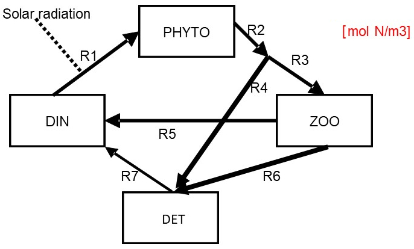

# Problem formulation

The NPZD model is a monument in biological oceanography and limnology. It provides a simplified description for nutrient cycling in the water column in which only four state variables are described: Nutrients (*N*), Phytoplankton (*P*), Zooplankton (*Z*) and Detritus (*D*).

In the marine environment, the limiting nutrient is typically dissolved inorganic nitrogen (DIN). In freshwater environments, dissolved inorganic phosphorus (DIP) is typically used as the limiting nutrient. 

The NPZD model is a "real-life" model, in the sense that it is actively used in research: it forms the biological heart of most biogeochemical modules in present-day ocean circulation models. 

In this exercise, you start by making an NPZD model, which you will then extend to a NPZD2 model by including *two* detritus fractions (hence the "D2"). 

The conceptual scheme of the NPZD model is given in Figure 1.

{width=8cm}

# Assumptions of the NPZD model

The following assumptions are made: 

*	All state variables are expressed in $mol~N~m^{-3}$.
*	DIN is the limiting nutrient. 
*	Solar radiation (light) is a forcing function that drives photosynthesis, and it changes seasonally. 
* A fraction of the light is photosynthetically active radation (PAR). PAR decreases exponentially with water depth (with the extinction coefficient of 0.05 $m^{-1}$).  The algae perceive --- on average --- the PAR in the *middle* of the water column.\footnote{This corresponds well to the average light intensity through the water-column.}
*	Nitrogen uptake is limited by light availability and nutrient availability. Nutrient and light limitation are both described with a type II functional response (Michaelis-Menten, or Monod kinetics). Total limitation is calculated as the *product* of nitrogen and light limitation. 
*	The food intake by zooplankton (i.e., by grazing on the phytoplankton) is governed by a type II functional response.
*	A fixed fraction *pFaeces* of total food intake by zooplankton is lost as faeces. 
*	Zooplankton excretes ammonium at a rate described by the first-order kinetics.
*	Zooplankton mortality is modelled as a quadratic function of zooplankton biomass. Tip: the units of the mortality parameter give a hint as to how such a function looks like.
* Mineralization of detritus is a first-order process.

# Tasks

## Step 1. Create the NPZD model

* Start by creating the mass balance equations based on the flow scheme above.
* Create suitable rate expressions for each of the flows, based on the assumptions given above. For ecological interactions you will need to think which component is the "worker" and which component is the "resource".
* The following table lists the values and units of the parameters used:

| Parameter      | Value     | Description                      | Units                       | 
| -------------- | --------- | -------------------------------- | --------------------------- |                  
| depth	         | 10        | water depth                      | $m$                         |
| rUptake	       | 1.0	     | Nitrogen uptake rate constant    | $d^{-1}$                    |
| ksPAR	         | 140	     | Monod ct for light limitation    | $\mu Einst~m^{-2}s^{-1}$    |
| ksDIN	         | $1\times 10^{-3}$ | Monod ct for nutrient limitation | $mol~N~m^{-3}$              |
| rGrazing	     | 1.0	     | Grazing rate constant            | $d^{-1}$                    |
| ksGrazing	     | $1\times 10^{-3}$ | Monod ct for grazing             | $mol~N~m^{-3}$              |
| pFaeces	       | 0.3	     | Part of ingestion to faeces      | $-$                         |
| rMortality     | 400    	 | Mortality rate constant          | $(mol~N~m^{-3})^{-1}d^{-1}$ |
| rExcretion     | 0.1	     | Excretion rate constant (to DIN) | $d^{-1}$                    |
| rMineralisation| 0.05      | Mineralisation rate constant     | $d^{-1}$                    |
		

* The initial conditions of the state variables (SV) are:

| SV           | value   | Units           |
|------------- | ------- |-----------------|
| DIN       	 |	0.010	 | $mol~N~m^{-3}$  |
| PHYTO     	 |	0.0005 | $mol~N~m^{-3}$  |
| ZOO       	 | 	0.0003 | $mol~N~m^{-3}$  |
| DET       	 | 	0.005	 | $mol~N~m^{-3}$  |

* Implement the model in R, using the R+markdown file *RTM_npzd.Rmd* to start with (this file already contains the statement that estimates the light intensity as a function of the time of the year and the depth of the water column).\footnote{You can download this file from Rstudio: File $\rightarrow$ new File $\rightarrow$ Rmarkdown $\rightarrow$ from template $\rightarrow$ RTM\_npzd.} First, change the heading and rename this file to *NPZD.Rmd*.
*	Run the model and inspect the output.

##	Step 2. NPZD2 --- expand the NPZD model with sediment detritus

First copy the file that implements the NPZD model and rename it as *NPZD2.Rmd*.  (The "D2" means that there will be eventually two types of detritus).

  *	Redraw the conceptual diagram by adding bottom detritus. Add the new flows. 
     - What are suitable units for bottom detritus? 
     - What are the units of the new flows?
  *	Assume that both algae and detritus sink with a sinking velocity of 1 $m~d^{-1}$. Upon entering the sediment, the algae die and add to  bottom detritus. 
  *	Bottom detritus mineralizes with the same rate constant as suspended detritus;  DIN released by this process is immediately exchanged with the entire water column (i.e., well-mixed water column). 
  *	Find suitable initial conditions for the bottom detritus. You may use trial and error; the bottom detritus concentration should not show any long-term trends, rather its dynamics should be repeated annually.
  *	Implement this model in R and run the model.
  *	At the last day of the simulation, where do we find most of the organic matter --- in the water or in the sediment? (tip: out[nrow(out),] shows the values on the last day).
  * Compare N contents in the different model compartments as a function of time. Where is most of the N stored during the summer and winter seasons?
