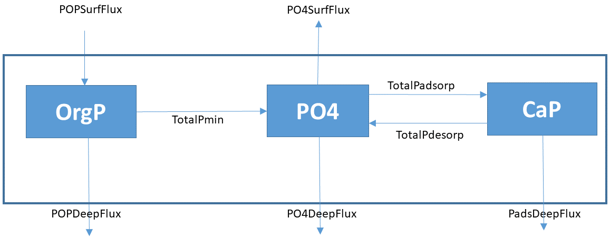

# Answers

```{r setup, include=FALSE}
knitr::opts_chunk$set(echo = TRUE)
```

Four species are modeled with the following concentrations and boundary conditions:

* POC: Particulate Organic Carbon, [$mol~C~m^{-3}~solid$]
  - imposed flux at the upstream boundary (flux.up), 
  - zero-gradient boundary downstream,
* DIC: Dissolved Inorganic Carbon, [$mol~C~m^{-3}~liquid$] 
  - imposed concentration upstream (C.up), 
  - zero-gradient boundary downstream,
* $P_{ads}$: Adsorbed phosphorus, [$mol~P~m^{-3}~solid$]
  - zero flux at the upstream boundary (flux.up = 0), 
  - zero-gradient boundary downstream,
* $H_2PO_4^{-}$: Dissolved phosphate, [$mol~P~m^{-3}~liquid$] 
  - imposed concentration upstream (C.up), 
  - zero-gradient boundary downstream.

Biogeochemical/physical processes: 

* First-order mineralization of organic matter produces DIC and $H_2PO_4^{-}$.
* Phosphate adsorption and desorption to $CaCO_3$.

What can be ignored:

* $CaCO_3$ is assumed to be present in excess, and therefore does not need to be modeled.
* pH is assumed to be constant, and therefore does not need to be modelled.

## Task 1. Model implementation in R

The partial derivatives related to transport are approximated by the function tran.1D from the ReacTran package. The steady-state and dynamic solutions are obtained using functions from the rootSolve and deSolve package. The latter two packages are loaded together with ReacTran. The diffusion coefficients are obtained using the marelac package.

```{r, message = FALSE}
require(marelac)
require(ReacTran)
```

### The model grid and associated properties

The model domain is divided into a grid of N boxes. The depth of the modeled sediment column is set to $0.6~m$. The grid size is exponentially increasing with depth, to achieve a better accuracy of the results in the sediment region where steep spatial gradients are likely present (here: close to the sediment-water interface).

```{r}
# grid: 200 boxes, total length = 0.6 m, later increased to 1 or 2 m.
Length <- 0.6   # [m]
N      <- 200

# grid with an exponentially increasing grid size, starting from 0.1 cm
Grid <- setup.grid.1D(L = Length, N = N, dx.1 = 0.1e-2)

# function describing the variation of porosity (volume fraction of liquid) with depth
porFun.L <- function(x, por.SWI, por.deep, porcoef)
  return(por.deep + (por.SWI-por.deep)*exp(-x*porcoef))

# solid volume fraction (svf = 1-porosity)
porFun.S <- function(x, por.SWI, por.deep, porcoef)
  return(1-porFun.L(x, por.SWI, por.deep, porcoef))

# calculate porosity and svf on the grid (mid-points and box interfaces, etc.)
porLiquid <- setup.prop.1D(func = porFun.L, grid = Grid,
  por.SWI = 0.9, por.deep = 0.6, porcoef = 50)

porSolid <- setup.prop.1D(func = porFun.S, grid = Grid,
  por.SWI = 0.9, por.deep = 0.6, porcoef = 50)

# Sediment diffusion coefficient for HCO3^- and HPO4^2- (m2/d), 
# defined at box interfaces!! (N+1 values)
diffHCO3  <- diffcoeff(S=35, t=20)$HCO3  * 3600*24  # m2/s to m2/d
diffH2PO4 <- diffcoeff(S=35, t=20)$H2PO4 * 3600*24  # m2/s to m2/d
porInt    <- porLiquid$int                  # porosity at box interfaces
diffDIC   <- diffHCO3  / (1-log(porInt^2))  # corrected for tortuosity
diffPO4   <- diffH2PO4 / (1-log(porInt^2))  # corrected for tortuosity
```

Visualise these settings:

```{r, fig.width=9, fig.height=3}
par(mfrow = c(1,4))
plot(porLiquid, type="l", grid = Grid, xyswap = TRUE, ylab = "depth (m)", 
     main = "porosity", xlab = "m3_liquid / m3_bulk")
plot(porSolid,  type="l", grid = Grid, xyswap = TRUE, ylab = "depth (m)", 
     main = "svf = 1-porosity", xlab = "m3_solid / m3_bulk")
plot(diffDIC, y = Grid$x.int, type="l", ylim = c(Length,0), ylab = "depth (m)", 
     main = "sediment diff. coeff (DIC)", xlab = "m2/d")
plot(diffPO4, y = Grid$x.int, type="l", ylim = c(Length,0), ylab = "depth (m)", 
     main = "sediment diff. coeff (PO4)", xlab = "m2/d")
```

### The parameters

Parameters are expressed in mol, m and day; the input is converted if necessary. We ignore the influence of sediment compaction on the advection velocity.

```{r}
parms <- c(
 biot     = 5e-4/365,      # [m2/d]      bioturbation mixing coefficient
 v        = 0.1e-2/365,    # [m/d]       sediment advection velocity 
 rMin     = 0.01,          # [/d]        POC mineralisation rate constant
 depoPOC  = 1e-3,          # [mol/m2/d]  POC deposition rate (flux at SWI)
 bwDIC    = 2,             # [mol/m3]    DIC bottom water concentration
 bwPO4    = 0.5e-3,        # [mol/m3]    PO4 bottom water concentration
 PCratio  = 1/106,         # [molP/molC] P:C ratio in Redfield organic matter
 rPads    = 5e-4,          # [/d]        rate constant for P adsorption to CaCO3
 rPdes    = 1e-5           # [/d]        P desorption rate constant
)
```

### The model function

```{r}
PDiamodel <- function (t, Conc, pars)   # Conc is a long vector
{
  with (as.list(pars),{
    # unpack state variables   
    POC  <- Conc[     1 :   N ]    # first N elements: POC
    DIC  <- Conc[(  N+1):(2*N)]    # next N elements: DIC
    PO4  <- Conc[(2*N+1):(3*N)]    # next N elements: PO4
    Pads <- Conc[(3*N+1):(4*N)]    # next N elements: adsorbed P

    # transport - note: zero gradient by default at lower boundaries
 
    # particulate substances, VF = solid volume fraction = 1-porosity!    
    tran.POC <- tran.1D(C = POC, flux.up = depoPOC, # upper boundary: flux 
                        dx = Grid, VF = porSolid,   # grid and volume fraction (1-por)
                        D = biot, v = v)            # mixing (bioturbation) and advection
        

    tran.Pads <- tran.1D(C = Pads, flux.up = 0,     # upper boundary: zero flux 
                        dx = Grid, VF = porSolid,   # grid and volume fraction (1-por)
                        D = biot, v = v)            # mixing (bioturbation) and advection
  
    # dissolved substances, VF = liquid volume fraction = porosity!   
    tran.DIC <- tran.1D(C = DIC, C.up = bwDIC,       # upper boundary: concentration
                        dx = Grid, VF = porLiquid,   # grid and volume fraction (por)
                        D = diffDIC, v = v)          # diffusive mixing and advection
                                                     # (bioturbation mixing negligible)
    
    tran.PO4 <- tran.1D(C = PO4, C.up = bwPO4,       # upper boundary: concentration
                        dx = Grid, VF = porLiquid,   # grid and volume fraction (por)
                        D = diffPO4, v = v)          # diffusive mixing and advection

    # === reaction rates ===
    # POC mineralisation
    Mineralisation <- rMin * POC        # [mol/m3 SOLID/d] (per volume of solid!)

    # P dynamics
    Adsorption     <- rPads * PO4       # [mol/m3 LIQUID/d]
    Desorption     <- rPdes * Pads      # [mol/m3 SOLID /d]

    # mass balances : dC/dt = transport + reactions
    poro    <- porLiquid$mid
    
    # solid components 
    dPOC.dt   <- tran.POC$dC - Mineralisation
    dPads.dt  <- ( tran.Pads$dC                         # transport
                   + Adsorption*poro/(1-poro)           # reaction [mol/m3 SOLID/d] !!
                   - Desorption )                       # reaction [mol/m3 SOLID/d] !!
    
    # solute components
    dDIC.dt <- ( tran.DIC$dC +                          # transport
                 Mineralisation * (1-poro)/poro )       # [mol/m3 LIQUID/d] !!
    dPO4.dt <- ( tran.PO4$dC                            # transport
                 + PCratio*Mineralisation*(1-poro)/poro # [mol/m3 LIQUID/d] !!
                 + Desorption*(1-poro)/poro             # [mol/m3 LIQUID/d] !!
                 - Adsorption)                          # [mol/m3 LIQUID/d] !!

    # depth-integrated rates: [mol/m2 BULK/d] !!
    TotalMin     <- sum(Mineralisation*Grid$dx * (1-poro))
    TotalPmin    <- PCratio*TotalMin
    TotalPdesorp <- sum(Desorption    *Grid$dx * (1-poro))
    TotalPadsorp <- sum(Adsorption    *Grid$dx * poro)

    return(list(c(dPOC.dt, dDIC.dt, dPO4.dt, dPads.dt), # t-derivatives as a LONG vector
          
          # Depth profiles of process rates, all in molP/m3 BULK/d!
          Mineralisation_B = PCratio*Mineralisation*(1-poro), 
          Adsorption_B     = Adsorption*poro,          
          Desorption_B     = Desorption*(1-poro),
          
          # quotient is a measure of the distance from an equilibrium
          Quotient         = PO4*poro / (Pads*(1-poro)), # corrected for porosity!
          
          # for budgetting
          TotalMin     = TotalMin,                  # [molC/m2 BULK/d]
          TotalPmin    = TotalPmin,                 # [molP/m2 BULK/d]
          TotalPdesorp = TotalPdesorp,
          TotalPadsorp = TotalPadsorp,
          DIC.SWI.Flux  = tran.DIC$flux.up,         # [molC/m2 BULK/d]
          DIC.Deep.Flux = tran.DIC$flux.down,
          POC.SWI.Flux  = tran.POC$flux.up,         # [molC/m2 BULK/d]
          POC.Deep.Flux = tran.POC$flux.down,
          PO4.SWI.Flux  = tran.PO4$flux.up,         # [molP/m2 BULK/d]
          PO4.Deep.Flux = tran.PO4$flux.down,
          Pads.SWI.Flux = tran.Pads$flux.up,        # [molP/m2 BULK/d]
          Pads.Deep.Flux= tran.Pads$flux.down,
          POC.SWI.Flux  = tran.POC$flux.up,         # [molC/m2 BULK/d]
          POC.Deep.Flux = tran.POC$flux.down,
          POP.SWI.Flux  = PCratio*tran.POC$flux.up, # [molP/m2 BULK/d]
          POP.Deep.Flux = PCratio*tran.POC$flux.down))
 })
}
```

## Task 2. Model applications

Three steady-state solutions are calculated, with different adsorption rate constants.

```{r}
# Number of species in the model, and their names
names <- c("POC", "DIC", "PO4", "Pads")
nspec <- length(names)

# Initial conditions
Conc  <- runif(nspec*N)  

# three runs with different adsorption rates
p1 <- p2 <- p3 <- parms  

p1["rPads"]  <- 0      # /day    
sol1 <- steady.1D (y=Conc, func=PDiamodel, parms=p1, 
                   nspec=nspec, dimens=N, names=names,
                   pos=TRUE)     

p2["rPads"]  <- 1e-3   # /day   
sol2 <- steady.1D (y=Conc, func=PDiamodel, parms=p2, 
                   nspec=nspec, dimens=N, names=names,
                   pos=TRUE) 

p3["rPads"]  <- 5e-3   # /day      
sol3 <- steady.1D (y=Conc, func=PDiamodel, parms=p3, 
                   nspec=nspec, dimens=N, names=names,
                   pos=TRUE) 
```

Here, we plot the concentration gradients. They show that the higher the adsorption rate, the more the dissolved phosphate is scavenged into the adsorbed phase, and the lower its concentration at depth.
```{r, fig.width=10, fig.height=3.5}
plot(sol1, sol2, sol3, xyswap=TRUE, grid = Grid$x.mid, lty=1, lwd=2, 
     xlab=c("molC/m3 Solid", "molC/m3 Liquid", 
            "molP/m3 Liquid", "molP/m3 Solid"), 
     ylab="depth (m)", mfrow=c(1,4))

legend("bottom", legend=c("0", "1e-4", "5e-4"), title="r.ads [/d]", 
       lwd=2, lty=1, col=1:3)
```

To aid interpretation of the depth profiles of concentrations, we also plot the depth profiles of the process rates. The process rates are best expressed per volume of *bulk* (indicated by the subscript 'B'), as they can be directly compared to each other.

```{r, fig.width=10, fig.height=4}
plot(sol1, sol2, sol3, xyswap=TRUE, grid = Grid$x.mid, lty=1, lwd=2,
     which=c("Mineralisation_B", "Adsorption_B", "Desorption_B"),
     xlab=c("molP/m3 Bulk/d",   "molP/m3 Bulk/d", "molP/m3 Bulk/d"), 
     ylab="depth (m)", mfrow=c(1,3))

legend("bottom", legend=c("0", "1e-4", "5e-4"), title="r.ads [/d]", 
       lwd=2, lty=1, col=1:3)
```

Finally, we also plot the quotient as a function of depth. We expect the value of Q in equilibrium to be equal to the equilibrium constant, which is equal to the ratio between the forward and backward reaction rate constants, $K_{eq}=r_{des}/r_{ads}$.

```{r, fig.width=4, fig.height=3}
plot(sol2, sol3, xyswap=TRUE, grid = Grid$x.mid, lty=1, lwd=2,
     which = c("Quotient"), xlim = c(0,0.05), col=c(2,3),
     xlab=c("PO4/Pads"), ylab="depth (m)", mfrow=c(1,1))
abline(v=p2["rPdes"]/p2["rPads"], col=2, lty=2)
abline(v=p3["rPdes"]/p3["rPads"], col=3, lty=2)
legend("bottomright", legend=c("0.1","0.02"), title="r.des/r.ads", 
       lwd=2, lty=1, col=1:2)
```

We see that the dissolved and adsorbed phases of P are in *disequilibrium* close to the SWI, and *approaching the equilibrium* with depth. (This explains the increasing concentrations of $P_{ads}$ with depth, as a result of the *net* rate of P adsorption being positive.) However, the equilibrium between the dissolved and adsorbed phases is *not* reached within the sediment column of $0.6~m$. This changes if the model is run for the sediment column depth set to $2~m$. (Not shown in this document, but try it to see it for yourself.)

Note, that if the length of the sediment column is changed, the solution will *change*! This is understandable, because by changing the length of the spatial domain, we *also* we change the *boundary conditions*! This highlights the importance of setting the boundary conditions so that they *realistically* represent the *in-situ* conditions of the studied system.

## Task 3. Phosphorus Budget

```{r}
convert  <- 365000   # conversion from mol/m2/d to mmol/m2/year

toselect <- c("TotalPmin", "TotalPdesorp", "TotalPadsorp", 
              "PO4.SWI.Flux", "PO4.Deep.Flux", "Pads.SWI.Flux", "Pads.Deep.Flux", 
              "POP.SWI.Flux", "POP.Deep.Flux")
BUDGET  <- data.frame(NoAdsorption = unlist(sol1[toselect]), 
                      MediumAdsorption = unlist(sol2[toselect]), 
                      HighAdsorption = unlist(sol3[toselect]) )*convert

# Show results
knitr:: kable(BUDGET, digit = 2)
```

By integrating the rates over the entire spatial domain, and by considering the fluxes at the upper and lower boundaries, we construct a conceptual diagram for P flow in the modelled sediment column as shown in Figure 1.

{width=10cm}


