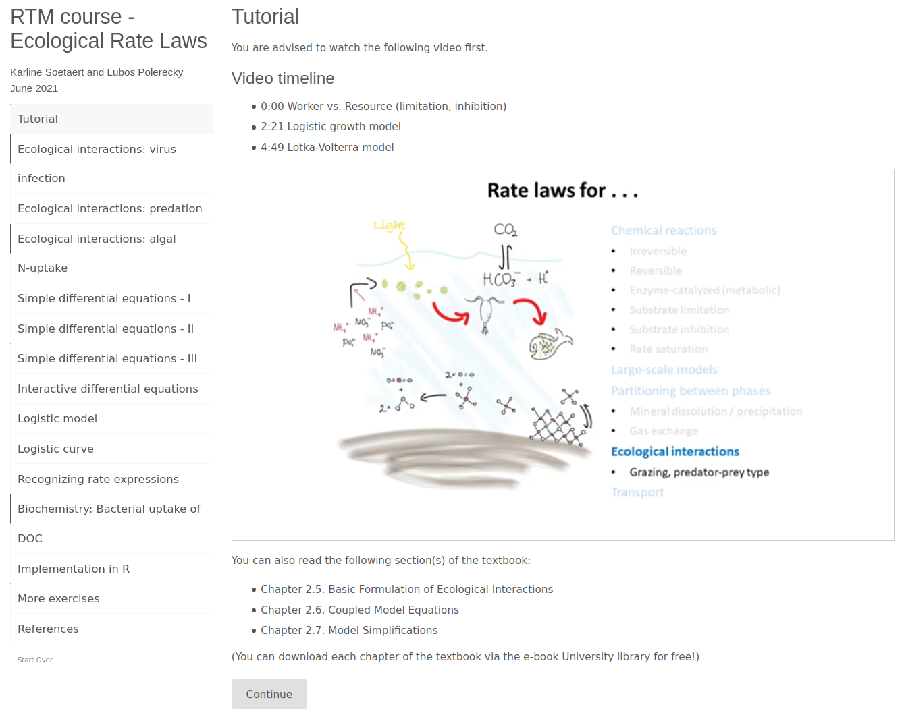

```{echo = FALSE, include = FALSE}
output: rmarkdown::html_vignette
  \usepackage[T1]{fontenc}
```

```{r, include = FALSE, message=FALSE}
knitr::opts_chunk$set(echo = TRUE)
```

# Introduction

The courses Environmental Modelling and Reactive Transport Modelling in the Hydrosphere have been taught at Ghent University (Belgium) and Utrecht University (The Netherlands), respectively, since many years. Students attending these courses learn how to make mechanistic models that start from first principles of physics, chemistry, biology, and ecology, are mathematically formulated as differential equations, and are solved numerically by a computer. The models aim to advance their understanding of natural systems by allowing prediction of the systems' behaviour under various scenarios (e.g., response of the global carbon cycle to burning of fossil fuels).

The aim of the courses is to teach students how to make models "from scratch". This differs from many modelling courses where students merely learn how to apply existing models. More specifically, students in our courses learn to

  - create conceptual models that describe environmental scenarios or problems,
  - translate conceptual models into mechanistic models and, ultimately, mathematical equations that describe the variation of the state variables characterising the system in time and space,
  - implement these mathematical equations in a computer program and solve them,
  - interpret the results in terms of the original environmental scenario or problem, and
  - apply the models to realistic scenarios.

We use R (R core team 2020) as the programming language for implementing and solving these models. This is mainly because there is an "ecosystem" of R-packages that provide methods for solving the type of differential equations that we deal with in the courses, including *rootSolve*, *deSolve*, *ReacTran* (Soetaert, 2009; Soetaert et al., 2010; Soetaert and Meysman, 2012). These packages have been implemented so that they hide much of the mathematical details behind the methods, allowing students to focus on the original problem rather than being concerned with finding a numerical approach to solve it. Additionally, they provide auxiliary functions that facilitate tabulation and visualisation of model results, fitting of models to data, etc.

Our students typically follow a master program in Earth or Life Sciences, and are interested in disciplines such as oceanography, biology, biogeochemistry, hydrology, or physics. Some have a good understanding of the processes occurring in the natural environment, but have never written a computer program before; others have ample experience in programming, mathematics or computer science, but little knowledge about the processes in nature. Due to this variation in background, knowledge and skills, a big challenge is to find a teaching style that can stimulate efficient and effective learning for all students. 

Previously, we have employed the more "traditional" teaching approach, where the instructor explains the context, theory and examples during lectures, and encourages students to practice the taught material by themselves (or in small groups) outside the class (e.g., by solving problems and exercises given as homework assignments). In this approach, however, the brighter students often get bored as they feel that the material is being taught too slowly, while the less bright students become demotivated or frustrated as they cannot follow. Additionally, the percentage of students that works on the outside-the-class assignments is typically less than desired.

Based on this experience, we decided to experiment with our didactic approach and employ the so-called "flipped class" teaching approach. In this approach, students obtain the theoretical lectures in advance and prepare themselves before the class. Then, during the class, they practice the learned concepts by solving problems and exercises with a direct feedback from the instructor. One of the advantages of the flipped class is that students can work more focused and thus obtain a more thorough understanding of the material. Before the class, students can take the time they need to prepare themselves individually. Subsequently, while in the classroom, they can directly interact with tutors and therefore explore the topics to the depth determined by their own ability, motivation and ambition. This provides more room for tutoring "a la tete du client".

The modelling course taught by Karline Soetaert and Dries Bonte at Ghent University has been in the form of a flipped class since the academic year 2019--2020, while the course taught by Lubos Polerecky and Karline Soetaert at Utrecht University first implemented this approach in the academic year 2020--2021. This way of teaching proved to be a positive experience: while in previous years students would complain that they did not get enough practice in class, there is now ample time for practical exercises. Also the class is much more dynamic, with dramatically improved students participation and involvement.

Here, we discuss how the flipped modelling class is implemented. Specifically, we describe a newly developed R-package RTM, which merges the main components of the teaching material --- tutorials, exercises, template files, and extra readers --- into a common platform and thus simplifies its delivery to students. 

# Implementation of the flipped class

To prepare for each lesson, students are offered the choice to either read one or more chapters from the course textbook (Soetaert and Herman, 2009), or watch one or more short knowledge clips that explain the theory. Then they are encouraged to test their understanding of the theory by answering a number of short (often multiple-choice) questions delivered in a quiz-like format. This initial "priming" phase is done individually by each student. Subsequently, students go to the classroom and submerge themselves, under the guidance of tutors, in solving more substantial exercises. The work in this second phase is done in small groups (2--4 students per group), which facilitates exchange of ideas among the students and thus boosts their overall participation and involvement.

## Knowledge clips

The theory behind the material taught in the modelling courses is explained in a series of knowledge clips. The videos, which typically take between 5 to 15 minutes, were developed by (1) creating a series of didactically sound slide presentations, (2) writing down the narrative for each slide, and (3) recording and combining the narrative and slides into a video. Steps 1 and 2 were developed by the tutors, while step 3 was partially outsourced and partially executed by the tutors.

Creation of the knowledge clips offers several longer-term advantages. For example, they are available to the public via a YouTube playlist,\footnote{https://www.youtube.com/playlist?list=PLx8PHcDdmF-uD1Pr07TU9SzlhlGpfrxqn} and so can serve as an online course. Also, if students wish to refresh their knowledge of the subject, they can re-watch the clips at any time and in any order. Importantly, they dictate the pace at which they watch and learn from the clips.

## Quiz-like questions

Each knowledge clip is accompanied by a set of quiz-like questions and short exercises (Figure 2). These were implemented in the form of *tutorials* provided by the R-package *learnr* (Schloerke et al., 2020). They mostly consist of multiple-choice questions, sprinkled here and there with a more substantial exercise that needs to be solved by completing an R-code embedded within the text.

The quizzes were designed to allow the students to test their basic understanding of the subject explained in the knowledge clip. Before we introduced these quizzes, we often noted that some students overestimate their grasp of the theory and are overly confident, while others are baffled by the complexity of the material and may loose confidence that they will eventually manage to understand it. The quizzes allow students to make this assessment by, and for, themselves. They are *not* graded, but students are encouraged to use them for their own benefit, as they facilitate better preparation for the more substantial exercises in the classroom and, ultimately, for the exam.

## Classroom exercises

While in the classroom, students work on practical modelling *exercises* that address current environmental problems. The overall philosophy of this activity is that students design, develop and implement their models "from scratch". That is, after being given a text that defines a problem, they start from a conceptual diagram and progress until they develop an R-code that generates quantitative predictions about the behaviour of the studied system. Based on these predictions they can discuss how to tackle the original problem.

At the time of writing this text, the exercises address, among others, the following environmental problems:

* *The CO$_2$ problem*. Atmospheric CO$_2$ concentrations are described by an Earth-system box model that comprises carbon fluxes among the major Earth's carbon reservoirs. The model is used to estimate the impact of anthropogenic activities (e.g., burning of fossil fuels, deforestation) on the atmospheric CO$_2$ concentrations and to explore the effects of certain mitigation strategies (e.g., ocean fertilisation). This exercise is an example of a linear model.
* *The ozone problem*. Ozone is a green-house gas and, at high concentrations, harmful to humans and animals. It also plays an important protective role by absorbing harmful UV radiation. The ozone model is used to test how anthropogenic emissions of NO (nitric oxide) due to combustion or burning of fuels alter the natural ozone dynamics in the lower atmosphere. It is an example of a "typical" chemistry model.
* *Ocean acidification*. This is a very complex problem as it deals with equilibrium chemistry. The topic is introduced by three exercises of increasing complexity. A more extensive model dealing with ocean acidification is not part of the mandatory course material, but is provided as auxiliary material that students may consult if they are interested in the topic (see below).
* *The COVID pandemic*.  An epidemiological model (so-called SIR model) is developed to describe the spread of the SARS-CoV2 (corona) virus within a population. In addition to infection and recovery, the model includes hospitalisations, mortality, vaccination, and virus mutations. The students practice how to use information from epidemiologists (who are not modelers) to develop and apply such models.
* *Agricultural eutrophication*. This model describes how fertilization with nutrients affects the competition between crops and weeds, and explores the impact of different fertilization strategies on agricultural run-off. In addition to ecological interactions, the model also contains a (simplistic) economic component that lets students explore the monetary aspects of farming.
* *Dead zones in a river*. This one-dimensional reaction-transport model describes the distribution of dissolved oxygen concentrations in a river subjected to excessive input of nutrients (ammonia). The model is used to estimate the maximal nutrient input that can be allowed to keep the minimal oxygen concentration above a certain critical level.

Additional exercise topics include

* introduction to R for modellers,
* making of conceptual diagrams and formulating of mass balance equations,
* dissolution of silica particles (e.g., diatom frustules),
* bacteria-mediated mineralisation of detritus,
* early diagenesis in marine sediments (a simplified P cycle, and the coupled cycles of C, N, O, and S),
* food web modelling of a lake or river ecosystem,
* competition between plants in grasslands,
* competition between floating plants and algae in shallow lakes,
* virus dynamics in the ocean,
* bio-economic modelling of a Scallop aquaculture.

New material can be added in the future, thus creating a repository from which modules can be selected based on students' interests that vary from year to year.

## Auxiliary material

In addition to tutorials and exercises, the RTM package provides a number of smaller readers that explain various topics in somewhat greater detail. Their aim is to satisfy the curiosity of students with the greatest motivation to learn modelling in R. The topics covered in these readers are not compulsory for the course, so the students get to see them after the mid-term exam, but before they start to work on their final projects. They include

* implementation of *events* in dynamic models developed in R,
* use of *forcing functions* based on data in models developed in R,
* display of *observed data* alongside model results in R,
* *fitting* of a 1D reaction-transport model to data in R,
* *visualisation* of multi-dimensional outputs from a 1D reaction-transport model in R,
* modelling of *pH dynamics* in a 1D reaction-transport model in R,
* mathematical analysis of the response of a system to a *perturbation from an equilibrium*,
* development of *interactive applications* in R,
* the basics about the *numerical methods* used for reaction-transport modelling in R,
* the basics about collaborative model development via *git*.

## Model templates

Although students develop their models from scratch, they do not necessarily start from an empty sheet when implementing them in R. Instead, they start from a number of R Markdown templates that are provided by the RTM package. Thus, rather then becoming easily confused or frustrated by the need to generate a syntactically correct R-code, students can focus on the implementation of the modelled processes and generation and visualisation of outputs using R-code chunks provided by the templates. The templates included in the package facilitate the development of

* dynamic models without the spatial component (*RTM_0D*),
* dynamic one-dimensional reaction-transport models (*RTM_1D*),
* dynamic one-dimensional reaction-transport models in porous media (*RTM_porous1D*).

Additionally, they include templates used in some of the exercises, including models that deal with

* local equilibrium chemistry (*RTM_equilibrium*),
* a basic food-web and element cycling model in an aquatic ecosystem (*RTM_npzd*).

## Final projects

After completing the tutorials, exercises, and the written mid-term exam, students proceed with a work on a larger project of their choice. This involves the development of a model about a specific environmental topic and is done in small groups of 2--4 people. In contrast to the exercises made in the classroom, they do this with less guidance from the tutors. They also need to document their work in a written report, where they outline the scientific rationale, describe their model (including assumptions and implementation), and present and interpret the results, much like they would do when writing a scientific paper. Note that the topics of these final projects are *not* part of the RTM package.

# Workflow example

We recommend that students use *Rstudio* to learn and develop their models in R. At the beginning of the course, students install the RTM package. At present, this is done using the R-command
```
devtools::install_github("dynamic-R/RTM", depend=TRUE)
```
Loading the package into R implements the following public functions: ``RTMtutorial()``, ``RTMexercise()``, ``RTMtemplate()``, and ``RTMreader()``. Additionally, it implements the private function ``RTManswer()``.

## Tutorials

The list of available tutorials (Table 1) is displayed by using the R-command 
```
RTMtutorial()
```

```{r, echo=FALSE}
knitr::kable(RTM:::RTMtutorial(), row.names = TRUE,
             caption="List of available tutorials provided by the RTM package.")
```

A specific tutorial is started by including the name, or the corresponding index, of the tutorial as the input argument to ``RTMtutorial()``. For example, the "ecology" tutorial is started using one of the following commands:
```
RTMtutorial("ecology")
RTMtutorial(11)
RTMtutorial("ecology", output = "RMD")
```
The first two commands open the tutorial in a web browser. In case this fails, the third command can be used to open the tutorial's R Markdown file in the *Rstudio* editor. Subsequently, the tutorial is started by clicking the "Run Document" button at the top of the editor window.

The first item in the tutorial provides a link to a short knowledge clip and a reference to chapters in the course textbook (Figure 1). These two resources are used to explain the theory behind the topics covered in the class.



Subsequently, students proceed by clicking on any of the quiz-like questions listed in the left panel. After selecting and submitting an answer (Figure 2, top), students receive feedback that explains the rationale behind the correct answer (Figure 2, middle). Each tutorial ends with a list of exercises that students should be able to solve after they have understood the material covered in the tutorial (Figure 2, bottom). These exercises are solved by the students in the classroom under the supervision of the tutors.


\clearpage

## Exercises

The list of available exercises (Table 2) is displayed by using the R-command 
```
RTMexercise()
```

```{r, echo=FALSE}
knitr::kable(RTM:::RTMexercise(), row.names = TRUE,
             caption="List of available exercises provided by the RTM package.")
```

A specific exercise is displayed by including the name, or the corresponding index, of the exercise as the input argument to ``RTMexercise()``. For example, the "COVID" exercise is started using one of the following commands:
```
RTMexercise("COVID")
RTMexercise(14)
RTMexercise("COVID", output = "PDF")
```
By default, the exercise is converted into a ``HTML`` format and displayed in a web browser. Additional output formats include ``RMD``, ``PDF``, or ``WORD``. Note that the ``PDF`` option requires an installation of \LaTeX, while the ``WORD`` option requires an installation of programs such as Microsoft Word or LibreOffice.

## Templates

In one of the tasks in the "COVID" exercise, students are asked to develop a model that describes the spread of a viral infection in a population of susceptible, infected and recovered individuals (the so-called SIR model). To implement the model in R, they are offered the possibility to use a template R Markdown file rather than start from a blank sheet. 

The list of available templates (Table 3) is displayed by using the R-command
```
RTMtemplate() ### note that this does not work at present. must use (x = "?")
```

```{r, echo=FALSE}
knitr::kable(RTM:::RTMtemplate(x = "?"), row.names = TRUE,
             caption="List of available templates provided by the RTM package.")
```

A specific template file is opened by including the name, or the corresponding index, of the template as the input argument to ``RTMtemplate()``. Alternatively, one can access it via the *Rstudio* menu File $\rightarrow$ New File $\rightarrow$ R Markdown $\rightarrow$ From Template.

For the "COVID" exercise, the template ``RTM_0D.Rmd`` is recommended. This template is opened using one of the R-commands
```
RTMtemplate("rtm0D")
RTMtemplate(1)
```
The core part of the template file is shown in Figure 3 (left panel). Using this template and the differential equations that the students formulated in the first part of the exercise, it should not be too difficult for them to implement the model in R. All they need to do is to modify the R-chunks where the initial values of the state variables, model parameters, rate expressions, mass balance equations (i.e., time-derivatives of the state variables), and extra output of the model function (e.g., process rates) are defined and the model is solved (Figure 3, right panel).


## Auxiliary material

The list of extra readers (Table 4), which are used as auxiliary material in the course for students that wish to explore specific topics in greater depth, is displayed by using the R-command
```
RTMreader()
```

```{r, echo=FALSE}
knitr::kable(RTM:::RTMreader(), row.names = TRUE,
             caption="List of extra readers provided by the RTM package.")
```

A specific reader is opened by including the name, or the corresponding index, of the template as the input argument to ``RTMreader()``.

In one of the tasks in the "COVID" exercise, students are asked to enhance their SIR model by considering that in order to curb the spread of the viral infection, the society takes measures by temporarily reducing the contact between people by 90% between days 30 and 70 after the viral outbreak. These measures can be modelled by assuming that the infection rate constant is reduced by 90% during this time interval. One way to implement such a model in R is through the use of a forcing function. The reader that explains the use of forcing functions in dynamic R-models is generated using the R-command
```
RTMreader("forcing", output="PDF")
```
By studying this reader, students will learn that all they need to do to implement such temporary measures in their model is to implement a forcing function based on data, add a forcing function as one of the input arguments of the model function, and include the forcing function when solving the model (Figure 4).


# Conclusion

The RTM package contains tutorials, exercises, model templates, and extra readers that students study and work through during the course *Reactive transport modeling in the Hydrosphere* (taught at Utrecht University, The Netherlands) or *Environmental modelling* (taught at Ghent University, Belgium). Anyone who wants to learn environmental or reaction-transport modelling can consult the tutorials and make the exercises. The answers are also provided, and can be viewed using the R-command ``RTM:::RTManswer()``.


# References

R Core Team (2020). R: A language and environment for statistical computing. R Foundation for Statistical Computing, Vienna, Austria. \url{https://www.R-project.org/}
  
B. Schloerke, J.J. Allaire and B. Borges (2020). learnr: Interactive Tutorials for R. R package version 0.10.1. \url{https://CRAN.R-project.org/package=learnr}
  
K. Soetaert (2009).  rootSolve: Nonlinear root finding, equilibrium and steady-state analysis of ordinary differential equations.  R-package version 1.6
  
K. Soetaert, T. Petzoldt, R. W. Setzer (2010). Solving Differential Equations in R: Package deSolve. Journal of Statistical Software, 33(9), 1--25. \url{http://www.jstatsoft.org/v33/i09/ DOI 10.18637/jss.v033.i09}
  
K. Soetaert and F. Meysman (2012). Reactive transport in aquatic ecosystems: Rapid model prototyping in the open source software R. Environmental Modelling & Software, 32, 49--60.
