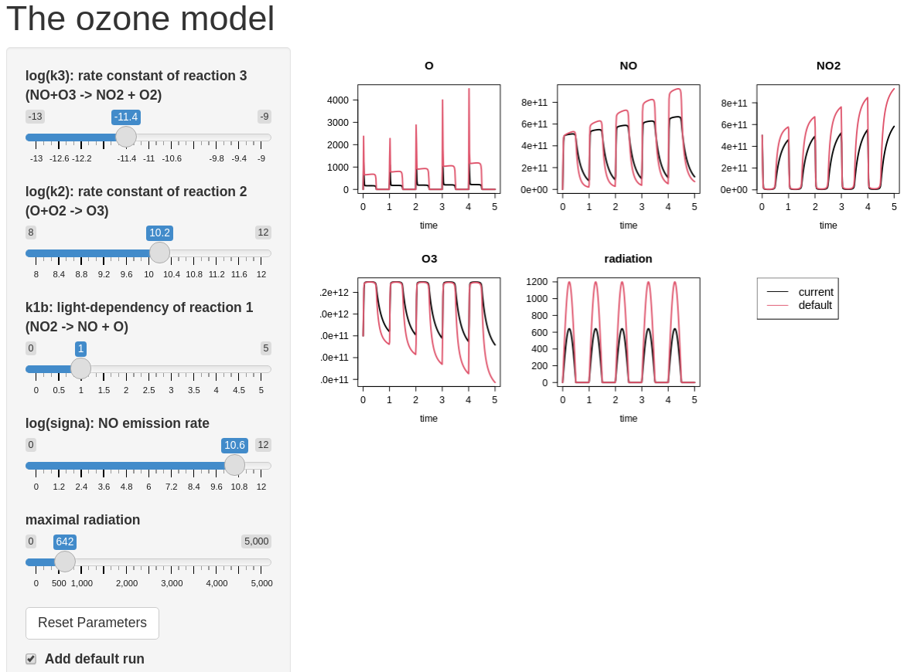

```{r setup, include=FALSE}
knitr::opts_chunk$set(echo = TRUE)
```

# Ozone model

## Model implementation in R

A detailed description of the ozone model is provided in the *ozone* exercise (enter ``RTMexercise("ozone")`` in the R-console to see the exercise). Here we only reproduce the R-code.

```{r, message = FALSE}
state.ini <- c(O = 0, NO = 1.3e8, NO2 = 5e11, O3 = 8e11)  # initial conditions

default.pars <- list(
  k3     = 1e-11,     # [/(mol/d)] 
  k2     = 1e10,      # [/d]
  k1a    = 1e-30,     # [/d] note: k1 = k1a + k1b*radiation
  k1b    = 1,         # [/(microEinst/m2/s)/d]
  sigma  = 1e11,      # [mol/d]           NO emission rate
  maxrad = 1200       # [microEinst/m2/s] maximal radiation
)

Ozone <- function(t, state, parms) {
  with (as.list(c(state, parms)), {

  radiation <- max(0, sin(t*2*pi))*maxrad    # radiation at time t (if time in days)

  # Rate expressions
  k1 <- k1a + k1b*radiation
  R1 <- k1*NO2
  R2 <- k2*O
  R3 <- k3*NO*O3
  
  # Mass balances [moles/day]
  dO   <-  R1 - R2
  dNO  <-  R1      - R3 + sigma
  dNO2 <- -R1      + R3
  dO3  <-       R2 - R3

  list(c(dO, dNO, dNO2, dO3), 
       radiation = radiation)
  })
}
```

For the web interface, we will create sliders so that we can change the values of the model parameters and see the effect on the model result. It is most instructive if we compare these altered model runs with the output of the default model run. We therefore run the model first with the default parameters:

```{r, message=FALSE}
require(deSolve)

outtimes    <- seq(from = 0, to = 5, length.out = 300)  # run for 5 days
Default.out <- ode(y=state.ini, parms=default.pars, func=Ozone, 
                   times=outtimes, method="vode")
```

## The webpage part

The code for interactive applications consists of a user interface (UI) and a server.

### The graphical user interface

We choose a main page with a side bar as the layout for this webpage (``pageWithSidebar``). 

* The header panel contains the title of the webpage.
* The side bar contains 
   - sliders that can be moved to change the value of model parameters (``sliderInput``). Note that each slider has a name that will be accessed in the server function. Here we choose the name of the parameter as the slider name.
   - a check box that, if checked, will cause the default run to be plotted together with the current model output; its name is *defaultRun* (``checkboxInput``).
   - a button that, when clicked, will reset the default parameter values; its name is *resetButton* (``actionButton``).
* The main panel contains the plot of the model run. Note that the name *PlotOzone* is used in the server function.

```{r, message=FALSE}
require(shiny)

UI.O3 <- shinyUI(pageWithSidebar(      # Define UI (user interface)

  # Application title
  headerPanel("The ozone model"),

  sidebarPanel(
   sliderInput(inputId="k3", 
               label = "log(k3): rate constant of reaction 3 (NO+O3 -> NO2 + O2)",
               min = -13, max = -9, step = 0.1, value = log10(default.pars$k3)),
   sliderInput(inputId="k2", 
               label = "log(k2): rate constant of reaction 2 (O+O2 -> O3)",
               min = 8, max = 12, step = 0.1, value = log10(default.pars$k2)),
   sliderInput(inputId="k1b", 
               label = "k1b: light-dependency of reaction 1 (NO2 -> NO + O)",
               min = 0, max = 5, step = 0.01, value = default.pars$k1b),
   sliderInput(inputId="sigma", 
               label = "log(signa): NO emission rate", 
               min = 0, max = 12, step = 0.1, value = log10(default.pars$sigma)),
   sliderInput(inputId="maxrad", 
               label = "maximal radiation",
               min = 0, max = 5000, value = default.pars$maxrad),
   
   actionButton (inputId="resetButton",
                 label="Reset Parameters"),
    
   checkboxInput(inputId="defaultRun",
                 label=strong("Add default run"), value=TRUE),
   br()   # HTML break - note: ends without ','
  ),

  mainPanel(
      plotOutput("PlotOzone"))
))
```

### The server

In the server, we write the code that is executed when a UI object (slider, button, check box, etc.) changes its status. In this implementation, 

* function ``observeEvent`` will be triggered when a user clicks the reset button;
* function ``reactive`` will be executed when any of the sliders has been changed;
* function ``renderPlot`` will put a figure on the main panel.

```{r}
Server.O3 <- shinyServer(function(input, output, session) {

  # -------------------
  # the 'reset' button
  # -------------------
  observeEvent(input$resetButton, {
    updateNumericInput(session, "k3",     value = log10(default.pars$k3))
    updateNumericInput(session, "k2",     value = log10(default.pars$k2))
    updateNumericInput(session, "k1b",    value =       default.pars$k1b)
    updateNumericInput(session, "sigma",  value = log10(default.pars$sigma))
    updateNumericInput(session, "maxrad", value =       default.pars$maxrad)
  })

 # Get the model parameters, as defined in the UI 
  getpars <- reactive( {
    pars        <- default.pars 
    pars$k3     <- 10^input$k3
    pars$k2     <- 10^input$k2   
    pars$k1b    <- input$k1b     
    pars$sigma  <- 10^input$sigma  
    pars$maxrad <- input$maxrad
    pars
  })

  # -------------------
  # the 'Plot' tab
  # -------------------

  output$PlotOzone <- renderPlot({     # will be visible in the main panel

   pars <- getpars() # Model parameters, as defined in the UI
   out  <- ode(y=state.ini, parms=pars, func=Ozone, times=outtimes, method="vode")

   if (input$defaultRun) {  # the check box is true
      plot (out, Default.out, lwd = 2, las = 1, lty = 1,
            cex.main = 1.5, cex.axis = 1.25, cex.lab = 1.25)
      plot.new()
      legend("topleft", legend = c("current", "default"), 
             cex = 1.5, col = 1:2, lty = 1)
    } else  
      plot (out, lwd = 2, las = 1, lty = 1,
            cex.main = 1.5, cex.axis = 1.25, cex.lab = 1.25)  
   })                             # end ouput$plot

})     # end of the definition of shinyServer
```

## Run the web application

To run this app, first run the entire R-code above (e.g., in R-studio, choose Run $\rightarrow$ Run All) and then write the following in the R-console (see screenshot in Figure 1):

```{}
shinyApp(ui = UI.O3, server = Server.O3)
```

Alternatively, set R's working directory to the directory containing the Rmd file and run the following commands:

```{}
knitr::purl("interactive.Rmd")    # to convert the R markdown file into an R-script
source("interactive.R")           # to run the generated R-script
shinyApp(ui = UI.O3, server = Server.O3)  # to run the shiny app
```

You can leave the application by pressing ESC within the console.

{width=14cm}

# References

Winston Chang, Joe Cheng, JJ Allaire, Yihui Xie and Jonathan McPherson (2020). shiny: Web
  Application Framework for R. R package version 1.4.0.2.
  https://CRAN.R-project.org/package=shiny
  
Karline Soetaert, Thomas Petzoldt, R. Woodrow Setzer (2010). Solving Differential
  Equations in R: Package deSolve. Journal of Statistical Software, 33(9), 1--25. URL
  http://www.jstatsoft.org/v33/i09/ DOI 10.18637/jss.v033.i09
