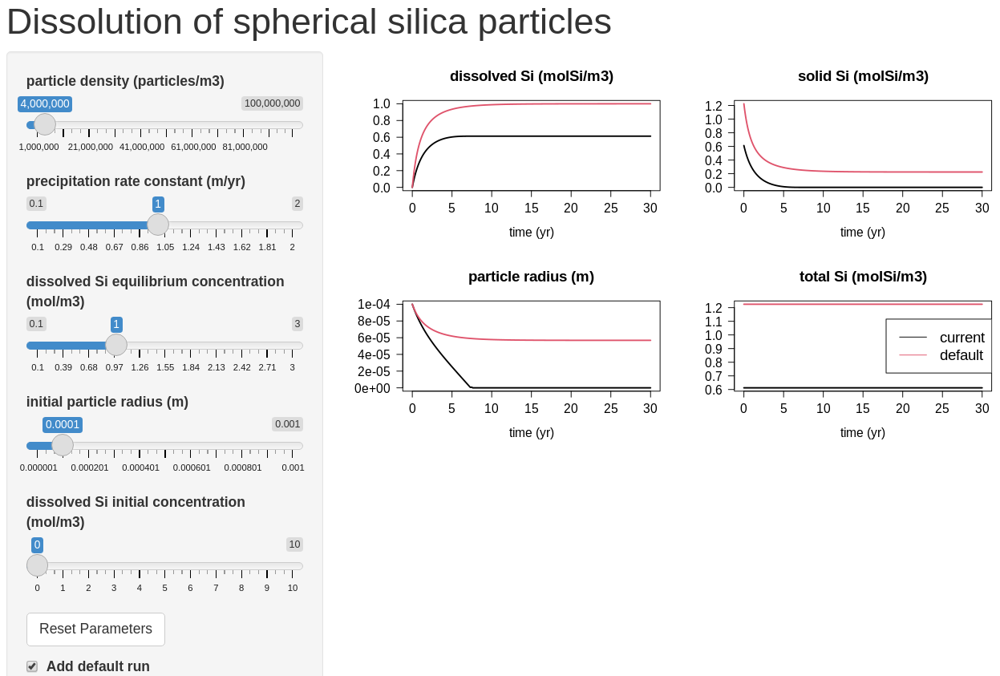

```{r setup, include=FALSE}
knitr::opts_chunk$set(echo = TRUE)
```

# Silica dissolution model

## Model implementation in R

A detailed description of the silica dissolution model is provided in the *dissolutionSi* exercise (enter ``RTMexercise("dissolutionSi")`` in the R-console to see the exercise). Here we only reproduce the R-code.

```{r}
default.parms <- list(
 NV   = 8e6      , # [number/m3], density of spherical silica particles (N/V)
 kp   = 1        , # [m/yr],      precipitation rate constant (assumed)
 MW   = 60.08e-3 , # [kg/mol],    silica molar weight
 rho  = 2196     , # [kg/m3],     silica density
 Ceq  = 1        , # [mol/m3],    equilibrium concentration of dissolved Si
 Cini = 0        , # [mol/m3],    initial concentration of dissolved Si
 Rini = 0.0001     # [m]          initial particle radius 
)

DissolveSilica <- function(t, state, parms) {
  with (as.list(c(state, parms)), {
    
    k2  <- 4*pi*kp * NV^(1/3) * (MW/(4/3*pi*rho))^(2/3) # modified rate constant
    Cs  <- max(0, Cs)   
    
    # mass balance equations
    dC.dt  <- -k2 * Cs^(2/3) * (C-Ceq) # dissolved silica
    dCs.dt <-  k2 * Cs^(2/3) * (C-Ceq) # solid silica (particles)
    
    return(list(c(dC.dt, dCs.dt), 
           R = ( Cs/NV * MW/(4/3*pi*rho) )^(1/3),  # Particle radius
           Ctot = C+Cs))                           # Total Si
  })
}

InitialCondition.fun <- function(parms)  # initial concentrations
  with (as.list(parms), {
    Cs.ini <-  NV* 4/3*pi*Rini^3 * rho/MW
    return(c(C=Cini, Cs=Cs.ini))  # [mol/m3])
  }) 

```

For the web interface, we will create sliders, so that we can change the values of some model parameters and initial conditions, and see the effect on the model result. It is most instructive if we compare these altered model runs with the default model run. We therefore run the model first with the default parameters:

```{r, message=FALSE}
require(deSolve)

state  <- InitialCondition.fun(default.parms)  # initial conditions
times  <- seq(from=0, to=30, by=0.1)           # time in years
Default <- ode(y=state, times=times, func=DissolveSilica, parms=default.parms)
```

## The webpage part

The code for interactive applications consists of a user interface (UI) and a server.

### The user interface

We choose a main page with a side bar as the layout for this webpage (``pageWithSidebar``). 

* The header panel contains the title of the webpage.
* The side bar contains 
   - sliders that can be moved to change the value of model parameters or initial conditions (``sliderInput``). Note that each slider has a name that will be accessed in the server function. Here we choose the name of the parameter or state variable as the slider name.
   - a check box that, if checked, will cause the default run to be plotted together with the current model output; its name is *defaultRun* (``checkboxInput``).
   - a button that, when clicked, will reset the default parameter values; its name is *resetButton* (``actionButton``).
* The main panel contains the plot of the model run. Note that the name *PlotSi* is used in the server function.

```{r, message=FALSE}
require(shiny)

UI.Si <- shinyUI(pageWithSidebar(      # Define UI (user interfae)

  # Application title
  headerPanel("Dissolution of spherical silica particles"),

  sidebarPanel(
   sliderInput(inputId="NV",
               label = "particle density (particles/m3)",
               min = 1e6, max = 1e8, step = 1e6, value = default.parms$NV),
   sliderInput(inputId="kp",
               label = "precipitation rate constant (m/yr)",
               min = 0.1, max = 2, step = 0.01, value = default.parms$kp),
   sliderInput(inputId="Ceq",
               label = "dissolved Si equilibrium concentration (mol/m3)",
               min = 0.1, max = 3, step = 0.01, value = default.parms$Ceq),
   sliderInput(inputId="Rini",
               label = "initial particle radius (m)",
               min = 1e-6, max = 0.001, step = 1e-6, value = default.parms$Rini),
   sliderInput(inputId="Cini", 
               label = "dissolved Si initial concentration (mol/m3)",
               min = 0, max = 10, step = 0.1, value = default.parms$Cini),
   
   actionButton (inputId="resetButton",
                 label="Reset Parameters"),
    
   checkboxInput(inputId="defaultRun",
                 label=strong("Add default run"), value=TRUE),
   br()   # HTML break - note: ends without ','
  ),

  mainPanel(
      plotOutput("PlotSi"))
))
```

### The server

In the server, we write the code that is executed when an UI object (slider, button, check box, etc.) changes its status. In this implementation, 

* function ``observeEvent`` will be triggered when a user clicks the reset button;
* function ``reactive`` will be executed when any of the sliders has been changed;
* function ``renderPlot`` will put a figure on the main panel.

```{r}
Server.Si <- shinyServer(function(input, output, session) {

  # -------------------
  # the 'reset' button
  # -------------------
  observeEvent(input$resetButton, {
    updateNumericInput(session, "NV",    value = default.parms$NV)
    updateNumericInput(session, "kp",    value = default.parms$kp)
    updateNumericInput(session, "Ceq",   value = default.parms$Ceq)
    updateNumericInput(session, "Rini",  value = default.parms$Rini)
    updateNumericInput(session, "Cini",  value = default.parms$Cini)
  })

 # Get the model parameters, as defined in the UI 
  getparms <- reactive( {
    parms        <- default.parms 
    parms$NV     <- input$NV
    parms$kp     <- input$kp   
    parms$Ceq    <- input$Ceq     
    parms$Cini   <- input$Cini  
    parms$Rini   <- input$Rini  
    parms
  })

  # -------------------
  # the 'Plot' tab
  # -------------------

  output$PlotSi <- renderPlot({     # will be visible in the main panel

   parms <- getparms()                    
   state <- InitialCondition.fun(parms)
   out   <- ode(y=state, parms=parms, func=DissolveSilica, times=times)

   if (input$defaultRun) {  # the check box is true
      plot (out, Default, xlab="time (yr)", 
            main=c("dissolved Si (molSi/m3)", "solid Si (molSi/m3)", 
                   "particle radius (m)", "total Si (molSi/m3)"),
            lwd = 2, las = 1, lty = 1,
            cex.main = 1.5, cex.axis = 1.25, cex.lab = 1.25)
      legend("right", legend = c("current", "default"), 
             cex = 1.5, col = 1:2, lty = 1)
    } else  
      plot (out, xlab="time (yr)", 
            main=c("dissolved Si (molSi/m3)", "solid Si (molSi/m3)", 
                   "particle radius (m)", "total Si (molSi/m3)"),
            lwd = 2, las = 1, lty = 1,
            cex.main = 1.5, cex.axis = 1.25, cex.lab = 1.25)  
   })                             # end ouput$plot

})     # end of the definition of shinyServer
```

## Run the web application

To run this app, first run the entire R-code above (e.g., in R-studio, choose Run $\rightarrow$ Run All) and then 
write the following in the R-console (see screenshot in Figure 1):

```{}
shinyApp(ui = UI.Si, server = Server.Si)
```

You can leave the application by pressing ESC within the console.

{width=14cm}

# References

Winston Chang, Joe Cheng, JJ Allaire, Yihui Xie and Jonathan McPherson (2020). shiny: Web
  Application Framework for R. R package version 1.4.0.2.
  https://CRAN.R-project.org/package=shiny
  
Karline Soetaert, Thomas Petzoldt, R. Woodrow Setzer (2010). Solving Differential
  Equations in R: Package deSolve. Journal of Statistical Software, 33(9), 1--25. URL
  http://www.jstatsoft.org/v33/i09/ DOI 10.18637/jss.v033.i09
