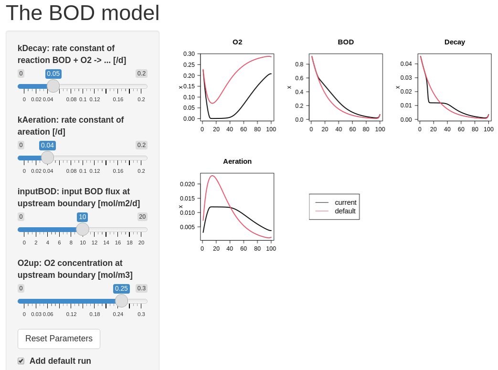

```{r setup, include=FALSE}
knitr::opts_chunk$set(echo = TRUE)
```

# Model implementation in R

We recommend to start from a *fully developed* (and debugged) model. Once the model is working, we can use it to create a shiny user interface around it.

In this example, we use the BOD model implemented in the template file ``RTM_1D``. This model is fully developed and working, because it is recommended as a starting point in the development of more complicated 1D reaction-transport models. Thus, we can copy and paste the code here with only one minor modification: we change the name of the default model parameters from ``pars`` to ``default.pars``.

```{r, eval = TRUE, cache = FALSE, echo = TRUE, warning=FALSE, message=FALSE}
require(ReacTran)  # package with solution methods - includes deSolve, rootSolve

# units: time=days, space=meters, amount=moles, concentration=mol/m3

# model grid
Length <- 1000                                 # [m]
N      <- 100                                  # [-] number of boxes
Grid   <- setup.grid.1D(L = Length, N = N)     # grid of N equally-sized boxes

# initial conditions - state variables are defined in the middle of grid cells
O2      <- rep(0.1,   times = N)               # [mol/m3]
BOD     <- rep(0.001, times = N)               # [mol/m3]

# initial state of the system: a vector with all state variables (size of 2*N)
state.ini   <- c(O2, BOD)

# names of the modeled state variables
SVnames <- c("O2", "BOD")

# default model parameters (a VECTOR)
default.pars <- c(      
  D         = 100,   # [m2/d]      dispersion coefficient (tidal mixing)
  v         = 10,    # [m/d]       advection velocity
  kDecay    = 0.05 , # [/d]        rate constant of BOD decay (first-order process)
  K.O2      = 0.001, # [mol/m3]    half-saturation O2 concentration for BOD decay
  inputBOD  = 10,    # [mol/m2/d]  BOD input rate upstream
  BODdown   = 0.1,   # [mol/m3]    BOD concentration downstream
  O2up      = 0.25,  # [mol/m3]    O2 concentration upstream
  satO2     = 0.3,   # [mol/m3]    saturation concentration of O2 (i.e., solubility)
  kAeration = 0.1    # [/d]        rate constant for air-water O2 exchange
)

# Model function
BOD1D <- function(t, state, parms) {  # state is a long vector, at time t
  with (as.list(parms),{
    
  # The vectors of the state variables O2 and BOD are
  # "extracted" from the LONG vector state passed to the function as input.
    O2  <- state[ (0*N+1) : (1*N) ]   # first N elements for O2
    BOD <- state[ (1*N+1) : (2*N) ]   # second N elements for BOD

  # Transport - tran.1D approximates the spatial derivatives
  # note: for O2: zero-gradient boundary downstream (default)
    tranO2  <- tran.1D(C    = O2,
                       C.up = O2up,         # imposed conc upstream, 
                       D = D, v = v,        # dispersion, advection 
                       dx = Grid)           # Grid

    tranBOD <- tran.1D(C       = BOD,
                       flux.up = inputBOD,  # imposed flux upstream
                       C.down  = BODdown,   # imposed conc downstream
                       D = D, v = v,        # dispersion, advection
                       dx = Grid)           # Grid

  # rate expressions [mol/m3/d] - values in the middle of grid cells
    Decay    <- kDecay * BOD * O2/(O2+K.O2) # BOD decay, limited by O2
    Aeration <- kAeration * (satO2-O2)      # air-water exchange of O2

  # Time-derivatives: dC/dt = transport + production - consumption [mol/m3/d]
    dO2.dt    <- tranO2$dC  + Aeration - Decay 
    dBOD.dt   <- tranBOD$dC            - Decay   

  # return vector of time-derivatives and ordinary variables as a list     
    return(list(c(dO2.dt, dBOD.dt),  # time-derivatives 
                                     # (the same order as state variables!!)
  # additional output:
    
    # process rates along the domain (1D vector)
    Decay           = Decay,                 # mol/m3/d
    Aeration        = Aeration,              # mol/m3/d
    
    # mean process rates (a number)
    MeanDecay       = mean(Decay),           # mol/m3/d
    MeanAeration    = mean(Aeration),        # mol/m3/d
    
    # rates integrated along the domain (for budgetting) 
    TotalDecay      = sum(Decay*Grid$dx),    # mol/m2/d
    TotalAeration   = sum(Aeration*Grid$dx), # mol/m2/d
    
    # fluxes at domain boundaries (for budgetting)
    BODinflux = tranBOD$flux.up,     # BOD flux INTO the system upstream,     mol/m2/d
    BODefflux = tranBOD$flux.down,   # BOD flux OUT of the system downstream, mol/m2/d       
    O2influx  = tranO2$flux.up,      # O2 flux INTO the system upstream,      mol/m2/d
    O2efflux  = tranO2$flux.down))   # O2 flux OUT of the system downstream,  mol/m2/d
  })
}
```

The web interface will contain sliders allowing us to change the values of some of the model parameters and see the effect on the model result. It is most instructive if we compare these altered model runs with the output of the default model run. We therefore run the model first with the default parameters. Note that in this example we are only interested in a steady-state solution of the model. Thus, we use ``steady.1D`` to calculate the model output.

```{r, message=FALSE}
# find default model solution
Default.out <- steady.1D(y = state.ini, parms = default.pars, func = BOD1D, 
                         names = SVnames, nspec = length(SVnames), dimens = N,
                         positive = TRUE, atol = 1e-10, rtol = 1e-10)
```

# The web interface part

The code for interactive applications consists of a graphical user interface (UI) and a server.

## The graphical user interface

We choose a main page with a side bar as the layout for this webpage (``pageWithSidebar``). 

* The header panel contains the title of the webpage.
* The side bar contains 
   - sliders that can be moved to change the value of model parameters (``sliderInput``). Note that each slider has a name that will be accessed in the server function. Here we choose the name of the parameter as the slider name.
   - a check box that, if checked, will cause the default run to be plotted together with the current model output; its name is *defaultRun* (``checkboxInput``).
   - a button that, when clicked, will reset the default parameter values; its name is *resetButton* (``actionButton``).
* The main panel contains the plot of the model run. Note that the name ``PlotBOD`` is used in the server function.

Note that because ``default.pars`` is a *vector*, we access the specific element value through the corresponding element name (i.e., using the ``["element_name"]`` syntax) when passing the value in the ``sliderInput`` function.

```{r, message=FALSE}
require(shiny)

UI.BOD <- shinyUI(pageWithSidebar(      # Define UI (user interface)

  # Application title
  headerPanel("The BOD model"),

  sidebarPanel(
   sliderInput(inputId="kDecay", 
               label = "kDecay: rate constant of reaction BOD + O2 -> ... [/d]",
               min = 0, max = 0.2, step = 0.01, value = default.pars["kDecay"]),
   sliderInput(inputId="kAeration", 
               label = "kAeration: rate constant of areation [/d]",
               min = 0, max = 0.2, step = 0.01, value = default.pars["kAeration"]),
   sliderInput(inputId="inputBOD", 
               label = "inputBOD: input BOD flux at upstream boundary [mol/m2/d]",
               min = 0, max = 20, step = 1, value = default.pars["inputBOD"]),
   sliderInput(inputId="O2up", 
               label = "O2up: O2 concentration at upstream boundary [mol/m3]", 
               min = 0, max = 0.3, step = 0.01, value = default.pars["O2up"]),

   actionButton (inputId="resetButton",
                 label="Reset Parameters"),
    
   checkboxInput(inputId="defaultRun",
                 label=strong("Add default run"), value=TRUE),
   br()   # HTML break - note: ends without ','
  ),

  mainPanel(
      plotOutput("PlotBOD"))
))
```

## The server

In the server, we write the code that is executed when a UI object (slider, button, check box, etc.) changes its status. In this implementation, 

* function ``observeEvent`` will be triggered when a user clicks the reset button;
* function ``reactive`` will be executed when any of the sliders has been changed;
* function ``renderPlot`` will put a figure on the main panel.

```{r}
Server.BOD <- shinyServer(function(input, output, session) {

  # -------------------
  # the 'reset' button
  # -------------------
  observeEvent(input$resetButton, {
    def.pars.list <- as.list(default.pars) # we must convert default.pars to a list!
    updateNumericInput(session, "kDecay",    value = def.pars.list$kDecay)
    updateNumericInput(session, "kAeration", value = def.pars.list$kAeration)
    updateNumericInput(session, "inputBOD",  value = def.pars.list$inputBOD)
    updateNumericInput(session, "O2up",      value = def.pars.list$O2up)
  })

  # Get the model parameters, as defined in the UI.
  getpars <- reactive( {
    pars           <- as.list(default.pars)
    pars$kDecay    <- input$kDecay      # input is a LIST!!
    pars$kAeration <- input$kAeration
    pars$inputBOD  <- input$inputBOD
    pars$O2up      <- input$O2up
    return(unlist(pars))                # convert output to a VECTOR
  })

  # -------------------
  # the 'Plot' tab
  # -------------------
  output$PlotBOD <- renderPlot({     # will be visible in the main panel

    pars <- getpars() # Get model parameters, as defined in the UI

    out  <- steady.1D(y = state.ini, parms = pars, func = BOD1D, 
                          names = SVnames, nspec = length(SVnames), dimens = N,
                          positive = TRUE, atol = 1e-10, rtol = 1e-10)
   
    # define, which quantities should be displayed in the plot
    disp_quantities <- c("O2", "BOD", "Decay", "Aeration")
   
    if (input$defaultRun) {  # the check box is true
       plot (out, Default.out, lwd = 2, las = 1, lty = 1,
             cex.main = 1.5, cex.axis = 1.25, cex.lab = 1.25,
             which = disp_quantities, mfrow=c(2,3))
       plot.new() # DO NOT DO THIS unless there is an empty space for another plot!!!
       legend("left", legend = c("current", "default"), 
              cex = 1.5, col = 1:2, lty = 1)
     } else  
       plot (out, lwd = 2, las = 1, lty = 1,
             cex.main = 1.5, cex.axis = 1.25, cex.lab = 1.25,
             which = disp_quantities, mfrow=c(2,3))
   })  # end ouput$plot

})     # end of the definition of shinyServer
```

### Beware of important details 

Here, we emphasize a few subtle but important details to be aware of when defining ``shinyServer``.

* In the ``updateNumericInput`` function, which is used within the ``observeEvent`` function, the value passed to the input parameter ``value`` must be an element of a **list**. If this were not the case, resetting to default parameter values would not work (this is true at least in the version 1.7.1 of shiny). Because our default parameters are stored in a **vector** (``default.pars``), we convert this vector into a list (``def.pars.list``) just before we use it. 

* Similarly, the variable ``input`` inside the ``reactive`` function is a **list**. Therefore, we first convert the vector of our model parameters to a list (called ``pars``), then update the values based on the ``input`` (using the ``$`` syntax), and finally output the result as a vector (using ``unlist(par)``). 

Note that we would *not* need to consider these issues if the model parameters were defined as a *list* from the start (i.e., by defining ``default.pars <- list(...)`` rather than ``default.pars <- c(...)``). However, we do not want to break this habit here and thus continue using model parameters as a *vector*.

Another issue is the legend. Typically, we use ``plot.new()`` just after we plot the model results and just before we display the legend. Here, we rely on the fact that the implementation of the ``plot`` function in the ``deSolve`` package sets the arrangement (``mfrow``) of the plots optimally. For example, if the model output contains 5 variables, the default plot arrangement will be ``mfrow=c(2,3)``. In this case, there will be an *empty space* for a new plot, and it is this empty space where a legend will be placed by the function ``legend``. That is, everything will work as expected. However, if the model output only contained, for example, 4 variables, the default plot arrangement would be ``mfrow=c(2,2)``, implying that there would be *no* empty space within the default plot arrangement for a new plot. In this case, issuing the command ``plot.new()`` would *delete* the graphs plotted by the previous ``plot`` command, and only the plot with the legend would remain. To overcome this undesirable behavior, we *force* the ``mfrow`` value in the ``plot`` function to a value that leaves that required empty space for the legend. Specifically, we set ``mfrow=c(2,3)`` although we only want to plot 4 output variables.

# Run the web application

To run the model as a shiny app (see screenshot in Figure 1), first run the entire R-code above (e.g., in R-studio, choose Run $\rightarrow$ Run All) and then enter the following command in the R-console:

```{}
shinyApp(ui = UI.BOD, server = Server.BOD)
```

Alternatively, set R's working directory to the directory containing the Rmd file and run the following commands:

```{}
knitr::purl("interactive_1D.Rmd")    # to convert the R markdown file into an R-script
source("interactive_1D.R")           # to run the generated R-script
shinyApp(ui = UI.BOD, server = Server.BOD)  # to run the shiny app
```

You can leave the application by pressing ESC within the console.

{width=14cm}

# References

Winston Chang, Joe Cheng, JJ Allaire, Yihui Xie and Jonathan McPherson (2020). shiny: Web
  Application Framework for R. R package version 1.4.0.2.
  https://CRAN.R-project.org/package=shiny
  
Karline Soetaert, Thomas Petzoldt, R. Woodrow Setzer (2010). Solving Differential
  Equations in R: Package deSolve. Journal of Statistical Software, 33(9), 1--25. URL
  http://www.jstatsoft.org/v33/i09/ DOI 10.18637/jss.v033.i09
