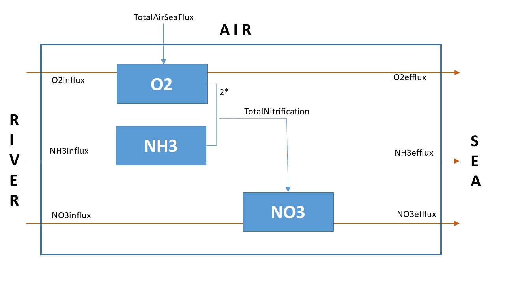

# Methods

The Methods section describes the "how". It should explain 

* the theoretical underpinning of the model (state variables, including units, conceptual diagram, chemical equations, if relevant, mass balance equations);
* key assumptions (rate expressions, boundary conditions);
* model implementation in R (model parameters & state variables, model function).

## Including external figures

If you want to include an external figure in the report (e.g., stored in a file ``NitBudget.png``), you can do so using the following markdown sentence:

``{width=70%}``

{width=70%}

The result will look as shown in Figure 1.

## Including equations

When writing chemical or mathematical equations, you can use \LaTeX\ commands within the Rmd file. For example:

* Displayed chemical equation without a label:
$$CH_2O + O_2 \rightarrow CO_2 + H_2O$$

* Displayed chemical equation with a label:
\begin{equation}
\label{eq:miner}
CH_2O + O_2 \rightarrow CO_2 + H_2O
\end{equation}

* Displayed mathematical equation with a label:
\begin{equation}
\label{eq1}
\frac{\partial O_2}{\partial t} = Transport(O_2) + R_{aeration} - R_{miner}
\end{equation}
The label can then be used to reference Eq. \ref{eq1} and Eq. \ref{eq:miner} even if you change the order of equations later on.

## Model implementation in R

It is a good idea to include the full R-code of your model. If the model is complex, it may also be worthwhile to explain the key components of the model implementation. 

As an example, here we include the implementation of the BOD model (available in the ``RTM_1D`` template).

```{r, warning=FALSE, message=FALSE}
require(ReacTran)

# units: time=days, space=meters, amount=moles, concentration=mol/m3

# model grid
Length <- 1000                                 # [m]
N      <- 100                                  # [-] number of boxes
Grid   <- setup.grid.1D(L = Length, N = N)     # grid of N equally-sized boxes

# initial conditions - state variables are defined in the middle of grid cells
O2      <- rep(0.1,   times = N)               # [mol/m3]
BOD     <- rep(0.001, times = N)               # [mol/m3]

# initial state of the system: a vector with all state variables (2*N)
state.ini   <- c(O2, BOD)

# names of the modeled state variables
SVnames <- c("O2", "BOD")

# model parameters
pars <- c(      
  D         = 100,   # [m2/d]      dispersion coefficient (tidal mixing)
  v         = 10,    # [m/d]       advection velocity
  kDecay    = 0.05 , # [/d]        rate constant of BOD decay (first-order process)
  K.O2      = 0.001, # [mol/m3]    half-saturation O2 concentration for BOD decay
  inputBOD  = 10,    # [mol/m2/d]  BOD input rate upstream
  BODdown   = 0.1,   # [mol/m3]    BOD concentration downstream
  O2up      = 0.25,  # [mol/m3]    O2 concentration upstream
  satO2     = 0.3,   # [mol/m3]    saturation concentration of O2 (i.e., solubility)
  kAeration = 0.1    # [/d]        rate constant for air-water O2 exchange
)

# Model function
BOD1D <- function(t, state, parms) {  # state is a long vector, at time t
  with (as.list(parms),{
    
  # The vectors of the state variables O2 and BOD are
  # "extracted" from the LONG vector state passed to the function as input.
    O2  <- state[ (0*N+1) : (1*N) ]   # first N elements for O2
    BOD <- state[ (1*N+1) : (2*N) ]   # second N elements for BOD

  # Transport - tran.1D approximates the spatial derivatives
  # note: for O2: zero-gradient boundary downstream (default)
    tranO2  <- tran.1D(C    = O2,
                       C.up = O2up,         # imposed conc upstream, 
                       D = D, v = v,        # dispersion, advection 
                       dx = Grid)           # Grid

    tranBOD <- tran.1D(C       = BOD,
                       flux.up = inputBOD,  # imposed flux upstream
                       C.down  = BODdown,   # imposed conc downstream
                       D = D, v = v,        # dispersion, advection
                       dx = Grid)           # Grid

  # rate expressions [mol/m3/d] - values in the middle of grid cells
    Decay    <- kDecay * BOD * O2/(O2+K.O2) # BOD decay, limited by O2
    Aeration <- kAeration * (satO2-O2)      # air-water exchange of O2

  # Time-derivatives: dC/dt = transport + production - consumption [mol/m3/d]
    dO2.dt    <- tranO2$dC  + Aeration - Decay 
    dBOD.dt   <- tranBOD$dC            - Decay   

  # return vector of time-derivatives and ordinary variables as a list     
    return(list(c(dO2.dt, dBOD.dt),  # time-derivatives 
                                     # (the same order as state variables!!)
  # additional output:
    
    # process rates along the domain (1D vector)
    Decay           = Decay,                 # mol/m3/d
    Aeration        = Aeration,              # mol/m3/d
    
    # mean process rates (a number)
    MeanDecay       = mean(Decay),           # mol/m3/d
    MeanAeration    = mean(Aeration),        # mol/m3/d
    
    # rates integrated along the domain (for budgetting) 
    TotalDecay      = sum(Decay*Grid$dx),    # mol/m2/d
    TotalAeration   = sum(Aeration*Grid$dx), # mol/m2/d
    
    # fluxes at domain boundaries (for budgetting)
    BODinflux = tranBOD$flux.up,     # BOD flux INTO the system upstream,     mol/m2/d
    BODefflux = tranBOD$flux.down,   # BOD flux OUT of the system downstream, mol/m2/d       
    O2influx  = tranO2$flux.up,      # O2 flux INTO the system upstream,      mol/m2/d
    O2efflux  = tranO2$flux.down))   # O2 flux OUT of the system downstream,  mol/m2/d
  })
}
```

## Modeled scenarios

After showing the R-code implementing the model, it is useful to explain the details of specific modeled scenarios or other types of analyses performed with the model (e.g., sensitivity analysis, fitting, or budgetting). The results can be calculated but not yet displayed (they will be displayed in the Results section). 

For example, here we find a steady-state solution for the default model parameters.

```{r}
std <- steady.1D(y = state.ini, parms = pars, func = BOD1D, 
          positive = TRUE, names = SVnames, nspec = length(SVnames), dimens = N,
          atol = 1e-10, rtol = 1e-10) 
```

In contrast, here we solve the model assuming no aeration.

```{r}
p2 <- pars
p2["kAeration"] <- 0
std2 <- steady.1D(y = state.ini, parms = p2, func = BOD1D, 
          positive = TRUE, names = SVnames, nspec = length(SVnames), dimens = N,
          atol = 1e-10, rtol = 1e-10)
```

Here, we construct the $O_2$ and $BOD$ budget for the modeled domain and store it in a format (a ``data.frame``) that can be displayed as a nice table in the Results section.

```{r}
toselect <- c("TotalDecay", "TotalAeration", "BODinflux", "BODefflux",
              "O2influx", "O2efflux")
BUDGET <- data.frame(default     = unlist(std[toselect]), 
                     no_aeration = unlist(std2[toselect]))
```

This can go on until you clarify all methodological aspects covered in your project.