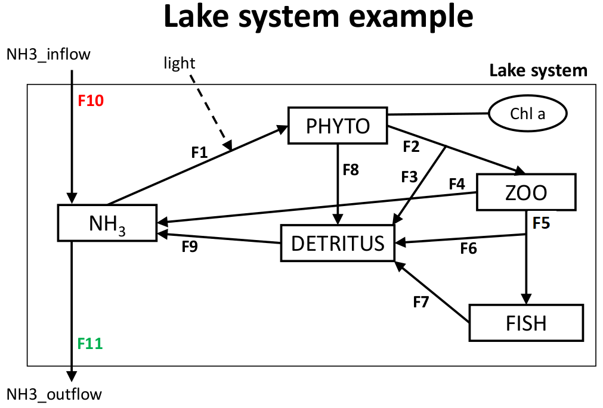
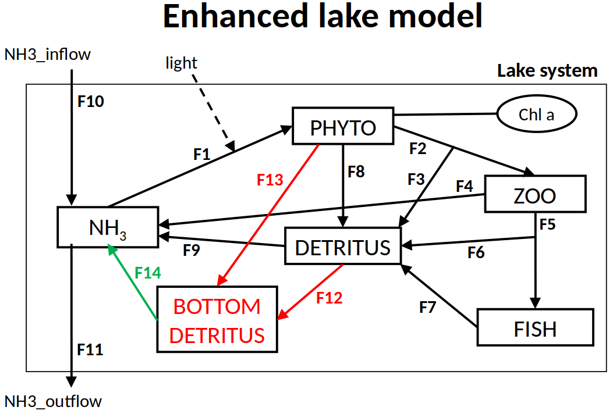
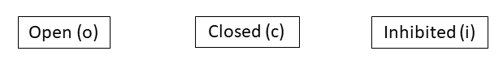
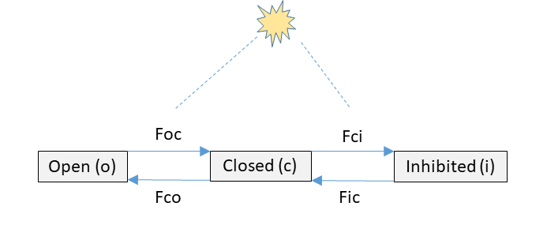

```{r setup, include=FALSE}
knitr::opts_chunk$set(echo = TRUE)
library(learnr)
```

## Tutorial

You are advised to watch the following video first.

### Video timeline
* 0:00 Introduction
* 0:25 The mass balance equation
* 2:07 Example 1: Simple model of N flow in a lake system
* 4:23 Consistency check
* 5:46 Check of units
* 7:12 Example 2: Enhanced model of N flow in a lake system
* 9:04 Note about benthic-pelagic coupling
* 11:15 Chemical reactions
* 12:40 Example 3: organic matter degradation
* 15:09 Summary


You can also read the following section(s) of the textbook:

* Chapter 2.1. Conceptual model

(You can download each chapter of the textbook via the e-book University library for free!)

## Mass balance of a lake ecosystem

Consider the conceptual diagram of a simple lake ecosystem model shown below. The state variables represent nitrogen (N) concentrations in the major lake compartments. Each state variable is in moles of N per cubic meter of water column ($mol~N~m^{-3}$), each flux is in moles of N per cubic meter of water column per day ($mol~N~m^{-3}~d^{-1}$), water column height is $h = 10~m$.

{width=14cm}

```{r ingredients_PHYTO, echo=FALSE}
question("Which of the following differential equations correctly describe mass balances for phytoplankton?", type = "learnr_checkbox",
 answer("$\\frac{d[PHYTO]}{dt} =  F1 - F2 - F8$", correct=TRUE),
 answer("$\\frac{d[PHYTO]}{dt} = -F1 + F2 + F8$", correct=FALSE),
 answer("$\\frac{d[PHYTO]}{dt} =  F1 - F2 - F8 + light$", correct=FALSE),
 answer("$\\frac{d[PHYTO]}{dt} =  F1 - F2 - F8 - F3$", correct=FALSE)
)
```

{width=14cm}
```{r ingredients_ZOO, echo=FALSE}
question("Which of the following differential equations correctly describe mass balances for zooplankton?", type = "learnr_checkbox",
 answer("$\\frac{d[ZOO]}{dt} = F2 - F4 - F5$", correct=FALSE),
 answer("$\\frac{d[ZOO]}{dt} = F2 - F3 - F4 - F5$", correct=TRUE),
 answer("$\\frac{d[ZOO]}{dt} = F2 - F4 - F5 - F6$", correct=FALSE),
 answer("$\\frac{d[ZOO]}{dt} = F2 - F3 - F4 - F5 - F6$", correct=FALSE)  
)
```

{width=14cm}

```{r ingredients_DET, echo=FALSE}
question("Which of the following differential equations correctly describe mass balances for detritus?", type = "learnr_checkbox",
 answer("$\\frac{d[DETRITUS]}{dt} = F2 + F6 - F5 + F7 + F8 - F9$", correct=FALSE),
 answer("$\\frac{d[DETRITUS]}{dt} = F3 + F6 + F7 + F8 - F9/h$", correct=FALSE),
 answer("$\\frac{d[DETRITUS]}{dt} = F3 + F6 + F7 + F8 - F9$", correct=TRUE),
 answer("$\\frac{d[DETRITUS]}{dt} = F3 + F6 + F7 + F8 - F9\\cdot h$", correct=FALSE)  
)
```

{width=14cm}
```{r ingredients_NH3, echo=FALSE}
question("Which of the following differential equations correctly describe mass balances for ammonia?", type = "learnr_checkbox",
 answer("$\\frac{d[NH3]}{dt} = F4 + F9/h - F1 + F10 - F11$", correct=FALSE),
 answer("$\\frac{d[NH3]}{dt} = F4 + F9 - F1 + F10 - F11$", correct=TRUE),
 answer("$\\frac{d[NH3]}{dt} = F4 + F9 - F1 + F10/h - F11$", correct=FALSE)
)
```

```{r NumberEquations, echo=FALSE}
msg <- "You will have as many mass balance equations as there are state variables"
  
question("How many differential equations are needed to fully describe mass balances in the lake model", type = "learnr_radio",
 answer("1"),
 answer("2"),
 answer("3"),
 answer("4"),
 answer("5", correct=TRUE),
 answer("6"),
 answer("7"),
 
 incorrect=msg, 
 correct=msg)
```

```{r UnitsEquations, echo=FALSE}
question("Check boxes with a TRUE statement.", type = "learnr_radio",
 answer("Modeled state variables MUST have the same units."),
 answer("Modeled state variables CANNOT have the same units."),
 answer("Modeled state variables should have the same units if possible.", correct = TRUE)
)
```

## Enhanced lake ecosystem

Consider the conceptual diagram of an enhanced lake ecosystem model shown below. The state variables represent nitrogen (N) concentrations in the major lake compartments. Each state variable except for the BOTTOM_DETRITUS is in moles of N per *cubic* meter of water column, each flux except for F12, F13 and F14 is in moles of N per *cubic* meter of water column per day. The new state variable BOTTOM_DETRITUS is in moles of N per *square* meter of lake bottom, the new fluxes F12, F13 and F14 are in moles of N per *square meter* of lake bottom per day, water column height is $h = 10~m$.

{width=14cm}

```{r PHYTO, echo=FALSE}
msg <- "F13, the sinking of phytoplankton, will be expressed in $mol~N/m^2/day$ (you will see later why), hence you need to divide by the height of the water to convert the flow of N to $mol~N/m^3/day$."
  
question("Which of the following differential equations correctly describe mass balances for the PHYTO state variable?", type = "learnr_checkbox",
 answer("$\\frac{d[PHYTO]}{dt} = F1 - F2 - F8 - F13$", correct=FALSE),
 answer("$\\frac{d[PHYTO]}{dt} = F1 - F2 - F8 - F13\\cdot h$", correct=FALSE),
 answer("$\\frac{d[PHYTO]}{dt} = F1 - F2 - F8 - F13/h$", correct=TRUE),
 answer("$\\frac{d[PHYTO]}{dt} = F1/h - F2/h - F8/h - F13$", correct=FALSE),
 answer("$\\frac{d[PHYTO]}{dt} = F1\\cdot h - F2\\cdot h - F8\\cdot h - F13$", correct=FALSE),
 
 incorrect=msg, 
 correct=msg)
```
{width=14cm}
```{r DET, echo=FALSE}
msg <- "F12, the sinking of detritus, is expressed in $mol~N/m^2/day$ (you will see later why). Thus you need to divide by the height of the water column to convert the flow of N to $mol~N/m^3/day$."

question("Which of the following differential equations correctly describe mass balances for the DETRITUS state variable?", type = "learnr_checkbox",
 answer("$\\frac{d[DETRITUS]}{dt} = F2 + F6 - F5 + F7 + F8 - F9 - F12$", correct=FALSE),
 answer("$\\frac{d[DETRITUS]}{dt} = F2 + F6 - F5 + F7 + F8 - F9 - F12\\cdot h$", correct=FALSE),
 answer("$\\frac{d[DETRITUS]}{dt} = F2 + F6 - F5 + F7 + F8 - F9 - F12/h$", correct=TRUE),
 
 incorrect=msg, 
 correct=msg)
```
{width=14cm}
```{r BotDet, echo=FALSE}
msg <- "F12 and F13, the sinking of detritus and algae, are expressed in $mol~N/m^2/day$ and therefore have the correct units for a flux to bottom detritus."
  
question("Which of the following differential equations correctly describe mass balances for the BOTTOM DETRITUS state variable?", type = "learnr_checkbox",
 answer("$\\frac{d[BOTTOM~DETRITUS]}{dt} = F12\\cdot h + F13\\cdot h - F14\\cdot h$", correct=FALSE),
 answer("$\\frac{d[BOTTOM~DETRITUS]}{dt} = F12 + F13 - F14$", correct=TRUE),
 answer("$\\frac{d[BOTTOM~DETRITUS]}{dt} = F12/h + F13/h - F14/h$", correct=FALSE),
 
 incorrect=msg, 
 correct=msg)
```
{width=14cm}

```{r pelagicNH3, echo=FALSE}
msg <- sprintf("F14 is estimated based on the bottom detritus concentraton, and has units of $mol~N/m^2/day$. Thus, it must be divided by water column height to obtain the correct units for the flux to ammonia.")

question("Which of the following differential equations correctly describe mass balances for the ammonia state variable?", type = "learnr_checkbox",
 answer("$\\frac{d[NH3]}{dt} = F4 + F9\\cdot h - F1 + F10 - F11 + F14$", correct=FALSE),
 answer("$\\frac{d[NH3]}{dt} = F4 + F9 - F1 + F10 - F11 + F14/h$", correct=TRUE),
 answer("$\\frac{d[NH3]}{dt} = F4 + F9 - F1 + F10/h - F11+ F14\\cdot h$", correct=FALSE),
 
 incorrect=msg, 
 correct=msg)
```

## Biogeochemical reaction

Consider organic matter (OM) mineralization in a water column. Under anoxic conditions (no $O_2$ available), OM can be mineralized with nitrate ($NO_3^-$) as the electron acceptor (Denitrification). The corresponding stoichiometry of the reaction is given by the equation below, where 16/106 corresponds to the Redfield (molar) ratio of C:N in OM. 

$$
5CH_2O(NH_3)_{16/106}+4NO_3^-+4H^+ \rightarrow 5CO_2+7H_2O+2N_2+5(NH3)_{16/106}
$$

* Assume that the rate of OM mineralization is $R$, in units of $mol~C~m^{-3}~h^{-1}$.
* Concentrations of OM and $CO_2$ are in $mol~C~m^{-3}$, concentrations of nitrate and ammonia are in $mol~N~m^{-3}$, and the concentration of dissolved $N_2$ gas is in $mol~N_2~m^{-3}$, where $m^3$ refers to the cubic meter of water column. Assume that OM mineralization is the only process in the system.

```{r Denitrification, echo=FALSE}
msg <- sprintf("As $R$ is expressed in $mol~C~m^{-3}~h^{-1}$, it is simplest to rewrite the chemical reaction for *one* mole of C reacting, i.e.: $CH_2O(NH_3)_{16/106}+4/5\\cdot NO_3^- + 4/5\\cdot H^+ \\rightarrow CO_2 + 7/5\\cdot H_2O + 2/5\\cdot N_2 + (NH3)_{16/106}$. This will make the mass balances clearer.")

question("Which of the following differential equations correctly describe mass balances for the system?", type = "learnr_checkbox",
 answer("$\\frac{d[OM]}{dt} = -5\\cdot R$", correct=FALSE),
 answer("$\\frac{d[OM]}{dt} = -R$", correct=TRUE),
 answer("$\\frac{d[OM]}{dt} = -(1/5)\\cdot R$", correct=FALSE),
 answer("$\\frac{d[CO2]}{dt} = 5\\cdot R$", correct=FALSE),
 answer("$\\frac{d[CO2]}{dt} = (1/5)\\cdot R$", correct=FALSE),
 answer("$\\frac{d[CO2]}{dt} = -R$", correct=FALSE),
 answer("$\\frac{d[CO2]}{dt} = R$", correct=TRUE),
 
 incorrect=msg,
 correct=msg)
```

$$
5CH_2O(NH_3)_{16/106}+4NO_3^-+4H^+ \rightarrow 5CO_2+7H_2O+2N_2+5(NH3)_{16/106}
$$
  
```{r Denitrification2, echo=FALSE}
msg <- sprintf("As $R$ is expressed in $mol~C~m^{-3}~h^{-1}$, it is simplest to rewrite the chemical reaction for *one* mole of C reacting, i.e.: $CH_2O(NH_3)_{16/106}+4/5\\cdot NO_3^-+4/5\\cdot H^+ \\rightarrow CO_2+7/5\\cdot H_2O+2/5\\cdot N_2+(NH3)_{16/106}$. Then, then the mass balances are clearer.")

question(sprintf("Which of the following differential equations correctly describe mass balances for the system?  $R$ has units of $mol~C~m^{-3}~h^{-1}$."), type = "learnr_checkbox",
 answer("$\\frac{d[NO3]}{dt} = -4\\cdot R$", correct=FALSE),
 answer("$\\frac{d[NO3]}{dt} = 4\\cdot R$", correct=FALSE),
 answer("$\\frac{d[NO3]}{dt} = -(4/5)\\cdot R$", correct=TRUE),
 answer("$\\frac{d[NO3]}{dt} = -(5/4)\\cdot R$", correct=FALSE),
 answer("$\\frac{d[NH3]}{dt} = -5\\cdot R$", correct=FALSE),
 answer("$\\frac{d[NH3]}{dt} = 5\\cdot R$", correct=FALSE),
 answer("$\\frac{d[NH3]}{dt} = (16/106)\\cdot R$", correct=TRUE),
 answer("$\\frac{d[NH3]}{dt} = -(16/106)\\cdot R$", correct=FALSE),
 answer("$\\frac{d[NH3]}{dt} = 5\\cdot (16/106)\\cdot R$", correct=FALSE),
 answer("$\\frac{d[NH3]}{dt} = -(106/16)\\cdot R$", correct=FALSE),
 answer("$\\frac{d[N2]}{dt} = 2\\cdot R$", correct=FALSE),
 answer("$\\frac{d[N2]}{dt} = (2/5)\\cdot R$", correct=TRUE),
 answer("$\\frac{d[N2]}{dt} = (4/5)\\cdot R$", correct=FALSE),
 answer("$\\frac{d[N2]}{dt} = 4\\cdot R$", correct=FALSE),
 answer("$\\frac{d[N2]}{dt} = R$", correct=FALSE),
 answer("$\\frac{d[N2]}{dt} = (1/2)\\cdot R$", correct=FALSE),
 
 incorrect=msg,
 correct=msg)
```

## Photosynthesis - conceptual model

Oxygenic photosynthesis (oxy-PS) is a process used by plants, algae, and cyanobacteria to convert light energy into chemical energy stored in carbohydrates, releasing molecular oxygen ($O_2$) as a by-product. In this process, enzymes comprising the photosystems I and II capture photons, which energize electrons and ultimately produce NADPH (the source of a proton) and ATP (chemical energy). These two components (NADPH and ATP) are then used in the Calvin cycle to convert $CO_2$ into carbohydrates.

In the overall flow of electrons through photosystems I and II, PSII can be in three states: 

(1) an open (or reactive) state, 
(2) a closed (or activated) state, and 
(3) an inhibited state. 

After being hit by photons, PSII transits from an open state to a closed one. The excited electrons are then transferred to PSI, and PSII returns to the open state. Excessive exposure to light leads to photo-inhibition, which shifts PSII from the closed state to the inhibited state. If the excessive light exposure stops (while the light exposure remains), PSII slowly recovers back to the closed state.



In the scheme above, you find the three states that are used in this simplified PSII model. Based on the above description, draw the arrows that represent the transitions from each state to the other state.  If we define with *Fab* the transition rate from state *a* to *b*, then tick the boxes that should be added in this conceptual scheme:

```{r flows, echo=FALSE}
question("If Fab denotes the transition flow from state a to b, toggle the correct fluxes", type = "learnr_checkbox",
 answer("Foc", correct=TRUE),
 answer("Fco", correct=TRUE),
 answer("Foi"),
 answer("Fio"),
 answer("Fci", correct=TRUE),
 answer("Fic", correct=TRUE),
 
 incorrect = ("the transition flows are Foc, Fco, Fci an Fic")  
)
```

## Photosynthesis - mass balance

You are given the following conceptual diagram of the PSII model.


* Write the mass balance equations for the state variables [o], [c] and [i]:

```{r PS_MB, echo=FALSE}
question("Which of the following equations represent the balance equation for state variable [c]?", type = "learnr_radio",
 answer(sprintf("$\\frac{d[c]}{dt}=Foc-Fco+Fic-Fci$"), correct=TRUE),
 answer(sprintf("$\\frac{d[c]}{dt}=-Foc+Fco-Fic+Fci$")),
 answer(sprintf("$\\frac{d[c]}{dt}=Foc+Fco$"))
 )
```

## Photosynthesis - units

* The state variables [o], [c], and [i] are fractions that sum to 1 (i.e., they are unitless). 

```{r PS_units, echo=FALSE}
question("If the time-unit in the model is second ('s'), what is the unit of the derivative $\\frac{d[i]}{dt}$?", type = "learnr_checkbox",
 answer(sprintf("$s$")),
 answer(sprintf("$/s$"), correct=TRUE),
 answer(sprintf("$-$ (unitless)")),
 answer(sprintf("$s^{-1}$"), correct=TRUE),

 incorrect = "The unit of a time-derivative = unit of the state variable per unit time.",   
 correct = "Indeed: the unit of a time-derivative = unit of the state variable per unit time. There are two ways to write this unit."
 )
```

* The rate expression for $F_{ic}$ is $$F_{ic} = r \cdot [i]$$

```{r PSunitFic, echo=FALSE}
msg <- sprintf("The unit of the flow $F_{ic}$ is $s^{-1}$, and [i] is unitless, hence $r$ has the unit of $s^{-1}$.")
  
question("What is the unit of the parameter $r$ ?", type = "learnr_radio",
 answer(sprintf("$s$")),
 answer(sprintf("$s^{-1}$"), correct=TRUE),
 answer(sprintf("$-$ (unitless)")),
 
 incorrect=msg,  
 correct=msg)
```

* The rate expression for $F_{oc}$ is equal to 
$$F_{oc} =\sigma \cdot I \cdot [o],$$ 
where the unit of $I$ (light intensity) is $\mu mol~photons~m^{-2}~s^{-1}$. 

```{r psunitfoc, echo=FALSE}
msg <- sprintf("The unit of the flow $F_{oc}$ is $s^{-1}$, and $I \\cdot [o]$ has units of $\\mu mol~photons~m^{-2}~s^{-1}$. To obtain the unit of $s^{-1}$, $\\sigma$ must be expressed in $m^2~(\\mu mol~photons)^{-1}$ (The parameter $\\sigma$ is called the absorption cross section of PSII).")
  
question("What is the unit of the parameter $\\sigma$ ?", type = "learnr_radio",
 answer(sprintf("$s$")),
 answer(sprintf("$m^2~(\\mu mol~photons)^{-1}$"), correct=TRUE),
 answer(sprintf("$s^{-1}$")),
 answer(sprintf("$\\mu mol~photons ~s^{-1}$")),
 
 incorrect=msg,
 correct=msg)
```

## More exercises

More exercises on creating mass balance equations can be found in the R-package RTM. Type the following commands in the R console to see these exercises:

```
require(RTM)
RTMexercise("massbalance_chemistry")
RTMexercise("massbalance_ecology")
```

## Textbook and Slides

Karline Soetaert, Peter M.J. Herman (2009). A Practical Guide to Ecological Modelling. Springer Netherlands. DOI: 10.1007/978-1-4020-8624-3.

Slides available at <a href="https://drive.google.com/drive/folders/1Bys0-xzXLCpFpWhD-HrH6jDKOyl8iJMd" target="_blank">google-drive</a>

See https://en.wikipedia.org/wiki/Photosynthesis for more details about photosynthesis.
