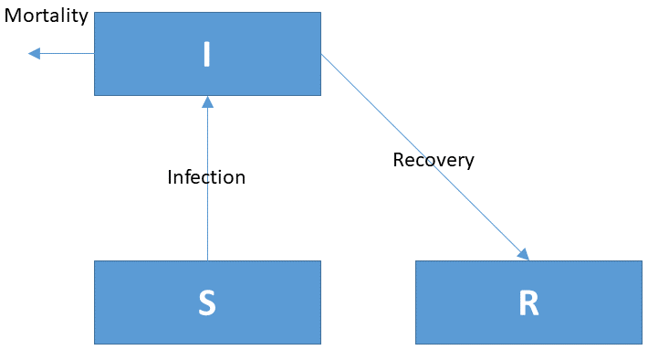

```{r setup, include=FALSE}
knitr::opts_chunk$set(echo = TRUE)
library(learnr)
```

## Tutorial

You are advised to first watch the following video. It briefly explains how to implement a simple COVID model in R.


## LV: Lotka-Volterra dynamics

The following R-code implements the Lotka-Volterra model. This model describes a predator-prey type of ecological interactions. The dynamics of the prey ($X$) and predator ($Y$) are described by these two coupled differential equations:

$$ \frac{{dX}}{{dt}} = a \cdot X \cdot \left( 1 - \frac{X}{K}\right) - b \cdot X \cdot Y$$
$$     \frac{{dY}}{{dt}} = g \cdot b \cdot X \cdot Y - e \cdot Y$$

* The initial values are: `X = 300`, `Y = 10` 
* The parameter values are: `a = 0.05`, `K = 500`, `b = 0.0002`, `g = 0.8`, `e = 0.03`
*	The model is run for 100 days, with an output shown every day.

```{r LV-setup_, echo = TRUE, fig.height=4, fig.width=6, message = FALSE}
require(deSolve)   # package with solution methods

state.ini <- c(X=300, Y=10)            # state variable initial conditions
parms     <- c(a=0.05, K=500, b=0.0002, g=0.8, e=0.03)  # parameter values

LVmodel <- function(t, state, parameters) { 
  with (as.list(c(state, parameters)), {
    
    # process rates
    Growth.X     <- a*X*(1-X/K)
    Grazing.Y    <- b*X*Y
    Mortality.Y  <- e*Y
    
    # time derivative
    dX.dt <- Growth.X  - Grazing.Y
    dY.dt <- g*Grazing.Y - Mortality.Y

    return (list(c(dX.dt, dY.dt),  # vector of derivatives
                 sum = X+Y))       # output variable
  })
}
times <- 1:100
out   <- ode(y = state.ini, func = LVmodel, times = times, parms = parms)
plot(out, mfrow = c(1,3))
```

### TASK 1

Run the model with other initial values (`X = 200`, `Y = 50`). Store the output in a variable `out2`. Plot the two runs simultaneously in one graph. 

Tip: `plot(out, out2)` will plot all variables at once for both runs.

```{r LV, exercise=TRUE, fig.height=4, fig.width=6}
## run model with new initial values, and plot both runs at once

```

```{r LV-hint, fig.height=4, fig.width=6}
state.ini2 <-  # type new initial conditions
out2       <-  # run the model, with the new initial conditions
plot(out, out2, mfrow = c(1,3))    # plot both runs at once
```

```{r LV-solution, fig.height=4, fig.width=6}
state.ini2 <- c(X = 200, Y = 50) 
out2   <- ode(y = state.ini2, func = LVmodel, times = times, parms = parms)
plot(out, out2, mfrow = c(1,3))
```

### TASK 2

Run the model over 1000 days, using the same initial conditions as before, and plot the two runs simultaneously in one graph.

* Run 1: `X = 300`, `Y = 10`, store as `out` 
* Run 2: `X = 200`, `Y = 50`, store as `out2`. 

```{r LVlonger, exercise=TRUE, fig.height=4, fig.width=6}
## run model with new initial values, and plot both runs at once

```

```{r LVlonger-hint, fig.height=4, fig.width=6}
state.ini  <- 
state.ini2 <- 
times2 <- 
out    <- 
out2   <- 
plot(out, out2, mfrow = c(1,3))
```

```{r LVlonger-solution, fig.height=4, fig.width=6}
state.ini  <- c(X = 300, Y = 10)
state.ini2 <- c(X = 200, Y = 50)
times2 <- 1:1000
out    <- ode(y = state.ini,  func = LVmodel, times = times2, parms = parms)
out2   <- ode(y = state.ini2, func = LVmodel, times = times2, parms = parms)
plot(out, out2, mfrow = c(1,3))
```

## LV: Adding a state variable

Now enhance the Lotka-Volterra model by adding an extra state variable `Z`. This new state variable will represent a new predator that competes for prey with the predator `Y`. The extra input you will need is as follows:

* Initial conditions for `Z` are the same as for `Y`.
* The grazing of `Z` on `X` is described by a parameter `bz = 0.0001`.
* The mortality of `Z` is described by a parameter `ez = 0.01`.
* The biomass yield is the same for both `Y` and `Z` (`g = 0.8`).

You can use the 2-state-variable LV model to start with.

```{r LV2, exercise=TRUE, fig.height=6, fig.width=6}
## Extend the current model with state variable Z (similar dynamics as Y)
state.ini <- c(X=300, Y=10)            
parms     <- c(a=0.05, K=500, b=0.0002, g=0.8, e=0.03)  

LVmodel <- function(t, state, parameters) { 
  with (as.list(c(state, parameters)), {

    # process rates
    Growth.X     <- a*X*(1-X/K)
    Grazing.Y    <- b*X*Y
    Mortality.Y  <- e*Y
    
    # time derivative
    dX.dt <- Growth.X  - Grazing.Y
    dY.dt <- g*Grazing.Y - Mortality.Y

    return (list(c(dX.dt, dY.dt),  # vector of derivatives
                 sum = X+Y))       # output variable
  })
}
times <- 1:1000
out   <- ode(y = state.ini, func = LVmodel, times = times, parms = parms)
plot(out, mfrow=c(2,2))
```

```{r LV2-solution}
state.ini <- c(X = 300, Y = 10, Z = 10) 
parms <- c(a = 0.05, K = 500, b = 0.0002, g = 0.8, e = 0.03, bz = 0.0001, ez = 0.01)

LVmodel3 <- function(t, state, parameters) {
  with (as.list(c(state, parameters)), {
    
    # process rates
    Growth.X     <- a*X*(1-X/K)
    Grazing.Y    <- b*X*Y
    Grazing.Z    <- bz*X*Z
    Mortality.Y  <- e*Y
    Mortality.Z  <- ez*Z
    
    # time derivative
    dX.dt <- Growth.X  - Grazing.Y - Grazing.Z
    dY.dt <- g*Grazing.Y - Mortality.Y
    dZ.dt <- g*Grazing.Z - Mortality.Z

    return (list(c(dX.dt, dY.dt, dZ.dt), sum = X+Y+Z))
  })
}
times <- 1:1000
out   <- ode(y = state.ini, func = LVmodel3, times = times, parms = parms)
plot(out, mfrow=c(2,2))
```

## SIR model

The models used to investigate the spread of infectious diseases are called SIR models. They describe the number of **S**usceptible, **I**nfected and **R**ecovered individuals in a population. Susceptible individuals are vulnerable to get the disease but are not (yet) infected. Infected individuals can recover, but some will die from the disease. Recovered individuals, at least in the first approximation, can no longer become infected. 

The conceptual diagram of a SIR model is shown in the following figure:

{width=10cm}

The corresponding differential equations are as follows:

$$\frac{dS}{dt} = -InfectionRate\\
\frac{dI}{dt} = InfectionRate - RecoveryRate - MortalityRate\\
\frac{dR}{dt} = RecoveryRate$$
where 

$$
InfectionRate = b \cdot I \cdot S\\
RecoveryRate = g \cdot I\\
MortalityRate = m \cdot I
$$

The parameter values are provided in the following table:

| Name      | Value      | Description         | Unit              |
| --------- | ---------- | ------------------- | ----------------- |
| b         | 0.00000002 | infection parameter | $ind^{-1}~d^{-1}$ |
| g         | 0.07       | recovery parameter  | $d^{-1}$          |
| m         | 0.007      | mortality parameter | $d^{-1}$          |

### TASK

Below is the skeleton of a SIR model. Expand it to describe the pandemic. Run the model for 365 days.

Apply the model to the Belgian situation. You can start the simulation assuming that all Belgian people are susceptible to the disease, and that the spreading of the disease starts with 1000 infected individuals that return from holidays. There are 11.5 million Belgians. Also calculate the total population.


```{r SIR, exercise=TRUE, fig.height=6, fig.width=6}
# fill in where it says ".."
require(deSolve)

state.ini <- c(S = .., I = .., R = .., Deceased = ..) # state variable initial conditions
parms     <- c(b = .., g = .., m = ..)              # parameters

SIRmodel <- function(t, state, parameters) {
  with (as.list(c(state, parameters)), {
    
    ..    # rate expresssions and mass balances
    
    return (list(c(dS.dt, dI.dt, dR.dt, dDeceased.dt),
                   Population = ))
  })
}
times <- 1:365
out   <- ode(y = state.ini, func = SIRmodel, times = times, parms = parms)
plot(out)
```

```{r SIR-hint}
SIRmodel <- function(t, state, parameters) {
  with (as.list(c(state, parameters)), {

    InfectionRate <- b*I*S
    RecoveryRate  <- 
    MortalityRate <-  
      
    dS.dt        <- -InfectionRate 
    dI.dt        <- 
    dR.dt        <- 
    dDeceased.dt <-

    return (list(c(dS.dt, dI.dt, dR.dt, dDeceased.dt), # derivative vector
                 Population = S+I+R))
  })
}

```

```{r SIR-solution, fig.height=6, fig.width=6}
state.ini   <- c(S = 11500000-1000, I = 1000, R = 0, Deceased = 0)

parms <- c(
  b = 0.00000002,    # [1/ind/d], infection parameter 
  g = 0.07,          # [1/d],     recovery rate of infected individuals
  m = 0.007          # [1/d],     mortality rate of infected individuals
)

SIRmodel <- function(t, state, parameters) {
  with (as.list(c(state, parameters)), {

    InfectionRate  <- b*S*I
    RecoveryRate   <- g*I
    MortalityRate  <- m*I
    
    dS.dt        <- -InfectionRate 
    dI.dt        <-  InfectionRate - RecoveryRate - MortalityRate
    dR.dt        <-  RecoveryRate
    dDeceased.dt <- MortalityRate

    return (list(c(dS.dt, dI.dt, dR.dt, dDeceased.dt), # the time derivatives
                 Population = S+I+R))    # extra output variable
  }) 
}
time.seq <- seq(from=0, to=365, by=1)   # time sequence, in days
out      <- ode(y=state.ini, times=time.seq, func=SIRmodel, parms=parms)
plot(out, las=1, col=1:2, lty=1)
```

## References

R Core Team (2020). R: A language and environment for statistical computing. R
  Foundation for Statistical Computing, Vienna, Austria. https://www.R-project.org/.

Karline Soetaert, Thomas Petzoldt, R. Woodrow Setzer (2010). Solving Differential
  Equations in R: Package deSolve. Journal of Statistical Software, 33(9), 1--25.
  DOI: 10.18637/jss.v033.i09. http://www.jstatsoft.org/v33/i09/

Karline Soetaert, Peter M.J. Herman (2009). A Practical Guide to Ecological Modelling. Springer Netherlands. DOI: 10.1007/978-1-4020-8624-3.

Slides available at <a href="https://drive.google.com/drive/folders/1Bys0-xzXLCpFpWhD-HrH6jDKOyl8iJMd" target="_blank">google-drive</a>