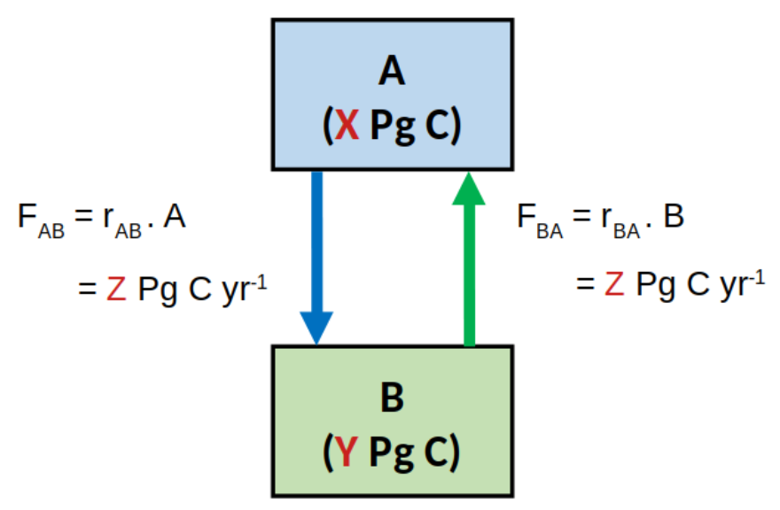

```{r setup, include=FALSE}
knitr::opts_chunk$set(echo = TRUE)
library(learnr)
```

## Tutorial

You are advised to watch the following video first.


There are no corresponding sections in the textbook.

## Two-box model

Figure below shows a conceptual diagram of a system in a **steady state**, including the rate laws describing the fluxes of carbon (C) between the compartments A and B. The values of X, Y and Z are $X=500$, $Y=2500$, $Z=50$.

{width=14cm}

The R chunk below sets the values of these variables/parameters.

```{r rab-setup}
X <- 500
Y <- 2500
Z <- 50
```

```{r}
X <- 500
Y <- 2500
Z <- 50
```

Use R to estimate the rate constants $r_{AB}$ and $r_{BA}$ using the values of X, Y and Z given above.

```{r rab, exercise=TRUE}
# fill in the formulas
rAB <- 
print(rAB)
rBA <- 
print(rBA)
```

<div id="rab-hint">
**Hint:** The equations to use are depicted in the figure above.
</div>

```{r rab-solution1, echo=FALSE}
msg <- sprintf("The rate constant $r_{AB}$ relates to the total flux $F_{AB}$ as : $r_{AB}=F_{AB}/A$; the steady-state value of $F_{AB}$ and $A$ are given by $Z=50$ and $X=500$ respectively, so the answer is: $r_{AB}= Z/X$")

question("What is the value of the rate constant $r_{AB}$?", type = "learnr_radio",
 answer(sprintf("%.3f $yr^{-1}$", Z/Y)),
 answer(sprintf("%.3f $yr^{-1}$", X/Z)),
 answer(sprintf("%.2f $yr^{-1}$", Z/X), correct=TRUE),
 incorrect = msg,   
 correct = msg
 
)
```

```{r rba-solution1, echo=FALSE}
question("What is the value of the rate constant $r_{BA}$?", type = "learnr_radio",
 answer(sprintf("%.3f $yr^{-1}$", Z/Y), correct=TRUE),
 answer(sprintf("%.3f $yr^{-1}$", X/Z)),
 answer(sprintf("%.2f $yr^{-1}$", X/Y))
)
```

Use R to estimate the residence time of carbon in the reservoir A ($\tau_{A}$) and B ($\tau_{B}$) using the values of X, Y and Z given above.

```{r tab, exercise=TRUE}
# fill in the formulas
tA <- 
print(tA)
tB <- 
print(tB)
```

<div id="tab-hint">
**Hint:** Residence time is the amount of material in the reservoir ($[Pg~C]$) divided by the outflow ($[Pg~C~yr^{-1}]$).
</div>

```{r ta-solution1, echo=FALSE}
question("What is the value of the residence time $\\tau_{A}$?", type = "learnr_radio",
 answer(sprintf("%.3f $yr$", X/Y)),
 answer(sprintf("%.3f $yr$", X/Z), correct=TRUE),
 answer(sprintf("%.2f $yr$", Z/X))
)
```

```{r tb-solution1, echo=FALSE}
question("What is the value of the residence time $\\tau_{B}$?", type = "learnr_radio",
 answer(sprintf("%.3f $yr$", Y/Z), correct=TRUE),
 answer(sprintf("%.3f $yr$", Z/X)),
 answer(sprintf("%.2f $yr$", Z/Y))
)
```

## Implementation in R

Based on the reader that has introduced you to solving dynamic models in R, it should be rather easy to understand the following R-code that implements the two-box model above in R.

Modify the R-code to implement two types of perturbation of the system: 

* *Deforestation*, which is modeled by assuming that $100~Pg~C$ was instantaneously moved from the reservoir B (biosphere) to the reservoir A (atmosphere).

* *Burning of fossil fuels*, which is modeled by assuming that $100~Pg~C$ was instantaneously added to the reservoir A (atmosphere) from an external reservoir (fossil fuels) that is not part of the model.

Note that after some time the system reaches a steady state. Think how this steady state depends on the type of perturbation.

```{r model2box-setup}
X <- 500
Y <- 2500
Z <- 50
```

```{r model2box, exercise=TRUE, echo=FALSE, exercise.lines = 22}
require(deSolve)

model2box <- function(t, s, p){  # model function
  with( as.list(c(s, p)), {
    dA.dt <- -rAB*A + rBA*B
    dB.dt <-  rAB*A - rBA*B
    return(list(c(dA.dt, dB.dt), SUM = A + B))
  })
}
pars <- c(rAB = Z/X, rBA = Z/Y)  # model parameters

# initial states
state.ini1 <- c(A = X, B = Y)         # steady state
state.ini2 <- c(A = X-10, B = Y+10)   # perturbed

t.seq <- seq(from=0, to=100, by=1)    # time sequence

# calculate the solutions
out1 <- ode(y=state.ini1, time=t.seq, func=model2box, parms=pars)
out2 <- ode(y=state.ini2, time=t.seq, func=model2box, parms=pars)

plot(out1,out2, lwd=2, mfrow=c(1,3))  # plot solutions
```

## Challenging questions

If you want a challenge, try to solve the following questions.

The system has been perturbed from the steady state by adding 100 Pg C from an external source to A. This perturbation did not affect the rate laws nor the rate constants. After some time, the system returned to a new steady state (equilibrium).

Quantify the *response time* of the system ($\tau_{AB}$), and the amounts of carbon in both reservoirs in this new steady state ($A_{eq}$ and $B_{eq}$). Use R and the values of X, Y and Z defined earlier in this tutorial to calculate $\tau_{AB}$, $A_{eq}$ and $B_{eq}$. Use the R-code from the earlier part of this tutorial to verify that your calculated values agree with those predicted by the numerical model.

```{r Tab, exercise=TRUE}
tau.AB  <- # enter formula
A.eq    <- # enter formula
B.eq    <- # enter formula
c(tau.AB=tau.AB, A.eq=A.eq, B.eq=B.eq)
```

<div id="Tab-hint">
**Hint:** It is time to use the 'pen & paper method' and do a little bit of maths.
<BR> 1. Write mass balance equations for $A$ and $B$, and substitute $$A=A_{eq} + \Delta A\cdot e^{-r\cdot t}$$ for $A$, and $$B = B_{eq} + \Delta B\cdot e^{-r\cdot t}$$ for $B$. 
<BR> 2. If you assume that $t$ is a very large number ($t\gg 1/r$), you will be able to derive the following relationship: $$r_{AB}\cdot A_{eq} = r_{BA}\cdot B_{eq}$$. 
<BR> 3. If you consider that $A+B$ must remain constant at *all* times (conservation of carbon in the system), you will be able to derive the following relationship: $$\Delta A = -\Delta B$$.
<BR> 4. By simplifying the equation obtained in 1, and combining it with relationships obtained in steps 2 and 3, you will be able to derive a relationship for $r$. The response time is then calculated as $$\tau_{AB}=1/r.$$
<BR> 5. The conservation of carbon in the system (point 3) implies a relationship $$A_{eq}+B_{eq} = A_{ini}+B_{ini},$$ where $A_{ini}$ and $B_{ini}$ are the initial values of $A$ and $B$, respectively, determined from $X$, $Y$ and the magnitude of the perturbation (now 100 Pg C).
<BR> 6. By combining the relationships obtained in steps 2 and 5, you will be able to derive formulas for $A_{eq}$ and $B_{eq}$.
</div>

```{r Tab-solution1, echo=FALSE}
msg <- "Using the hint, you should be able to derive the formula $r=r_{AB}+r_{BA}$, from which you can calculate $\\tau_{AB}$."


question("What is the value of the response time $\\tau_{AB}$?", type = "learnr_radio",
 answer(sprintf("%.3f $yr$", 1/(Z/X + 0*Z/Y))),
 answer(sprintf("%.3f $yr$", 1/(0*Z/X + Z/Y))),
 answer(sprintf("%.2f $yr$", 1/(Z/X + Z/Y)), correct=TRUE),
 
 incorrect=paste("Incorrect.", msg),
 correct=paste("Correct.", msg)
)
```

```{r Tab-solution2, echo=FALSE}
msg <- "Using the hint, you should be able to derive the formula $$A_{eq}=\\frac{r_{BA}}{r_{AB}+r_{BA}}\\cdot (A_{ini}+B_{ini}),$$ from which you can calculate $A_{eq}$ considering that $A_{ini}+B_{ini}=X+Y+100$."

question("What is the value of the equilibrium carbon content in reservoir A?", type = "learnr_radio",
 answer(sprintf("%.3f $Pg~C$", Y/(X+Y)*(X+Y+100))),
 answer(sprintf("%.3f $Pg~C$", X/(X+Y)*(X+Y+100)), correct=TRUE),
 answer(sprintf("%.2f $Pg~C$", X/(X+Y)*(X+Y+80))),
 
 incorrect = paste("Incorrect.", msg),
 correct = paste("Correct.", msg) 
)
```

```{r Tab-solution3, echo=FALSE}
msg <- "Using the hint, you should be able to derive the formula $$B_{eq}=\\frac{r_{AB}}{r_{AB}+r_{BA}}\\cdot (A_{ini}+B_{ini}),$$ from which you can calculate $B_{eq}$ considering that $A_{ini}+B_{ini}=X+Y+100$."

question("What is the value of the equilibrium carbon content in reservoir B?", type = "learnr_radio",
 answer(sprintf("%.3f $Pg~C$", Y/(X+Y)*(X+Y+100)), correct=TRUE),
 answer(sprintf("%.3f $Pg~C$", X/(X+Y)*(X+Y+100))),
 answer(sprintf("%.2f $Pg~C$", Y/(X+Y)*(X+Y+80))),
 
 incorrect = paste("Incorrect.", msg),
 correct = paste("Correct.", msg)
         )
```

## Slides

Slides available at <a href="https://drive.google.com/drive/folders/1Bys0-xzXLCpFpWhD-HrH6jDKOyl8iJMd" target="_blank">google-drive</a>

## References

R Core Team (2020). R: A language and environment for statistical computing. R
  Foundation for Statistical Computing, Vienna, Austria. https://www.R-project.org/.

Karline Soetaert, Thomas Petzoldt, R. Woodrow Setzer (2010). Solving Differential
  Equations in R: Package deSolve. Journal of Statistical Software, 33(9), 1--25.
  DOI: 10.18637/jss.v033.i09. http://www.jstatsoft.org/v33/i09/

Karline Soetaert, Peter M.J. Herman (2009). A Practical Guide to Ecological Modelling. Springer Netherlands. DOI: 10.1007/978-1-4020-8624-3.
