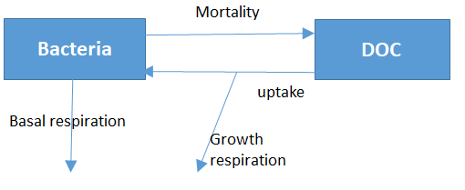

```{r setup, include=FALSE}
knitr::opts_chunk$set(echo = TRUE)
library(learnr)
```

## Tutorial

You are advised to watch the following video first.

### Video timeline
* 0:00 Worker vs. Resource (limitation, inhibition)
* 2:21 Logistic growth model
* 4:49 Lotka-Volterra model


You can also read the following section(s) of the textbook:

* Chapter 2.5. Basic Formulation of Ecological Interactions
* Chapter 2.6. Coupled Model Equations
* Chapter 2.7. Model Simplifications

(You can download each chapter of the textbook via the e-book University library for free!)

## Ecological interactions: virus infection

In a population comprising individuals that are *susceptible* to a virus and individuals that are *infected* by a virus, infection can be modelled as a process similar to an elementary chemical reaction: a susceptible person can become infected if he/she "collides" with an infected person. 

Suppose that the *probability* that a susceptible person meets an infected person, whereby this encounter leads to the susceptible person becoming infected, is described by a parameter $b$ (in units of $ind^{-1}~d^{-1}$).  The amounts of susceptible and infected individuals in the population are denoted by $S$ and $I$, respectively.

```{r infection_rate, echo=FALSE}
msg <- "To become infected, a susceptible person needs to 'collide' with *one* infected person. Therefore, the infection rate is *first-order* with respect to the infected and susceptible persons, i.e., $InfectionRate = b\\times S\\times I$. The proportionality constant, $b$, describes the probability (expressed per individual per day) that a susceptible person meets an infected person and their encounter results in the susceptible person becoming infected."

question(sprintf("What is a suitable expression for the infection rate?"), type = "learnr_checkbox",
 answer(sprintf("$InfectionRate = b \\times (S+I)$"), correct=FALSE),
 answer(sprintf("$InfectionRate = b \\times S$"), correct=FALSE),
 answer(sprintf("$InfectionRate = b \\times I$"), correct=FALSE),
 answer(sprintf("$InfectionRate = b \\times S \\times I$"), correct=TRUE),
 answer(sprintf("$InfectionRate = S \\times \\frac{I}{I+b}$"), correct=FALSE),
 answer(sprintf("$InfectionRate = b \\times I^2 \\times S$"), correct=FALSE),
 
 incorrect=sprintf(msg),
 correct=sprintf(msg))
```
<div id="infection_rate-hint">
**Note:** The "chemical reaction" that occurs between susceptible and infected persons can be written as:
$S + I \rightarrow 2 I$, i.e. it is a reaction between S and I that causes 2 persons to be infected as a result.
</div>

## Ecological interactions: predation

```{r predation, echo=FALSE}
msg <- "There are several correct answers. Answer 1 assumes a linear functional response (type I); answer 4 assumes a type II functional response, and answer 5 assumes a type III functional response."

question("Foxes (F) predate on rabbits (R). What is a suitable expression for the predation rate?", type = "learnr_checkbox",
 answer(sprintf("$r \\times F \\times R$"), correct=TRUE),
 answer(sprintf("$r \\times F \\times R^2$"), correct=FALSE),
 answer(sprintf("$r \\times F \\times (1-\\frac{F}{R})$"), correct=FALSE),
 answer(sprintf("$r \\times F \\times \\frac{R}{R+ K_R}$"), correct=TRUE),
 answer(sprintf("$r \\times F \\times \\frac{R^2}{R^2+ K_R^2}$"), correct=TRUE),
 answer(sprintf("$r \\times F \\times (1-\\frac{F}{K}) \\times R$"), correct=FALSE),
 
 incorrect=msg,  
 correct=msg)
```

## Ecological interactions: algal N-uptake

```{r Nuptake, echo=FALSE}
question("Algal N-uptake is stimulated by nitrate (NO3) and inhibited by ammonia (NH3) concentrations. What would be a suitable expression for the rate of algal growth?", type = "learnr_checkbox",
 answer(sprintf("$r \\times \\frac{[NO3]}{[NO3]+K_{NO3}} \\times [ALGAE] + \\frac{K_{NH3}}{[NH3]+K_{NH3}} \\times [ALGAE]$")),
 answer(sprintf("$r \\times \\frac{[NO3]}{[NO3]+K_{NO3}} \\times \\frac{K_{NH3}}{[NH3]+K_{NH3}} \\times [ALGAE]$"), correct=TRUE),
 answer(sprintf("$r \\times \\frac{[NO3]}{[NO3]+K_{NO3}} \\times \\frac{K_{NH3}}{[NH3]+K_{NH3}}$")),
 answer(sprintf("$r \\times \\frac{[NO3]}{[NO3]+K_{NO3}} \\times [NH3]$")),
 answer(sprintf("$r \\times \\frac{[NO3]}{[NO3]+K_{NO3}} \\times \\left(1 - \\frac{[NH3]}{[NH3]+K_{NH3}}\\right) \\times [ALGAE]$"), correct=TRUE),
 answer(sprintf("$\\frac{[NO3]}{[NO3]+K_{NO3}} \\times \\frac{K_{NH3}}{[NH3]+K_{NH3}} \\times [ALGAE]$")),
 answer(sprintf("$r \\times \\frac{K_{NO3}}{[NO3]+K_{NO3}} \\times [ALGAE]$"))
)
```

## Simple differential equations - I

```{r diffeq1, echo=FALSE}
question(sprintf("The change in time of a quantity M (in moles) is described by the differential equation $$\\frac{dM}{dt} = -r \\times M,$$ where $r > 0$. Which of the following statements is true?"), type = "learnr_checkbox",
 answer("this describes zero-order kinetics"),
 answer("this describes first-order kinetics", correct = TRUE),
 answer("this describes second-order kinetics"),
 answer("this is a mix of first-order and second-order kinetics"),
 answer(sprintf("the unit of the rate constant $r$ is $day$")),
 answer(sprintf("the unit of the rate constant $r$ is $day^{-1}$"), correct=TRUE),
 answer(sprintf("the unit of the rate constant $r$ is $mol~day^{-1}$")),
 answer(sprintf("the unit of the rate constant $r$ is $day~mol^{-1}$"))
)  
```

```{r diffeq1b, echo=FALSE}
question(sprintf("The change in time of a quantity M (in moles) is described by the differential equation $$\\frac{dM}{dt} = -r \\times M,$$ where $r > 0$. Which of the following statements is true?"), type = "learnr_checkbox",
 answer("M decreases linearly with time"),
 answer("M decreases exponentially with time", correct=TRUE),
 answer("M increases linearly with time"),
 answer("M increases exponentially with time"),
 answer("M has logistic growth")
)  
```

## Simple differential equations - II

```{r diffeq2, echo=FALSE}
question(sprintf("The change in time of a quantity M (in moles) is described by the differential equation $$\\frac{dM}{dt} = -r,$$ where $r > 0$. Which of the following statements is true?"), type = "learnr_checkbox",
 answer("this describes zero-order kinetics", correct = TRUE),
 answer("this describes first-order kinetics"),
 answer("this describes second-order kinetics"),
 answer("this is a mix of first-order and second-order kinetics"),
 answer(sprintf("the unit of the rate constant $r$ is $day$")),
 answer(sprintf("the unit of the rate constant $r$ is $day^{-1}$")),
 answer(sprintf("the unit of the rate constant $r$ is $mol~day^{-1}$"), correct=TRUE),
 answer(sprintf("the unit of the rate constant $r$ is $day~mol^{-1}$"))
)  
```

```{r diffeq2b, echo=FALSE}
question(sprintf("The change in time of a quantity M (in moles) is described by the differential equation $$\\frac{dM}{dt} = -r,$$ where $r > 0$. Which of the following statements is true?"), type = "learnr_checkbox",
 answer("M decreases linearly with time", correct=TRUE),
 answer("M decreases exponentially with time"),
 answer("M increases linearly with time"),
 answer("M increases exponentially with time"),
 answer("M has logistic growth")
)  
```

## Simple differential equations - III

```{r diffeq3, echo=FALSE}
question(sprintf("The change in time of a quantity M (in moles) is described by the differential equation $$\\frac{dM}{dt} = r \\times M \\times \\left(1-\\frac{M}{K}\\right),$$ where $r > 0$ and $K>0$. Which of the following statements is true?"), type = "learnr_checkbox",
 answer("this describes zero-order kinetics"),
 answer("this describes first-order kinetics"),
 answer("this describes second-order kinetics"),
 answer("this is a mix of first-order and second-order kinetics", correct = TRUE)
)
```

```{r diffeq3b, echo=FALSE}
question(sprintf("The change in time of a quantity M (in moles) is described by the differential equation $$\\frac{dM}{dt} = r \\times M \\times \\left(1-\\frac{M}{K}\\right),$$ where $r > 0$ and $K>0$. Which of the following statements is true?"), type = "learnr_checkbox",
 answer(sprintf("the unit of the rate constant $r$ is $day$")),
 answer(sprintf("the unit of the rate constant $r$ is $day^{-1}$"), correct=TRUE),
 answer(sprintf("the unit of the rate constant $r$ is $mol~day^{-1}$")),
 answer(sprintf("the unit of the rate constant $r$ is $day~mol^{-1}$")),
 answer(sprintf("the unit of the rate constant $r$ is $mol$")),
 answer(sprintf("the unit of the parameter $K$ is $day$")),
 answer(sprintf("the unit of the parameter $K$ is $day^{-1}$")),
 answer(sprintf("the unit of the parameter $K$ is $mol~day^{-1}$")),
 answer(sprintf("the unit of the parameter $K$ is $day~mol^{-1}$")),
 answer(sprintf("the unit of the parameter $K$ is $mol$"), correct=TRUE)
)  
```

```{r diffeq3c, echo=FALSE}
question(sprintf("The change in time of a quantity M (in moles) is described by the differential equation $$\\frac{dM}{dt} = r \\times M \\times \\left(1-\\frac{M}{K}\\right),$$ where $r > 0$ and $K>0$. Which of the following statements is true?"), type = "learnr_checkbox",
 answer("M decreases linearly with time"),
 answer("M decreases exponentially with time"),
 answer("M increases linearly with time"),
 answer("M increases exponentially with time"),
 answer("M has logistic growth", correct=TRUE)
)  
```


## Logistic model

A population is growing according to the logistic model $\frac{dM}{dt} = r \times M \times \left(1-\frac{M}{K}\right)$ characterised by the carrying capacity of $K=10^6~ind~km^{-2}$.

```{r logistic1, echo=FALSE}
msg <- "At population size that is much smaller than the carrying capacity, the term of the logistic expression in brackets $(1-\\frac{M}{K})$ will be very close to 1, so that $$\frac{dM}{dt} \\approx r \times M $, which has an exponential behavior."
question(sprintf("How would you best characterize the growth of the population when the population density is about $10^5~ind~km^{-2}$?"), type = "learnr_radio",
 answer("The population growth is approximately linear", correct=FALSE),
 answer("The population growth is approximately exponential", correct=TRUE),
 answer("The population stays relatively constant"), 
 answer("The population shrinks exponentially towards K"),
 incorrect = paste("incorrect. ", msg)
 correct = paste("correct. ", msg)
)  
```

```{r logistic2, echo=FALSE, eval=FALSE}
question(sprintf("How would you best characterize the growth of the population when the population density is about $5\\times 10^5~ind~km^{-2}$?"), type = "learnr_radio",
 answer("The population growth is approximately linear", correct=TRUE),
 answer("The population growth is approximately exponential"),
 answer("The population stays relatively constant"), 
 answer("The population shrinks exponentially towards K")
)  
```


```{r logistic3, echo=FALSE}
msg <- "At population size that is almost equal to the carrying capacity, the term of the logistic expression in brackets $(1-\\frac{M}{K})$ becomes very small, so that $$\frac{dM}{dt} \\approx 0$, which indicates that the population will remain (almost) constant."
question(sprintf("How would you best characterize the growth of the population when the population density is about $9.8\\times 10^5~ind~km^{-2}$?"), type = "learnr_radio",
 answer("The population growth is approximately linear"),
 answer("The population growth is approximately exponential"),
 answer("The population stays relatively constant", correct=TRUE), 
 answer("The population shrinks exponentially towards K"),
 incorrect = paste("incorrect. ", msg)
 correct = paste("correct. ", msg)
)  
```

```{r logistic4, echo=FALSE}
msg <- "When $M = 0$, then the $\frac{dM}{dt} = 0$ and the population will stay at 0."
question(sprintf("How would you best characterize the growth of the population when the population density is  $0~ind~km^{-2}$?"), type = "learnr_radio",
 answer("The population growth is approximately linear"),
 answer("The population growth is approximately exponential"),
 answer("The population stays constant", correct=TRUE), 
 answer("The population shrinks exponentially towards K"),
 incorrect = paste("incorrect. ", msg)
 correct = paste("correct. ", msg)
)  
```

## Recognizing rate expressions

```{r RateLim, echo=FALSE}
msg <- "Algal uptake of ammonia is less energy demanding than uptake of nitrate, and so the uptake of nitrate is inhibited by the presence of ammonia. Nitrate is the rate limiting substrate, so the dependence of the rate on nitrate concentration is described by the Michaelis-Menten kinetics. The work is performed by the algae, therefore the rate is first-order with respect to algae."

question(sprintf("The rate expression that describes the uptake of nitrate ($NO_3$) in the presence of ammonia ($NH_3$) by marine microscopic algae (P) is $$R = r \\times \\frac{[NO_3]}{[NO_3]+K_N} \\times \\frac{K_A}{[NH_3] + K_A} \\times [P].$$ Which of the following statements is true?"), type = "learnr_checkbox",
 answer("The process is limited by nitrate",  correct = TRUE),
 answer("The process is inhibited by nitrate"),
 answer("The process is limited by ammonia"),
 answer("The process is inhibited by ammonia",  correct = TRUE),
 answer("The process is first-order with respect to algae",  correct = TRUE),
 answer("The process is zero-order with respect to algae"),
 
 incorrect=msg, 
 correct=msg)
```

## Biochemistry: Bacterial uptake of DOC

The scheme below describes bacterial dynamics in a well-stirred closed system. It describes the exchange of carbon between bacterial biomass (B) and dissolved organic carbon (DOC). Both state variables are in units of $mol~C~m^{-3}$. 



You are given a table with parameter values:

parameter   |  value      | description                 | unit                        |
------------|-------------|---------------------------- | --------------------------- |
$g$         | 0.2         | uptake rate constant        |$hr^{-1}$                    |
$k_s$       | 10          | half-saturation concentration    |$mol~C~m^{-3}$               |
$\gamma$    | 0.5         | bacterial growth efficiency  | -                           |
$r$         | 0.01        | basal respiration parameter |$hr^{-1}$                    |
$m$         | 0.0005      | mortality rate constant         |$(mol~C~m^{-3})^{-1} hr^{-1}$| 

The initial conditions are:
$$ B_{0} = 0.1~mol~C~m^{-3} \qquad DOC_{0}=100~mol~C~m^{-3}$$

```{r bact1, echo=FALSE}
question(sprintf("Based on the model scheme and parameter definitions, which is the correct expression for the bacterial growth?"), type = "learnr_radio",
 answer(sprintf("$g \\times \\frac{B}{B+k_s} \\times DOC$"), message="this equations assumes that DOC is the active compartment"),
 answer(sprintf("$g \\times \\frac{DOC}{DOC+k_s} \\times B$"), message = "almost correct - this formulation represents DOC uptake - not growth"),
 answer(sprintf("$\\gamma \\times g \\times \\frac{B}{B+k_s} \\times DOC$"), message="this equations assumes that DOC is the active compartment"),
 answer(sprintf("$\\gamma \\times g \\times \\frac{DOC}{DOC+k_s} \\times B$"), correct=TRUE),
 answer(sprintf("$\\gamma \\times g \\times \\frac{DOC}{DOC+k_s}$"), message = "you forgot to add the active compartment here"),
 answer(sprintf("$\\gamma \\times g \\times \\frac{DOC_0}{DOC_0+k_s} \\times B_0$"), message = "Rate expressions use the concentrations of DOC and bacteria at the prevailing time steps; $B_0$ and $DOC_0$ are the initial conditions"),
 allow_retry = TRUE
)  
```

```{r bact2, echo=FALSE}
msg <- "The units of the mortality parameter indicate that the rate expression for mortality is second-order."

question(sprintf("Based on the model scheme and parameter definitions, which is the correct expression for the bacterial mortality?"), type = "learnr_radio",
 answer(sprintf("$m \\times DOC$")),
 answer(sprintf("$m \\times B$")),
 answer(sprintf("$m \\times \\frac{DOC}{DOC+k_s} \\times B$")),
 answer(sprintf("$m \\times B^2$"), correct=TRUE),
 
 incorrect=msg, 
 correct=msg)  
```

## Implementation in R

By now you should be able to write the mass balance equations and rate expressions for the  model describing bacterial uptake of DOC. We do not give them in a mathematical formalism but implement them directly in R. 

```{r model, message=FALSE, fig.height=3, fig.width=6}
require(deSolve)

# Bacterial uptake of DOC
# -----------------------

#         [/hr], [molC/m3],  [-]   , [/hr] , [/(molC/m3)/hr]
parms <- c(g=0.2, ks=10,  gamma=0.5, r=0.01, m=0.0005)   #  model parameters
y.ini <- c(B=0.1, DOC=100)                    # [molC/m3] initial conditions

Bactmod <- function(t, y, p){  # model function, calculates time-derivatives
  with (as.list(c(y,p)),{

  # rate expressions
    BactUptake   <- g * DOC/(DOC+ks) * B
    BactGrowth   <- gamma * BactUptake
    BactDeath    <- m * B^2
    BasalResp    <- r * B
    ActivityResp <- (1-gamma) * BactUptake
  
  # mass balance equations
    dB.dt   <-  BactUptake - ActivityResp - BasalResp - BactDeath
    dDOC.dt <- -BactUptake + BactDeath
  
  # return derivative vector and output variable  
    list(c(dB.dt, dDOC.dt), 
         TotalC=B+DOC)
  })
}

times <- seq(from=0, to=100, by=1)
out <- ode(y=y.ini, times=times, func=Bactmod, parms=parms)
plot(out, mfrow=c(1,3))
```

### TASK

You get as input the above R-code implementing the model of bacterial uptake of DOC. Your task is to add dissolved *inorganic* carbon (DIC) to the model. Assume the initial concentration of DIC to be 0. Hint: Realize that DIC is produced by the bacterial respiration.

```{r model3eq, exercise=TRUE, fig.height=3, fig.width=6}
require(deSolve)

# Bacterial uptake of DOC
# -----------------------

#         [/hr], [molC/m3],  [-]   , [/hr] , [/(molC/m3)/hr]
parms <- c(g=0.2, ks=10,  gamma=0.5, r=0.01, m=0.0005)   #  model parameters
y.ini <- c(B=0.1, DOC=100)                    # [molC/m3] initial conditions

Bactmod <- function(t, y, p){  # model function, calculates time-derivatives
  with (as.list(c(y,p)),{

  # rate expressions
    BactUptake   <- g * DOC/(DOC+ks) * B
    BactGrowth   <- gamma * BactUptake
    BactDeath    <- m * B^2
    BasalResp    <- r * B
    ActivityResp <- (1-gamma) * BactUptake
  
  # mass balance equations
    dB.dt   <-  BactUptake - ActivityResp - BasalResp - BactDeath
    dDOC.dt <- -BactUptake + BactDeath
  
  # return derivative vector and output variable  
    list(c(dB.dt, dDOC.dt), 
         TotalC=B+DOC)
  })
}

times <- seq(from=0, to=100, by=1)
out <- ode(y=y.ini, times=times, func=Bactmod, parms=parms)
plot(out, mfrow=c(1,4))
```


```{r model3eq-solution, fig.height=3, fig.width=6}
require(deSolve)

# Bacterial uptake of DOC
# -----------------------

#         [/hr], [molC/m3],  [-]   , [/hr] , [/(molC/m3)/hr]
parms <- c(g=0.2, ks=10,  gamma=0.5, r=0.01, m=0.0005)   #  model parameters
y.ini <- c(B=0.1, DOC=100)                    # [molC/m3] initial conditions

Bactmod <- function(t, y, p){  # model function, calculates time-derivatives
  with (as.list(c(y,p)),{

  # rate expressions
    BactUptake   <- g * DOC/(DOC+ks) * B
    BactGrowth   <- gamma * BactUptake
    BactDeath    <- m * B^2
    BasalResp    <- r * B
    ActivityResp <- (1-gamma) * BactUptake
  
  # mass balance equations
    dB.dt   <-  BactUptake - ActivityResp - BasalResp - BactDeath
    dDOC.dt <- -BactUptake + BactDeath
  
  # return derivative vector and output variable  
    list(c(dB.dt, dDOC.dt), 
         TotalC=B+DOC)
  })
}

times <- seq(from=0, to=100, by=1)
out <- ode(y=y.ini, times=times, func=Bactmod, parms=parms)
plot(out, mfrow=c(1,4))
```

<div id="model3eq-hint">
**Tips:** 

- You will need to add a new state variable called DIC in y.ini.

- In the model function you must specify the mass balance for DIC (call it dDIC.dt), and include it in the time-derivative vector.

- You also need to include DIC in the total carbon concentration. Because the model now "captures" all C pools, the total C concentration should remain constant during the simulation.
</div>

## More exercises

To learn more about modelling of ecological interactions, solve additional exercises available in the R-package RTM. To display these exercises, type one of the following commands in the R-console:

```
require(RTM)
RTMexercise("detritus")
RTMexercise("COVID")
RTMexercise("npzd")
RTMexercise("crops_weeds")
```

## References and slides

R Core Team (2020). R: A language and environment for statistical computing. R
  Foundation for Statistical Computing, Vienna, Austria. URL
  https://www.R-project.org/.

Karline Soetaert, Thomas Petzoldt, R. Woodrow Setzer (2010). Solving Differential
  Equations in R: Package deSolve. Journal of Statistical Software, 33(9), 1--25.
  DOI: 10.18637/jss.v033.i09. http://www.jstatsoft.org/v33/i09/
  
Karline Soetaert, Peter M.J. Herman (2009). A Practical Guide to Ecological Modelling. Springer Netherlands. DOI: 10.1007/978-1-4020-8624-3.

Slides available at <a href="https://drive.google.com/drive/folders/1Bys0-xzXLCpFpWhD-HrH6jDKOyl8iJMd" target="_blank">google-drive</a>
